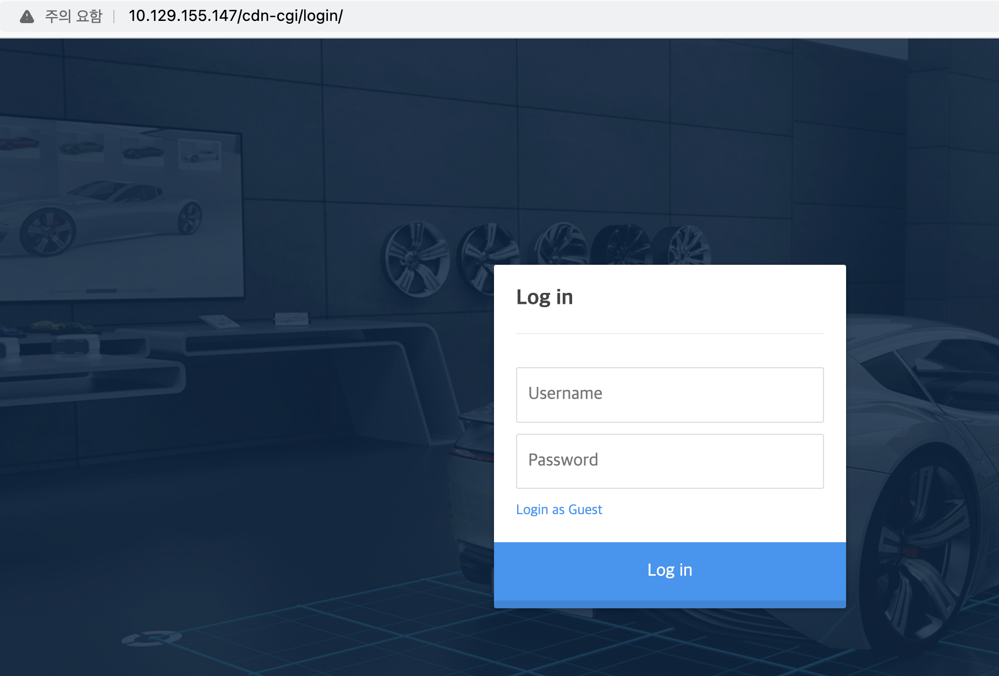
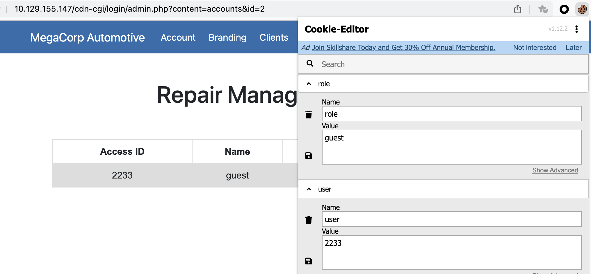
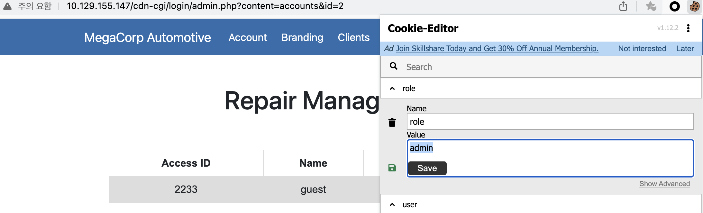
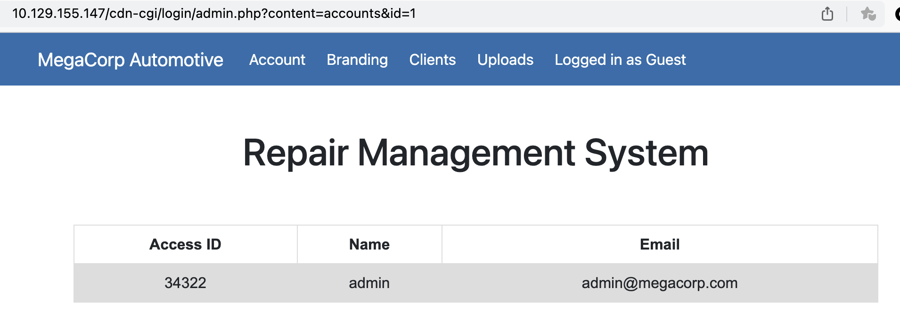
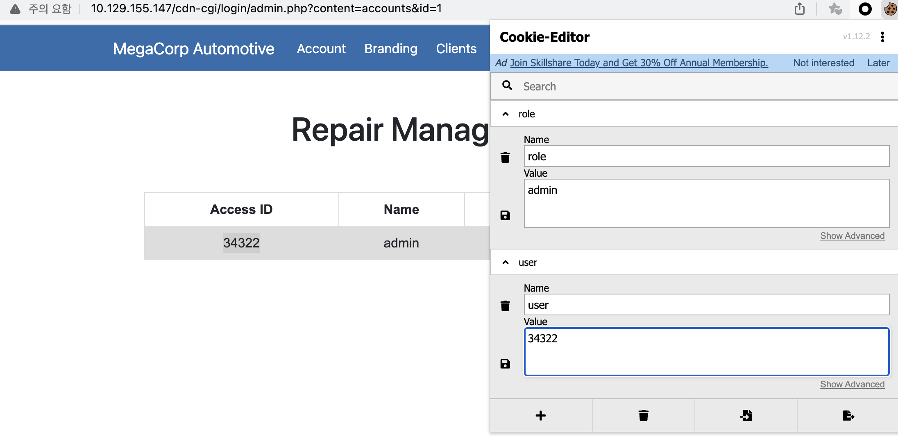
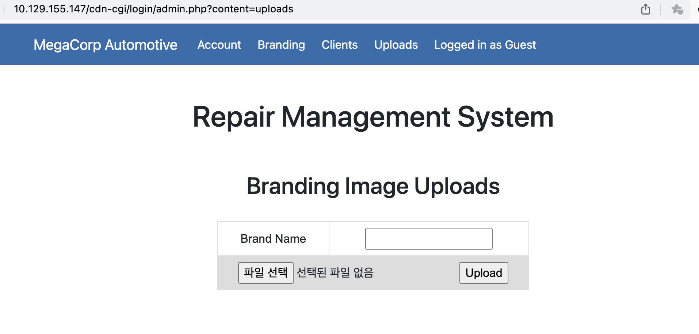

port scan 결과를 보면 22, 80 port가 활성화되어 있느 것을 볼 수 있다.
``` bash
┌──(root㉿9048af13b510)-[/]
└─# nmap -sCV 10.129.155.147 -Pn
Starting Nmap 7.94SVN ( https://nmap.org ) at 2024-02-25 04:01 UTC
Nmap scan report for 10.129.155.147
Host is up (0.29s latency).
Not shown: 998 closed tcp ports (reset)
PORT   STATE SERVICE VERSION
22/tcp open  ssh     OpenSSH 7.6p1 Ubuntu 4ubuntu0.3 (Ubuntu Linux; protocol 2.0)
| ssh-hostkey:
|   2048 61:e4:3f:d4:1e:e2:b2:f1:0d:3c:ed:36:28:36:67:c7 (RSA)
|   256 24:1d:a4:17:d4:e3:2a:9c:90:5c:30:58:8f:60:77:8d (ECDSA)
|_  256 78:03:0e:b4:a1:af:e5:c2:f9:8d:29:05:3e:29:c9:f2 (ED25519)
80/tcp open  http    Apache httpd 2.4.29 ((Ubuntu))
|_http-title: Welcome
|_http-server-header: Apache/2.4.29 (Ubuntu)
Service Info: OS: Linux; CPE: cpe:/o:linux:linux_kernel
```

우선 로그인 페이지를 찾아야하여 웹 소스를 확인하였다. 아래와 같이 '/cdn-cgi/login' 페이지에 대한 정보 획득이 가능하다.
``` html
<script src="/cdn-cgi/login/script.js"></script>
<script src="/js/index.js"></script>
``` 
해당 경로로 접근 시 아래와 같이 로그인 페이지가 나타난다.



게스트로 로그인 후 쿠키를 보면 아래와 같이 role과 userid가 있다.


role을 변경해보았으나, 별 차이가 없다.


URL을 보니 id가 2 라고 되어 있어, 1로 변경해보았더니 admin 계정의 id 값을 획득 할 수 있다.


이제 role과 id 값을 모두 알고 있으니 쿠키를 변경하여, 관리자만 접근 가능한 업로드 페이지에 접근해보자. 성공적으로 접근하였다.


업로드 관련된 문자를 보니, 브랜드 이미지 관련 하여 사진을 업로드하는 것으로 보인다. 업로드한 파일은 그럼 어디로 갈 것인가를 파악해야할 듯 싶다. 우선 위쪽의 탭을 보면 'Branding' 탭이 있으니, 관련 있을 듯 하다.



