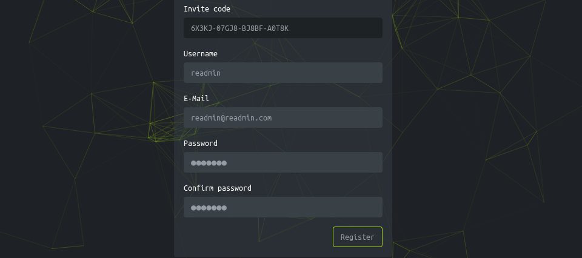

## [0x00] port scan 
---
port scan 결과를 보면 ssh와 http가 열려있음을 알 수 있고, 접속 시 'http://2million.htb/'로 redirect 됨을 알 수 있다.
``` bash
┌──(root㉿kali)-[/home/user/htb/Log4jUnifi]
└─# nmap -sCV 10.10.11.221
Starting Nmap 7.94SVN ( https://nmap.org ) at 2024-03-12 05:57 EDT
Nmap scan report for 10.10.11.221
Host is up (0.31s latency).
Not shown: 998 closed tcp ports (reset)
PORT   STATE SERVICE VERSION
22/tcp open  ssh     OpenSSH 8.9p1 Ubuntu 3ubuntu0.1 (Ubuntu Linux; protocol 2.0)
| ssh-hostkey:
|   256 3e:ea:45:4b:c5:d1:6d:6f:e2:d4:d1:3b:0a:3d:a9:4f (ECDSA)
|_  256 64:cc:75:de:4a:e6:a5:b4:73:eb:3f:1b:cf:b4:e3:94 (ED25519)
80/tcp open  http    nginx
|_http-title: Did not follow redirect to http://2million.htb/
Service Info: OS: Linux; CPE: cpe:/o:linux:linux_kernel
```

http://2million.htb/ 에 접속 시도 시 연결이 되지 않는 것을 알 수 있다. htb에서 이런 경우에는 /etc/hosts 파일을 수정해주어야 한다. 수정 시 정상적으로 접근 된다.
``` bash
┌──(root㉿kali)-[/home/user/htb]
└─# curl http://2million.htb/
curl: (6) Could not resolve host: 2million.htb

┌──(root㉿kali)-[/home/user/htb]
└─# echo '10.10.11.221 2million.htb' >> /etc/hosts

┌──(root㉿kali)-[/home/user/htb]
└─# curl http://2million.htb/
<!DOCTYPE html>
<html lang="en">

<head>

    <meta charset="utf-8">
    <meta http-equiv="X-UA-Compatible" content="IE=edge">
```


## [0x01] web site
---
웹 페이지 방문 시 아래와 같은 모습이 보이며, 특별한 기능은 없고 login 기능이 동작한다.


login 관련해서 sql injection이 동작할 듯 하여, sqlmap을 실행해보았으나 별 다른 소득은 없다.
``` bash
┌──(root㉿5a6b886b0929)-[~]
└─# sqlmap -u http://2million.htb/login --cookie="PHPSESSID=cava0m1a2hvo6f7kjvrjpdqas5"  dbs
        ___
       __H__
 ___ ___[,]_____ ___ ___  {1.8.2#stable}
|_ -| . [(]     | .'| . |
|___|_  [(]_|_|_|__,|  _|
      |_|V...       |_|   https://sqlmap.org

[!] legal disclaimer: Usage of sqlmap for attacking targets without prior mutual consent is illegal. It is the end user's responsibility to obey all applicable local, state and federal laws. Developers assume no liability and are not responsible for any misuse or damage caused by this program

[*] starting @ 14:22:12 /2024-03-12/

[14:22:12] [WARNING] you've provided target URL without any GET parameters (e.g. 'http://www.site.com/article.php?id=1') and without providing any POST parameters through option '--data'
do you want to try URI injections in the target URL itself? [Y/n/q]

[14:22:18] [INFO] testing connection to the target URL
[14:22:18] [INFO] checking if the target is protected by some kind of WAF/IPS
[14:22:19] [INFO] testing if the target URL content is stable
[14:22:19] [INFO] target URL content is stable
[14:22:19] [INFO] testing if URI parameter '#1*' is dynamic
got a 301 redirect to 'http://2million.htb/404'. Do you want to follow? [Y/n]

[14:22:24] [INFO] URI parameter '#1*' appears to be dynamic
[14:22:25] [WARNING] heuristic (basic) test shows that URI parameter '#1*' might not be injectable
[14:22:26] [INFO] testing for SQL injection on URI parameter '#1*'
[14:22:26] [INFO] testing 'AND boolean-based blind - WHERE or HAVING clause'
[14:22:31] [INFO] testing 'Boolean-based blind - Parameter replace (original value)'
[14:22:33] [INFO] testing 'MySQL >= 5.1 AND error-based - WHERE, HAVING, ORDER BY or GROUP BY clause (EXTRACTVALUE)'
[14:22:35] [INFO] testing 'PostgreSQL AND error-based - WHERE or HAVING clause'

...

[14:22:58] [INFO] testing 'Oracle AND time-based blind'
it is recommended to perform only basic UNION tests if there is not at least one other (potential) technique found. Do you want to reduce the number of requests? [Y/n] y
[14:23:45] [INFO] testing 'Generic UNION query (NULL) - 1 to 10 columns'
[14:23:48] [WARNING] URI parameter '#1*' does not seem to be injectable
[14:23:48] [CRITICAL] all tested parameters do not appear to be injectable. Try to increase values for '--level'/'--risk' options if you wish to perform more tests. If you suspect that there is some kind of protection mechanism involved (e.g. WAF) maybe you could try to use option '--tamper' (e.g. '--tamper=space2comment') and/or switch '--random-agent'

[*] ending @ 14:23:48 /2024-03-12/
```

gobuster로 스캔 시 에러와 함께 제대로 동작하지 않는다.
``` bash
┌──(root㉿kali)-[/home/user]
└─# gobuster dir -u http://2million.htb/login -w dsstorewordlist.txt
===============================================================
Gobuster v3.6
...
Error: the server returns a status code that matches the provided options for non existing urls. http://2million.htb/login/7a655d81-ea16-48b7-b7f9-74fbe6a659ab => 301 (Length: 162). To continue please exclude the status code or the length
```

문제 원인을 파악해보니 특정 상태값 처리 떄문으로, [github 커뮤니티](https://github.com/OJ/gobuster/issues/276#issuecomment-1009422173)에 나온 것과 같이 `-b xxx`을 지정해주니 잘 동작한다. 마찬가지로 별 다른 소득은 없다.
``` bash
┌──(root㉿5a6b886b0929)-[~]
└─# gobuster dir -u 2million.htb/ -w dsstorewordlist.txt -b 301
===============================================================
Gobuster v3.6
by OJ Reeves (@TheColonial) & Christian Mehlmauer (@firefart)
===============================================================
[+] Url:                     http://2million.htb/
[+] Method:                  GET
[+] Threads:                 10
[+] Wordlist:                dsstorewordlist.txt
[+] Negative Status codes:   301
[+] User Agent:              gobuster/3.6
[+] Timeout:                 10s
===============================================================
Starting gobuster in directory enumeration mode
===============================================================
/api                  (Status: 401) [Size: 0]
/home                 (Status: 302) [Size: 0] [--> /]
/404                  (Status: 200) [Size: 1674]
/login                (Status: 200) [Size: 3704]
/register             (Status: 200) [Size: 4527]
/logout               (Status: 302) [Size: 0] [--> /]
Progress: 1828 / 1829 (99.95%)
===============================================================
Finished
===============================================================
``` 


## [0x02] join page
---
웹 페이지를 둘러보면 생각보다 많은 기능이 존재하지는 않다. 그 중 회원가입으로 보이는 부분이 보인다.


임의의 값을 입력해서 진행하려 하니 정상적으로 진행되지 않는다.


해당 사이트의 코드를 보면 htb-frontend.min.js, inviteapi.min.js 파일을 갖고 오며, verify api 검증을 통해 /register 페이지로의 이동을 확인할 수 있다.


우선 inviteapi.min.js의 코드르 보자. 아래와 같이 난독화가 되어 있다.
``` bash
┌──(root㉿kali)-[/home/user]
└─# curl http://2million.htb/js/inviteapi.min.js

eval(function(p,a,c,k,e,d){e=function(c){return c.toString(36)};if(!''.replace(/^/,String)){while(c--){d[c.toString(a)]=k[c]||c.toString(a)}k=[function(e){return d[e]}];e=function(){return'\\w+'};c=1};while(c--){if(k[c]){p=p.replace(new RegExp('\\b'+e(c)+'\\b','g'),k[c])}}return p}('1 i(4){h 8={"4":4};$.9({a:"7",5:"6",g:8,b:\'/d/e/n\',c:1(0){3.2(0)},f:1(0){3.2(0)}})}1 j(){$.9({a:"7",5:"6",b:\'/d/e/k/l/m\',c:1(0){3.2(0)},f:1(0){3.2(0)}})}',24,24,'response|function|log|console|code|dataType|json|POST|formData|ajax|type|url|success|api/v1|invite|error|data|var|verifyInviteCode|makeInviteCode|how|to|generate|verify'.split('|'),0,{}))
```

내용을 보면 난독화 되어 있는데, 각자 편한 방법으로 난독화를 풀면 된다. 나의 경우 [온라인 사이트](http://dean.edwards.name/unpacker/)를 통해 진행하였다😎. 해제된 내용은 아래와 같다. 주요 함수로 'verifyInviteCode'와 'makeInviteCode'가 존재한다.
``` javascript
function verifyInviteCode(code) {
    var formData = {
        "code": code
    };
    $.ajax({
        type: "POST",
        dataType: "json",
        data: formData,
        url: '/api/v1/invite/verify',
        success: function(response) {
            console.log(response)
        },
        error: function(response) {
            console.log(response)
        }
    })
}

function makeInviteCode() {
    $.ajax({
        type: "POST",
        dataType: "json",
        url: '/api/v1/invite/how/to/generate',
        success: function(response) {
            console.log(response)
        },
        error: function(response) {
            console.log(response)
        }
    })
}

```

makeInviteCode를 브라우저 console에서 실행한 결과 아래와 같이 나온다. ROT13으로 인코딩 되어있다는 힌트를 얻을 수 있다. 


물론 curl을 통해서도 실행할 수 있다.
``` bash
┌──(root㉿kali)-[/home/user]
└─# curlcurl -X POST "http://2million.htb/api/v1/invite/how/to/generate" | jq
  % Total    % Received % Xferd  Average Speed   Time    Time     Time  Current
                                 Dload  Upload   Total   Spent    Left  Speed
100   249    0   249    0     0    644      0 --:--:-- --:--:-- --:--:--   645
{
  "0": 200,
  "success": 1,
  "data": {
    "data": "Va beqre gb trarengr gur vaivgr pbqr, znxr n CBFG erdhrfg gb /ncv/i1/vaivgr/trarengr",
    "enctype": "ROT13"
  },
  "hint": "Data is encrypted ... We should probbably check the encryption type in order to decrypt it..."
}
```

decode 결과는 아래와 같다. `/api/v1/invite/generate` API를 호출하여 invite code를 생성하라는 내용이다.
``` bash
In order to generate the invite code, make a POST request to /api/v1/invite/generate
```

이제 invite code를 생성해보자. response에 base64 값이 전달된다.
``` bash
┌──(root㉿kali)-[/home/user]
└─# curl -X POST "http://2million.htb/api/v1/invite/generate" | jq
  % Total    % Received % Xferd  Average Speed   Time    Time     Time  Current
                                 Dload  Upload   Total   Spent    Left  Speed
100    91    0    91    0     0    225      0 --:--:-- --:--:-- --:--:--   226
{
  "0": 200,
  "success": 1,
  "data": {
    "code": "SzRTNVAtMVBYR0gtRlVPRzItWEc2MEk=",
    "format": "encoded"
  }
}
```

생성된 값을 base64로 decoding 하여 invite 페이지에서 입력 시 register 페이지로 이동되며, 회원가입을 진행 할 수 있다.


회원 가입한 계정 정보로 로그인 시 아래와 같은 페이지를 맞이하게 된다.


## [0x0] 
---


## [xx] conclusion
---
뭔가 풀면서 억지로 이어지는 기분이 많이 든다...굳이 js