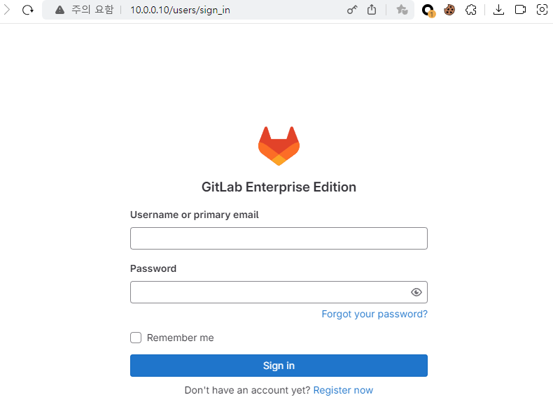
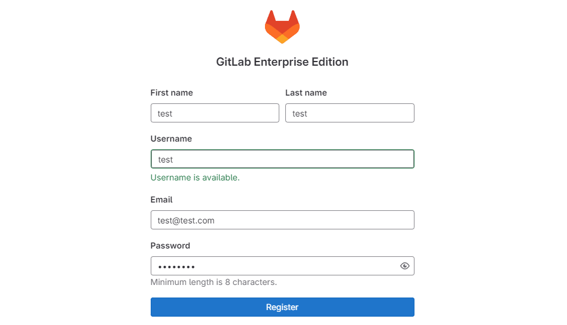
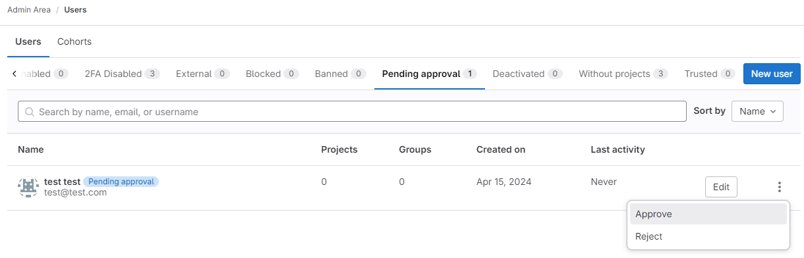

## [0x00] overview
---
os: ubuntu 22.04


## [0x01] install
---

필수 도구 설치
``` bash
sudo apt-get update
sudo apt-get install -y curl openssh-server ca-certificates tzdata perl
```


GitLab 패키지 설치
``` bash
curl https://packages.gitlab.com/install/repositories/gitlab/gitlab-ee/script.deb.sh | sudo bash
sudo EXTERNAL_URL="http://10.0.0.10" apt-get install gitlab-ee
```

root 계정 및 비밀번호 파일 위치 확인 `/etc/gitlab/initial_root_password`
``` bash
Notes:
Default admin account has been configured with following details:
Username: root
Password: You didn't opt-in to print initial root password to STDOUT.
Password stored to /etc/gitlab/initial_root_password. This file will be cleaned up in first reconfigure run after 24 hours.

NOTE: Because these credentials might be present in your log files in plain text, it is highly recommended to reset the password following https://docs.gitlab.com/ee/security/reset_user_password.html#reset-your-root-password.
```

``` bash
root@user-pc:/home/user# cat /etc/gitlab/initial_root_password
# WARNING: This value is valid only in the following conditions
#          1. If provided manually (either via `GITLAB_ROOT_PASSWORD` environment variable or via `gitlab_rails['initial_root_password']` setting in `gitlab.rb`, it was provided before database was seeded for the first time (usually, the first reconfigure run).
#          2. Password hasn't been changed manually, either via UI or via command line.
#
#          If the password shown here doesn't work, you must reset the admin password following https://docs.gitlab.com/ee/security/reset_user_password.html#reset-your-root-password.

Password: 7w████████████████████████████████████████w=

```


``` bash
gitlab Reconfigured!

       *.                  *.
      ***                 ***
     *****               *****
    .******             *******
    ********            ********
   ,,,,,,,,,***********,,,,,,,,,
  ,,,,,,,,,,,*********,,,,,,,,,,,
  .,,,,,,,,,,,*******,,,,,,,,,,,,
      ,,,,,,,,,*****,,,,,,,,,.
         ,,,,,,,****,,,,,,
            .,,,***,,,,
                ,*,.


     _______ __  __          __
    / ____(_) /_/ /   ____ _/ /_
   / / __/ / __/ /   / __ `/ __ \
  / /_/ / / /_/ /___/ /_/ / /_/ /
  \____/_/\__/_____/\__,_/_.___/


Thank you for installing GitLab!
GitLab should be available at http://10.0.0.10

For a comprehensive list of configuration options please see the Omnibus GitLab readme
https://gitlab.com/gitlab-org/omnibus-gitlab/blob/master/README.md

Help us improve the installation experience, let us know how we did with a 1 minute survey:
https://gitlab.fra1.qualtrics.com/jfe/form/SV_6kVqZANThUQ1bZb?installation=omnibus&release=16-10
```


## [0x02] root login
---
등록한 도메인 또는 ip 로 접근하면 아래와 같이 Gitlab에 성공적으로 접속할 수 있다.


이제 기본 계정인 root와 initial_root_password에 등록된 비밀번호를 통해 로그인하면 된다.


## [0x03] register
---
이제 root가 아닌 일반 계정을 생성해보자. 아래와 같은 형태로 작성하여 제출하면 관리자의 승인을 기다려야 한다.


root 계정으로 접속하여 아래와 같이 Approve 진행해주어야 새로운 계정으로 로그인이 가능하다.
