## [0x00] overview
---
오랜만에 악성코드 분석을 해보고자 lumma stealer 악성코드를 수집집하여 분석해보았다. 쉬운 녀석보다는 조금 어려운 녀석을 분석하고 싶었기에, 파일 크기도 작지 않은 녀석(아마 더미코드가 붙어서 분석이 어렵지 않을까)으로 택했다.

### ananlysis env
Vmware에서 Windows 7 x64 환경으로 구축하여 실행하려 했으나 필요한 모듈이나 업데이트 문제 등으로 환경을 재구축하여 분석을 진행하였다.
- OS: Windows 10 x64
- Platform: Hyper-V
- Malware
    - md5: 54E97708C9714C69BD34300EA9F397D6
    - file size: 2.96MB

## [0x01] file information
---
기본적인 파일 정보는 아래와 같다. x64, PE, 그리고 exe라는 정보를 알 수 있다.
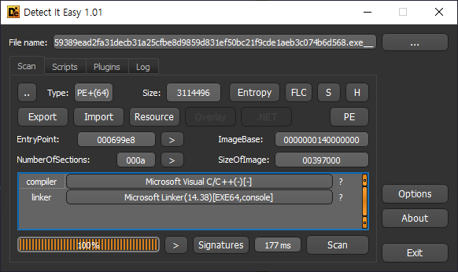

함수 정보를 보니 친절하게도 injection 관련 함수가 쉽게 보인다. 
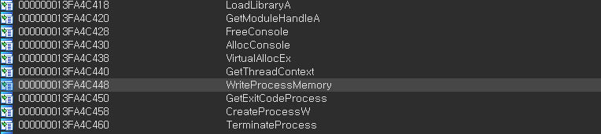


## [0x02] init process and code
--- 
기본적으로 초반 코드부터 악성 행위를 수행하지는 않고, 문자열 복호화, 코드 복호화 등의 작업을 다수 수행한다. 
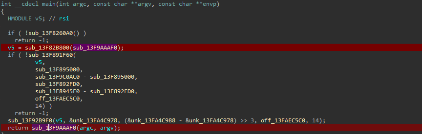

각 함수 사이에도 꽤 적지 않는 내부 함수 호출을 시도하기에 단순히 코드를 순서대로 분석해서 들어가면 오래 걸릴 수 있다.
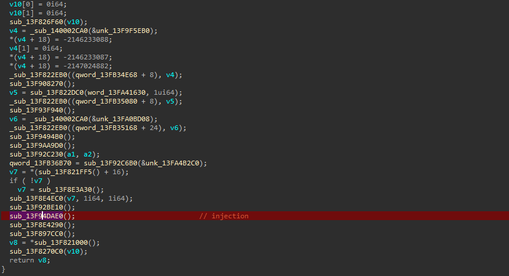


## [0x03] process injection
---

필요한 준비가 다 된 후 프로세스를 생성하여 인젝션을 시도한다. 인젝션 대상은 `wab.exe`이다.
> Windows Address Book(wab)는 윈도우 운영 체제에 기본적으로 탑재된 주소록 관리 애플리케이션 

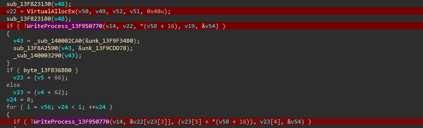

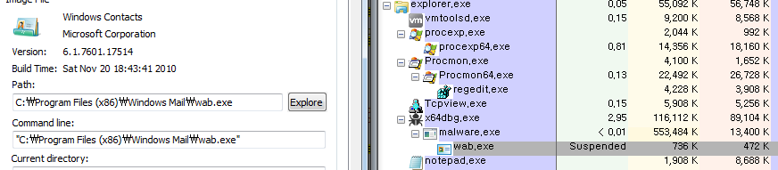

이후 ResumeThread를 통해 injection 한 코드가 동작하게끔 한다.
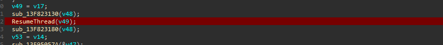


## [0x04] injected code
---

그렇다면 어떤 코드를 인젝션 하는가 보았더니 MZ 로 시작하는 pe 파일의 내용을 바로 메모리에 맞추어 `WriteProcessMemory`를 사용하고 있었다. 온전한 PE 파일 형태이기에 추출해보았다.

- extraced
    - md5: AA17CF9FF92E097F2B6CF9C993C4ABEC
    - file size: 321KB 

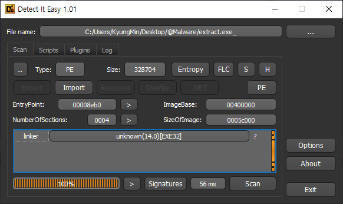

코드는 많지 않아 보이지만, 마찬가지로 분석하기 어렵게 꼬아놓아져 있는 형태이다.
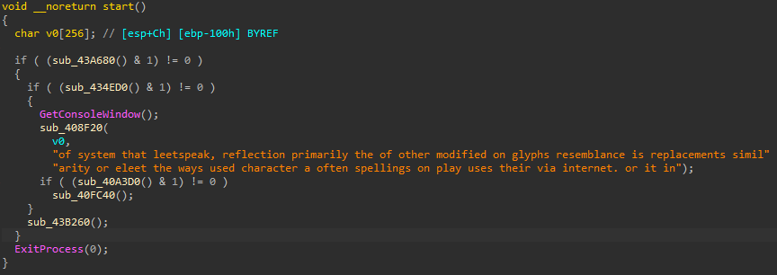

전체적인 주요 내용은 아래와 같다.
``` bash
| sub esp,10C                             |
| call <extract.module_load>              | module load
| test al,1                               |
| jne extract.538EC1                      |
| jmp extract.538F07                      |
| call extract.564ED0                     | choice run malware
| test al,1                               |
| jne extract.538ECC                      |
| jmp extract.538F00                      |
| call dword ptr ds:[<&GetConsoleWindow>] |
| mov dword ptr ss:[esp+8],eax            |
| lea eax,dword ptr ss:[esp+C]            |
| lea ecx,dword ptr ds:[572261]           |
| mov dword ptr ss:[esp],eax              |
| mov dword ptr ss:[esp+4],ecx            |
| call extract.538F20                     | ready to run - setting ecx
| call extract.53A3D0                     | connect c2 server
| test al,1                               |
| jne extract.538EF7                      |
| jmp extract.538F00                      |
| call extract.53FC40                     | success to connect c2 logic
| jmp extract.538EFE                      |
| jmp extract.538F00                      |
| call extract.56B260                     | free
| jmp extract.538F07                      |
| xor eax,eax                             |
| mov dword ptr ss:[esp],0                |
| call dword ptr ds:[<&ExitProcess>]      |
| int3                                    |
```


우선 기본적으로 추가적인 dll을 로드하기 위한 작업을 수행한다. 
> ntdll.dll, crypt32.dll, advapi32.dll, msvcrt.dll, sechost.dll, winhttp.dll

추출한 내역을 바탕으로 실행 시 아래와 같이 선택 화면이 나온다. 친절하기도 해라.. 혹시나 다른 프레임워크를 통해 포함된 내용인가 했으나 검색 해도 별다른 소득은 없다.
> Do you want to run a malware? (Crypt build to disable this message)
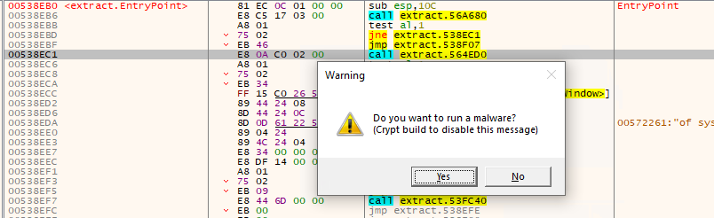

실행에 동의할 경우 필요한 api를 하나하나 로드한다.
```
WinHttpOpen
WinHttpConnect
WinHttpOpenRequest
WinHttpCrackUrl
WinHttpSetTimeouts
WinHttpAddRequestHeaders
WinHttpSendRequest
WinHttpReceiveResponse
WinHttpQueryDataAvailable
WinHttpReadData
WinHttpWriteData
WinHttpCloseHandle
```
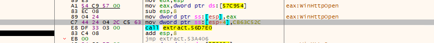

이후 암호화된 문자열을 복호화하며 통신을 시도한다. 통신에 사용된 c2 서버는 아래와 같지만, 정상적으로 파일이 다운로드 되지 않아 이후의 동작은 확인할 수 없다.
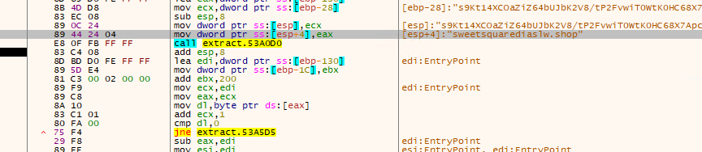
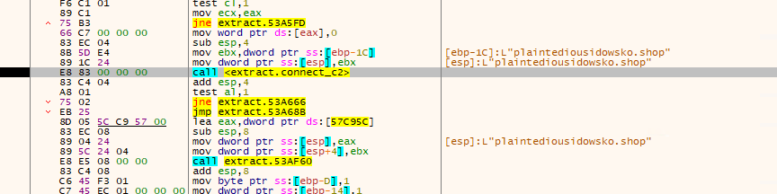

정상적으로 연결되었을 경우 아래와 같이 authrootstl.cab 파일의 다운로드를 시도한다.
```
05/17/24 08:55:16 AM [          Diverter] svchost.exe (1488) requested UDP 172.21.135.101:53
05/17/24 08:55:16 AM [        DNS Server] Received A request for domain 'holicisticscrarws.shop'.
05/17/24 08:55:16 AM [          Diverter] extract.exe (8140) requested TCP 192.0.2.123:443
05/17/24 08:55:16 AM [          Diverter] svchost.exe (1488) requested UDP 172.21.135.101:53
05/17/24 08:55:16 AM [        DNS Server] Received A request for domain 'ctldl.windowsupdate.com'.
05/17/24 08:55:16 AM [          Diverter] extract.exe (8140) requested TCP 192.0.2.123:80
05/17/24 08:55:16 AM [    HTTPListener80]   GET /msdownload/update/v3/static/trustedr/en/authrootstl.cab?d6d6d648f2c16513 HTTP/1.1
05/17/24 08:55:16 AM [    HTTPListener80]   Connection: Keep-Alive
05/17/24 08:55:16 AM [    HTTPListener80]   Accept: */*
05/17/24 08:55:16 AM [    HTTPListener80]   User-Agent: Microsoft-CryptoAPI/10.0
05/17/24 08:55:16 AM [    HTTPListener80]   Host: ctldl.windowsupdate.com
05/17/24 08:55:16 AM [    HTTPListener80]
```

성공적으로 연결이 되었다면 api를 호출할 것으로 보인다.
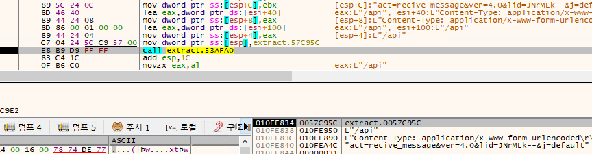


## [0x05] bypass exit 
사용할 코드를 복호화 한다.
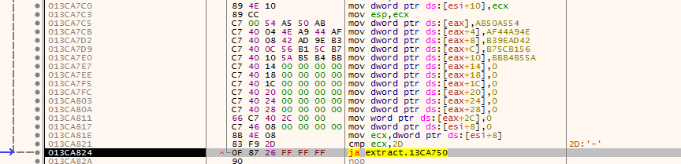

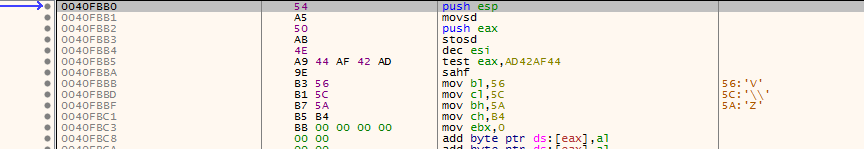

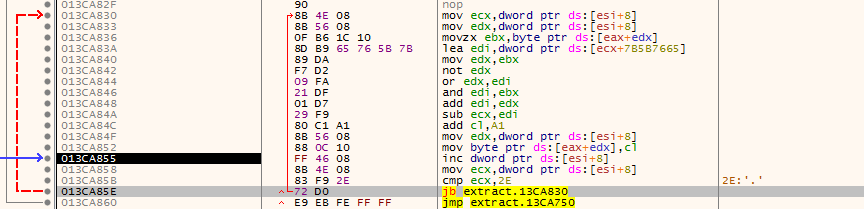


sha 알고리즘과 관련된 항목을 찾는다.
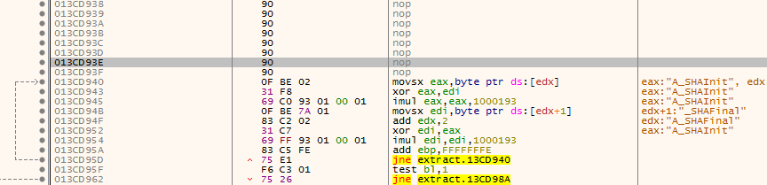


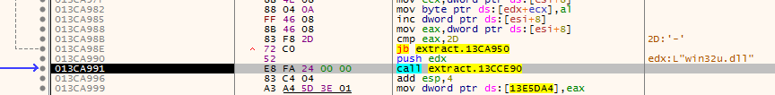


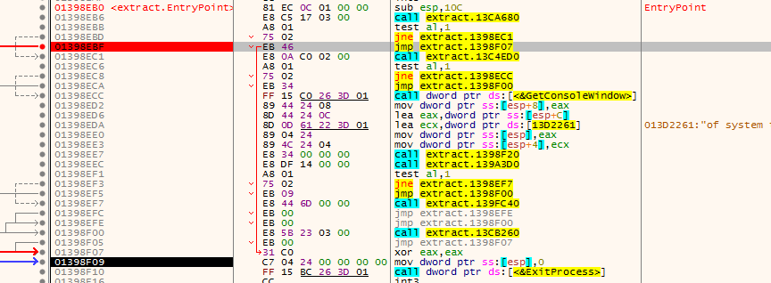

정상 동작을 위해 아래와 같이 opcode를 수정해준다.
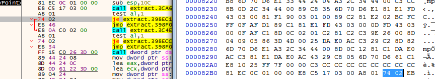


## [0x00] TTPs
---
TA0004.T1190 – Exploit Public-Facing Application
TA0005.T1055.012 - Process Injection. Process Hollowing

TA0005.T1140 - Deobfuscate/Decode Files or Information
TA0005.T1027.007 - Dynamic API Resolution

TA0002.T1106 - Native API
    a suspicious direct syscall was executed
    suspicious module load using direct syscall

## [0x00] reference
---

main
- md5: 54E97708C9714C69BD34300EA9F397D6
- sha256: 59389ead2fa31decb31a25cfbe8d9859d831ef50bc21f9cde1aeb3c074b6d568

extract
- md5: AA17CF9FF92E097F2B6CF9C993C4ABEC
- sha256: 3984a5df1e5178681a26b5f55cf6c293bd88d487e8838a822df4f3ef0c4204d2


https://cyberint.com/blog/research/the-lumma-stealer-infostealer-the-details/

sample download
- [Malware Bazear](https://bazaar.abuse.ch/download/59389ead2fa31decb31a25cfbe8d9859d831ef50bc21f9cde1aeb3c074b6d568/)

ref
- [Cyberint. 'The Lumma Stealer InfoStealer: The Details'](https://cyberint.com/blog/research/the-lumma-stealer-infostealer-the-details/)
