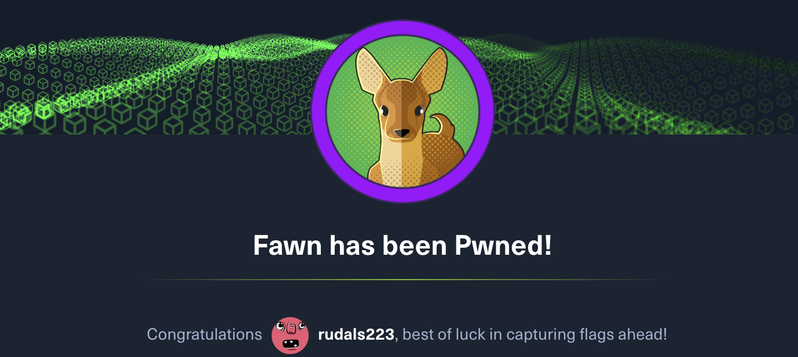

핵더박스 두번째 기본 문제

5번 | 평소에 nmap은 -Pn 옵션이나 기본 옵션으로만 사용해서 이런 옵션이 있는지 몰랐다.

``` bash
 ✘ read-min 🍻   ~/Documents/Git/read-min.github.io   main  nmap -sV 10.129.131.24
Starting Nmap 7.94 ( https://nmap.org ) at 2024-02-03 13:29 KST
Nmap scan report for 10.129.131.24
Host is up (0.27s latency).
Not shown: 999 closed tcp ports (conn-refused)
PORT   STATE SERVICE VERSION
21/tcp open  ftp     vsftpd 3.0.3
Service Info: OS: Unix

Service detection performed. Please report any incorrect results at https://nmap.org/submit/ .
Nmap done: 1 IP address (1 host up) scanned in 108.51 seconds
```

ftp에 접속하는 방법은 아래와 같다.
``` bash
 read-min 🍻   ~/Documents/Git/read-min.github.io   main  ftp 10.129.131.24

Connected to 10.129.131.24.
220 (vsFTPd 3.0.3)
Name (10.129.131.24:km): anonymous
331 Please specify the password.
Password:
230 Login successful.
```
어떤 파일이 있는지 확인해본 결과 flag.txt 파일이 존재한다. get 명령어를 통해 다운로드 후 확인하면 플래그 획득이 가능하다.
``` bash
ftp> ls
200 PORT command successful. Consider using PASV.
150 Here comes the directory listing.
-rw-r--r--    1 0        0              32 Jun 04  2021 flag.txt
226 Directory send OK.
ftp> get flag.txt
200 PORT command successful. Consider using PASV.
150 Opening BINARY mode data connection for flag.txt (32 bytes).
226 Transfer complete.
32 bytes received in 0.000674 seconds (46.4 kbytes/s)
```
쉽지만 차근 차근 기초부터 쌓아간다는 마음으로 꾸준히 해보자. 공부보단 즐긴다는 느낌으로
