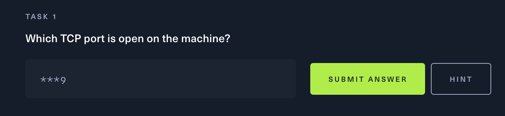

이번 문제는 TCP 관련 문제로 보인다.


이번에는 첫 문제부터 당황하게 됐다. 수 없이 많이 써본 nmap인데, 이걸 못 풀어서 힌트를 봐야만 했다.


당연히 nmap을 기본 옵션으로 하더라도 열려있는 포트에 대해 갖고 오는줄 알고 있었는데, '-p-' 옵션을 줘야 모든 포트에 대해 스캔한다는 것을 알았다.

> Use Nmap to run a port scan, scanning all ports with '-p-'. This can be really slow, so consider adding '--min-rate 5000' or '-T5' to speed it up.

기본 스캔에 대한 결과는 아래와 같이 아무것도 나오지 않는다.
``` shell
 read-min 🍻   ~  nmap -sV 10.129.16.97
Starting Nmap 7.94 ( https://nmap.org ) at 2024-02-03 17:03 KST
Nmap scan report for 10.129.16.97
Host is up (0.27s latency).
All 1000 scanned ports on 10.129.16.97 are in ignored states.
Not shown: 1000 closed tcp ports (conn-refused)

Service detection performed. Please report any incorrect results at https://nmap.org/submit/ .
Nmap done: 1 IP address (1 host up) scanned in 96.35 seconds
```

하지만 힌트에 나온 옵션대로 스캔한 결과 아래와 같다. (스캔 시간이 꽤 오래 걸린다.)
``` shell
 read-min 🐸   ~  nmap 10.129.203.15 -sV -sC -T4 -5- -Pn
Starting Nmap 7.94 ( https://nmap.org ) at 2024-02-04 13:06 KST
Warning: 10.129.203.15 giving up on port because retransmission cap hit (6).
Nmap scan report for 10.129.203.15
Host is up (0.26s latency).
Not shown: 3942 closed tcp ports (conn-refused), 57 filtered tcp ports (no-response)
PORT     STATE SERVICE VERSION
6379/tcp open  redis   Redis key-value store 5.0.7

Service detection performed. Please report any incorrect results at https://nmap.org/submit/ .
Nmap done: 1 IP address (1 host up) scanned in 353.88 seconds
```

위 결과를 통해 6379 port에서 redis 서비스가 열려있는 것을 확인 할 수 있다. 이후 redis와 상호작용 하기 위해 redis-cli가 필요하므로, 아래와 같이 설치한다.

``` shell
apt install redis-server
```

수집한 정보에 따른 redis 서버 접속해보자.

``` shell
# redis-cli -h 10.129.203.15 -p 6379
10.129.203.15:6379> help
redis-cli 7.0.15
To get help about Redis commands type:
      "help @<group>" to get a list of commands in <group>
      "help <command>" for help on <command>
      "help <tab>" to get a list of possible help topics
      "quit" to exit

To set redis-cli preferences:
      ":set hints" enable online hints
      ":set nohints" disable online hints
Set your preferences in ~/.redisclirc
```

접속한 redis 서버의 정보 조회를 위해 info 명령을 사용 할 수 있으며, 버전, 메모리 등 다양한 정보를 출력해 준다. 맨 마지막에 나온 db0:keys=4의 경우 데이터베이스의 0번(DB0)에서 현재 보유하고 있는 키(Key)의 총 개수가 4개라는 것을 나타낸다.
``` shell
10.129.203.15:6379> info
# Server
redis_version:5.0.7
redis_git_sha1:00000000
redis_git_dirty:0
redis_build_id:66bd629f924ac924
redis_mode:standalone
os:Linux 5.4.0-77-generic x86_64
arch_bits:64
multiplexing_api:epoll
atomicvar_api:atomic-builtin

...skip...

# Keyspace
db0:keys=4,expires=0,avg_ttl=0
10.129.203.15:6379>
```

redis의 경우 테이블과 같은 개념이 아닌, key/value의 형태로 아래와 같이 어떤 키가 있는지 보고 내용 조회를 할 수 있다.
``` shell
10.129.203.15:6379> KEYS *
1) "numb"
2) "temp"
3) "stor"
4) "flag"
(1.12s)
10.129.203.15:6379> get "numb"
"bb2c8a7506ee45cc981eb88bb81dddab"
10.129.203.15:6379> get "flag"
```
위와 같은 방법으로 조회가 가능하다.

