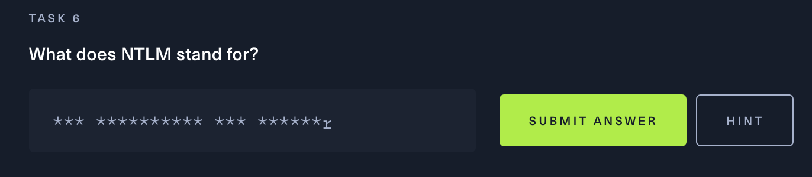

대상 서버 nmap 스캔 결과는 아래와 같다. (동일한 인자를 줬지만 kali에선 되고 mac에선 되지 않았다...왜그럴까..)
``` bash
# nmap 10.129.2.235 -sC -sV -Pn
Starting Nmap 7.94SVN ( https://nmap.org ) at 2024-02-05 14:03 UTC
Nmap scan report for 10.129.2.235
Host is up (0.51s latency).
Not shown: 999 filtered tcp ports (no-response)
PORT   STATE SERVICE VERSION
80/tcp open  http    Apache httpd 2.4.52 ((Win64) OpenSSL/1.1.1m PHP/8.1.1)
|_http-title: Site doesn't have a title (text/html; charset=UTF-8).
|_http-server-header: Apache/2.4.52 (Win64) OpenSSL/1.1.1m PHP/8.1.1

Service detection performed. Please report any incorrect results at https://nmap.org/submit/ .
Nmap done: 1 IP address (1 host up) scanned in 197.03 seconds
```

80 port로 접근가 열려있는 것을 확인할 수 있으며, 접근 시 아래와 같이 .htb 사이트로 이동된다.

``` bash
# curl 10.129.73.133
<meta http-equiv="refresh" content="0;url=http://unika.htb/">#
```

하지만 이동 된 후 아무 페이지를 찾을 수 없다는 내용만 존재하여, 다양한 시도를 해보았으나 문제를 풀 수가 없었다.


알고 보니 해당 증상은 문제가 있는 것으로 아래와 같이 hosts 파일을 수정해주어야 정상적으로 사이트에 접근된다.
``` bash 
sudo vi /etc/hosts

# 아래 IP는 각자 발급 받은 Machine의 IP 입력 필요
10.129.73.133    unika.htb
```

수정 후 사이트에 접근하면 정상적으로 접근되는 것을 확인 할 수 있다.


문제를 풀던 중 아래 문제의 답이 도저히 나오지 않아 결국 타 공략을 보았다. NT Lan Manager가 많이 나와 왜 글자 수가 다르지? 생각했지만, NT도 줄임말이여서 그런 것이였다...괜히 패배한 기분이다.



작성 중

10.129.73.133