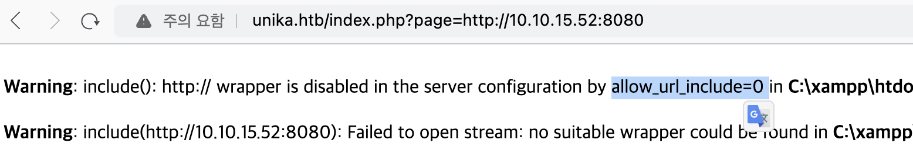

Hack the box 문제 풀이 중 RFI를 테스트 하다 아래와 같은 내용을 확인하였다.

관련해서 내용을 찾아보니 php 구성 시 allow_url_include는 기본적으로 off 되어 원격 http 또는 ftp url을 로드하지 않도록 하여 공격을 방지한다. 
> Link: https://www.mannulinux.org/2019/05/exploiting-rfi-in-php-bypass-remote-url-inclusion-restriction.html

하지만 allow_url_include와 allow_url_open가 모두 off로 설정 되어 있더라도 SMB URL 로드는 차단하지 않는다. PHP의 이러한 특징은 smb 공유를 통해 원격으로 php 웹쉘을 로드하는데 사용할 수 있다.
