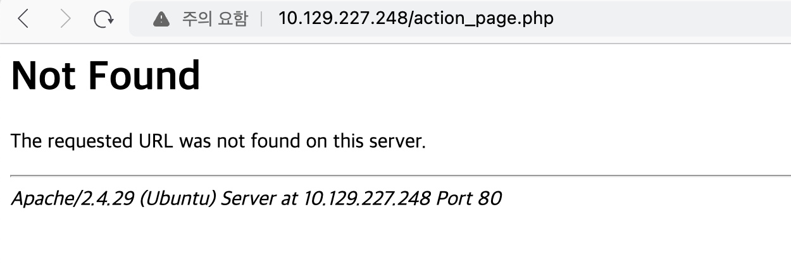
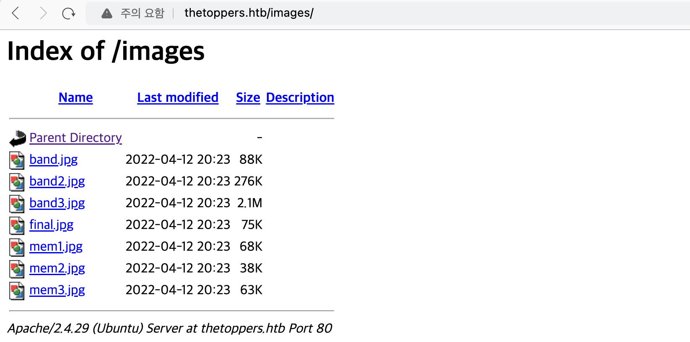

우선 port scan 결과를 먼저 확인해보자. ssh와 http port가 기본 포트에 맞추어 열려있다.
``` bash
┌──(root㉿fb940ca6010c)-[/rfi]
└─# nmap -sC -sV 10.129.227.248
Starting Nmap 7.94SVN ( https://nmap.org ) at 2024-02-14 14:17 UTC
Nmap scan report for 10.129.227.248
Host is up (0.29s latency).
Not shown: 998 closed tcp ports (reset)
PORT   STATE SERVICE VERSION
22/tcp open  ssh     OpenSSH 7.6p1 Ubuntu 4ubuntu0.7 (Ubuntu Linux; protocol 2.0)
| ssh-hostkey:
|   2048 17:8b:d4:25:45:2a:20:b8:79:f8:e2:58:d7:8e:79:f4 (RSA)
|   256 e6:0f:1a:f6:32:8a:40:ef:2d:a7:3b:22:d1:c7:14:fa (ECDSA)
|_  256 2d:e1:87:41:75:f3:91:54:41:16:b7:2b:80:c6:8f:05 (ED25519)
80/tcp open  http    Apache httpd 2.4.29 ((Ubuntu))
|_http-title: The Toppers
|_http-server-header: Apache/2.4.29 (Ubuntu)
Service Info: OS: Linux; CPE: cpe:/o:linux:linux_kernel

Service detection performed. Please report any incorrect results at https://nmap.org/submit/ .
Nmap done: 1 IP address (1 host up) scanned in 20.33 seconds
```

이전 문제와는 조금은 다르지만 유사한 점이 있다. IP로 해당 사이트가 접근 되긴 하지만, 다른 페이지로의 이동은 되지 않는다. 할당 된 ip로 접근 시 아래와 같이 웹에 접근 된다.


다만, 사이트의 기능을 눌러보면 아래와 같이 접근되지 않는 부분이 있다. 아마 `/etc/hosts`에 등록을 해주어야 하는 것 같다.


그렇다면 사이트 url을 알아야 등록이 가능한데, 나의 경우 페이지 소스를 보며 찾았다. 굳이 페이지 소스가 아니라 CONTANT에 기재된 이메일 주소를 통해 유추해볼 수도 있다. 이메일 주소에 포함된 'thetoppers.htb'가 site url로 추정된다.
``` html
      <div class="w3-col m6 w3-large w3-margin-bottom">
        <i class="fa fa-map-marker" style="width:30px"></i> Chicago, US<br>
        <i class="fa fa-phone" style="width:30px"></i> Phone: +01 343 123 6102<br>
        <i class="fa fa-envelope" style="width:30px"> </i> Email: mail@thetoppers.htb<br>
      </div>
      <div class="w3-col m6">
```

`/etc/hosts`를 수정해도 위의 페이지는 들어가지지 않는다. 그렇다면 접근 가능한 다른 url이 있는지 파악하기 위해 gobuster를 사욜해보고자 한다. 결과는 아래와 같고 사용한 리스트 파일은 [링크](https://raw.githubusercontent.com/aels/subdirectories-discover/main/dsstorewordlist.txt)에서 다운 가능하다.
``` bash
┌──(root㉿fb940ca6010c)-[/]
└─# gobuster dir -u http://thetoppers.htb/ -w ./dsstorewordlist.txt
===============================================================
Gobuster v3.6
by OJ Reeves (@TheColonial) & Christian Mehlmauer (@firefart)
===============================================================
[+] Url:                     http://thetoppers.htb/
[+] Method:                  GET
[+] Threads:                 10
[+] Wordlist:                ./dsstorewordlist.txt
[+] Negative Status codes:   404
[+] User Agent:              gobuster/3.6
[+] Timeout:                 10s
===============================================================
Starting gobuster in directory enumeration mode
===============================================================
/images               (Status: 301) [Size: 317] [--> http://thetoppers.htb/images/]
/index.php            (Status: 200) [Size: 11952]
/.htaccess            (Status: 403) [Size: 279]
/.htpasswd            (Status: 403) [Size: 279]
/.htpasswds           (Status: 403) [Size: 279]
Progress: 1828 / 1829 (99.95%)
===============================================================
Finished
===============================================================
```

수집된 경로를 보아 /images에 접근 가능한 듯하다. 접근 해보니 아래와 같이 Directory Listing 취약점이 존재하는 것을 알 수 있다. 


다만 저 경로 외에 더 이상의 접근은 되지 않아 별 다른 정보를 획득하지는 못했다. 그렇다면 우선 남은 추가 정보는 Apache 버전 정보이다.
```
Apache/2.4.29 (Ubuntu) Server at thetoppers.htb Port 80
```