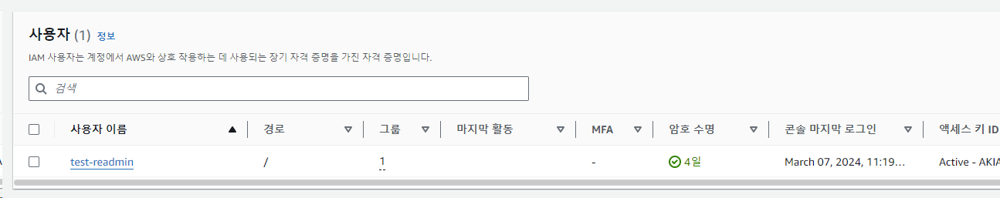
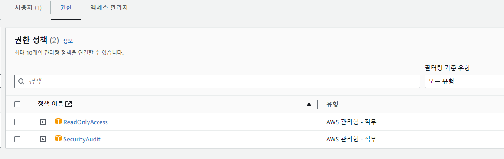
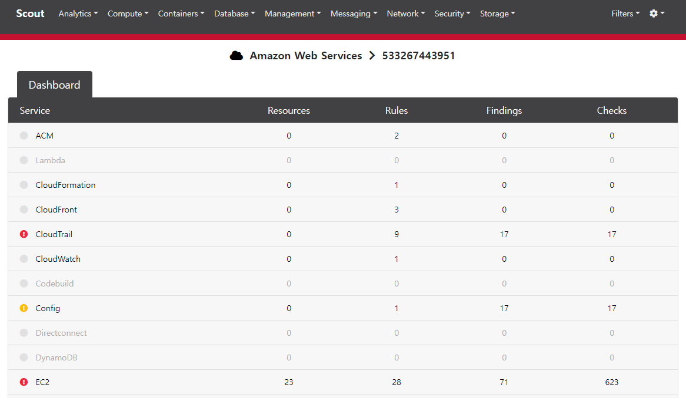
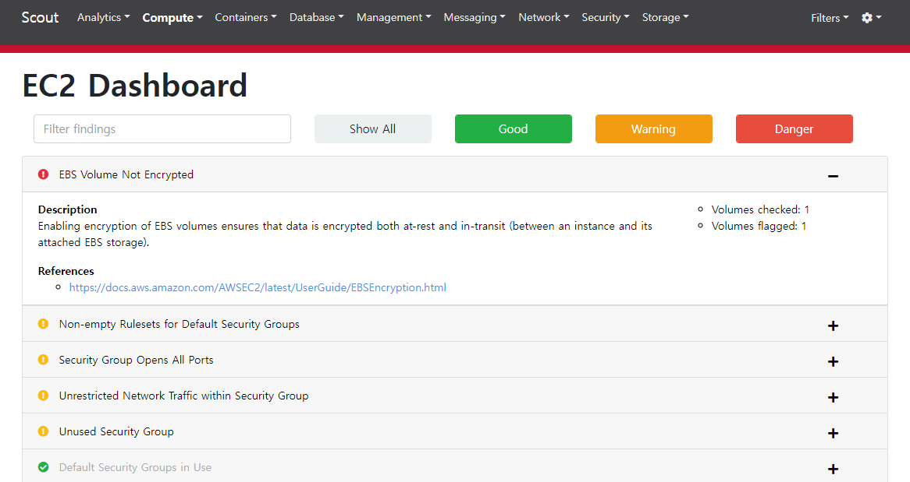
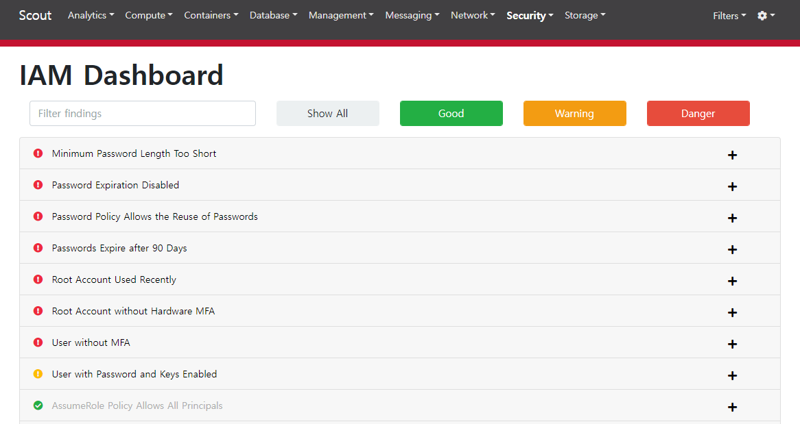

> test
{: .prompt-tip }

## [0x00] Ncc ScoutSuite
---
NCC 그룹에서 제작한 ScoutSuite는 클라우드 환경의 보안 상태를 평가하는 오픈 소스 다중 클라우드 보안 감사 도구로 각 클라우드 업체가 제공한 api를 사용하여 구성 데이터를 수집하고 검토한다.

지원 대상
- Amazon Web Services
- Microsoft Azure
- Google Cloud Platform
- Alibaba Cloud (alpha)
- Oracle Cloud Infrastructure (alpha)
- Kubernetes clusters on a cloud provider (alpha)


## [0x01] Install & Prepare
---
python-pip를 통해 쉽게 설치가 가능하다.
``` bash
root@user-pc:/home/user# pip install scoutsuite
```

나의 경우 aws 환경에 대해 테스트를 진행할 것이다. aws 테스트 관련해서는 [해당 링크](https://github.com/nccgroup/ScoutSuite/wiki/Amazon-Web-Services)에서 자세한 내용 확인이 가능하다. 

우선 점검을 위해 임시로 iam에서 사용자('test-readmin')를 생성하였다.


점검을 위해선 아래와 같이 ReadOnlyAccess, SecurityAudit 권한이 필요하다.


이후 aceess_key 발급과 함께 secret을 확인하여 아래와 같이 입력해주면 된다.
``` bash
root@test-ubuntu:/home/user# scout aws --access-keys --access-key-id AKI███████████████PR --secret-access-key 0Ar█████2h█████tRLYg█████iHO9██████████v
2024-03-11 06:29:30 test-ubuntu scout[2128708] INFO Launching Scout
2024-03-11 06:29:30 test-ubuntu scout[2128708] INFO Authenticating to cloud provider
2024-03-11 06:29:34 test-ubuntu scout[2128708] INFO Gathering data from APIs
2024-03-11 06:29:34 test-ubuntu scout[2128708] INFO Fetching resources for the ACM service
2024-03-11 06:29:35 test-ubuntu scout[2128708] INFO Fetching resources for the Lambda service
2024-03-11 06:29:36 test-ubuntu scout[2128708] INFO Fetching resources for the CloudFormation service
2024-03-11 06:29:37 test-ubuntu scout[2128708] INFO Fetching resources for the CloudTrail service
2024-03-11 06:29:38 test-ubuntu scout[2128708] INFO Fetching resources for the CloudWatch service
2024-03-11 06:29:38 test-ubuntu scout[2128708] INFO Fetching resources for the CloudFront service
2024-03-11 06:29:39 test-ubuntu scout[2128708] INFO Fetching resources for the CodeBuild service
2024-03-11 06:29:40 test-ubuntu scout[2128708] INFO Fetching resources for the Config service
2024-03-11 06:29:41 test-ubuntu scout[2128708] INFO Fetching resources for the Direct Connect service
2024-03-11 06:29:42 test-ubuntu scout[2128708] INFO Fetching resources for the DynamoDB service
2024-03-11 06:29:43 test-ubuntu scout[2128708] INFO Fetching resources for the EC2 service
2024-03-11 06:29:43 test-ubuntu scout[2128708] INFO Fetching resources for the EFS service
2024-03-11 06:29:44 test-ubuntu scout[2128708] INFO Fetching resources for the ElastiCache service
2024-03-11 06:29:45 test-ubuntu scout[2128708] INFO Fetching resources for the ELB service
2024-03-11 06:29:46 test-ubuntu scout[2128708] INFO Fetching resources for the ELBv2 service
2024-03-11 06:29:47 test-ubuntu scout[2128708] INFO Fetching resources for the EMR service
2024-03-11 06:29:48 test-ubuntu scout[2128708] INFO Fetching resources for the IAM service
2024-03-11 06:29:48 test-ubuntu scout[2128708] INFO Fetching resources for the KMS service
2024-03-11 06:29:49 test-ubuntu scout[2128708] INFO Fetching resources for the RDS service
2024-03-11 06:29:49 test-ubuntu scout[2128708] INFO Fetching resources for the RedShift service
2024-03-11 06:29:50 test-ubuntu scout[2128708] INFO Fetching resources for the Route53 service
2024-03-11 06:29:51 test-ubuntu scout[2128708] INFO Fetching resources for the S3 service
2024-03-11 06:29:53 test-ubuntu scout[2128708] INFO Fetching resources for the SES service
2024-03-11 06:29:54 test-ubuntu scout[2128708] INFO Fetching resources for the SNS service
2024-03-11 06:29:55 test-ubuntu scout[2128708] INFO Fetching resources for the SQS service
2024-03-11 06:29:55 test-ubuntu scout[2128708] INFO Fetching resources for the VPC service
2024-03-11 06:29:56 test-ubuntu scout[2128708] INFO Fetching resources for the Secrets Manager service
2024-03-11 06:31:20 test-ubuntu scout[2128708] INFO Running pre-processing engine
2024-03-11 06:31:20 test-ubuntu scout[2128708] INFO Running rule engine
2024-03-11 06:31:21 test-ubuntu scout[2128708] INFO Applying display filters
2024-03-11 06:31:21 test-ubuntu scout[2128708] INFO Running post-processing engine
2024-03-11 06:31:21 test-ubuntu scout[2128708] INFO Saving data to scoutsuite-report/scoutsuite-results/scoutsuite_results_aws-533267443951.js
2024-03-11 06:31:21 test-ubuntu scout[2128708] INFO Saving data to scoutsuite-report/scoutsuite-results/scoutsuite_exceptions_aws-533267443951.js
2024-03-11 06:31:21 test-ubuntu scout[2128708] INFO Creating scoutsuite-report/aws-533267443951.html
2024-03-11 06:31:21 test-ubuntu scout[2128708] INFO Opening the HTML report
```


## [0x02] Result
---
수집된 결과는 html 형태로 scoutsuite-report에 저장 된다.
``` bash
root@test-ubuntu:/home/user# ls -al
drwxr-xr-x 8 root    root    4096 Mar 11 06:31 scoutsuite-report/

root@test-ubuntu:/home/user# ls -al scoutsuite-report
-rw-r--r-- 1 root    root    200419 Mar 11 06:31 aws-533267443951.html
drwxr-xr-x 4 root    root      4096 Mar 11 06:31 inc-bootstrap
drwxr-xr-x 5 root    root      4096 Mar 11 06:31 inc-fontawesome
drwxr-xr-x 2 root    root      4096 Mar 11 06:31 inc-handlebars
drwxr-xr-x 2 root    root      4096 Mar 11 06:31 inc-jquery
drwxr-xr-x 3 root    root      4096 Mar 11 06:27 inc-scoutsuite
drwxr-xr-x 2 root    root      4096 Mar 11 06:31 scoutsuite-results
```

해당 html 파일을 보면 다양한 항목에 대한 결과가 나타나며, 아이콘을 통해 취약한 항목을 빠르게 확인 가능하다.

아래는 EC2에 대한 취약점 결과로, EBS 암호화를 진행하지 않아 문제라고 알려주고 있다.


아래는 IAM에 대한 점검 결과로 계정 관리에 대해 다수의 미흡한 항목을 확인할 수 있다.



## [0x03] Conclusion
---
다수의 점검 항목이 있는 만큼, 보안 가이드 항목으로 참고하기에 좋을 듯하다. 또한 무료 사용이 가능한만큼, 최소한의 보안 요구 조건으로 정해도 되지 않을까 싶다.


## [0x04] Reference
---
- https://github.com/nccgroup/ScoutSuite