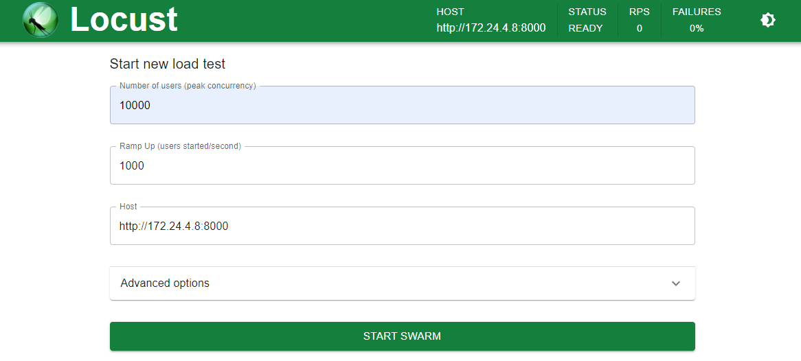

## [0x00] overview
---
이번 포스트에서는 네트워크 트래픽 부하 테스트를 위해 사용한 도구를 기록 한다.


## [0x01]  iperf
---
iperf는 네트워크 대역폭을 측정하기 위한 도구로, 서버/클라이언트 간의 데이터 전송 속도를 측정한다. tcp, udp를 지원하여 각각 테스트가 가능하다.

- 서버 측 설정
``` bash
root@ubt-1:~# iperf -s
------------------------------------------------------------
Server listening on TCP port 5001
TCP window size:  128 KByte (default)
------------------------------------------------------------
[  4] local 10.0.0.101 port 5001 connected with 10.0.0.83 port 33308
[ ID] Interval       Transfer     Bandwidth
[  4]  0.0-10.0 sec  1.25 GBytes  1.07 Gbits/sec
```
- 클라이언트 측 설정
``` bash
root@ubt-2:~# iperf -c 10.0.0.101 -b 1G
------------------------------------------------------------
Client connecting to 10.0.0.101, TCP port 5001
TCP window size:  212 KByte (default)
------------------------------------------------------------
[  3] local 10.0.0.83 port 33308 connected with 10.0.0.101 port 5001
[ ID] Interval       Transfer     Bandwidth
[  3]  0.0-10.0 sec  1.25 GBytes  1.07 Gbits/sec
```

udp에 대한 테스트를 하고자 할 경우 서버/클라이언트 모두 -u 옵션을 주면 된다.


## [0x02] locust
---
locust는 웹 요청을 테스트 하는 도구로, 실제 사용자가 웹 요청을 보내는 것처럼 사용자 수를 지정하여 특정 페이지 호출에 대한 응답 시간 등을 측정한다. 사용을 위해선 `pip`로 설치가 필요하다.
``` bash
pip install locust
```

설치 후 locust를 실행하면 웹 페이지를 접속하라고 나온다.
``` bash
root@test-ubuntu:/home/kyungmk# locust
[2024-03-12 07:21:06,185] test-ubuntu/INFO/locust.main: Starting web interface at http://0.0.0.0:8089
[2024-03-12 07:21:06,190] test-ubuntu/INFO/locust.main: Starting Locust 2.23.1
```

locust 실행 후 8089 port 페이지 접속 시 아래와 같이 설정을 진행할 수 있다.


Options
- Number of users: 최대 사용자 수
- Ramp up: 사용자 수 증가 단위
- Host: 테스트 대상 URL 경로 / 특정 파일도 지정 가능
- Advanced options: 추가적인 옵션 지정 (사용해본적 없음)

옵션을 지정 후 실행 시 아래와 같이 진행 결과에 대해 나온다.


'Charts' 탭을 통해 대상 웹 서버에서의 응답 시간 지연율 등을 확인할 수 있다.


## [0x02] iftop
---
네트워크 트래픽 양(bps)을 확인하고자 할 경우 `iftop`을 설치하여 실행하면 아래와 같이 inbound/outbound에 대한 각 트래픽 양을 보여준다.
``` bash
                      12.5Kb                 25.0Kb                37.5Kb                 50.0Kb           62.5Kb
└─────────────────────┴──────────────────────┴─────────────────────┴──────────────────────┴──────────────────────
test-ubuntu22                              => 211.34.57.129                               1.36Kb  2.00Kb  2.00Kb
                                           <=                                              160b    456b    456b
test-ubuntu22                              => kns.kornet.net                                 0b    390b    390b
                                           <=                                                0b    700b    700b

─────────────────────────────────────────────────────────────────────────────────────────────────────────────────
TX:             cum:   2.38KB   peak:   3.77Kb                                   rates:   1.36Kb  2.38Kb  2.38Kb 
RX:                    1.13KB           3.05Kb                                             160b   1.13Kb  1.13Kb 
TOTAL:                 3.51KB           6.82Kb                                            1.52Kb  3.51Kb  3.51Kb
```


## [0x03] vnstat
---
iftop과 유사한 도구이지만, 좀 더 간결하게 bps, pps 값을 확인 가능한 도구로 vnstat이 있다. 개인적으로 pps 구하는 도구를 찾기가 가장 어려웠다.
``` bash
root@blvkcs-nids01:/data/suricata/script# vnstat -l -i ens1f1np1
Monitoring ens1f1np1...    (press CTRL-C to stop)
   rx:     3.62 Gbit/s 456972 p/s          tx:         0 bit/s     0 p/
```

## [0x04] conclusion
---
보안 업무를 하다보니 이외의 도구는 조금 낯선 감이 있다. 특히 뭐라고 검색해야할지 모르다보니 헤맸다.