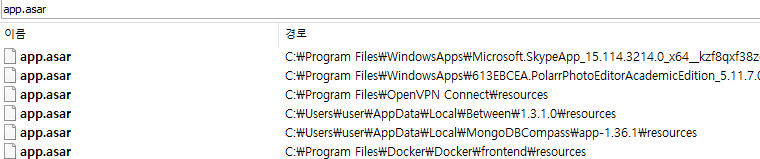
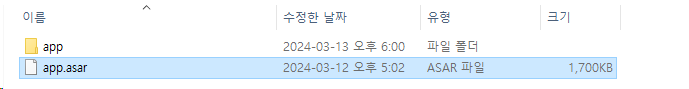

## [0x00] summary
---
``` bash
> npm install -g @electron/asar
> asar extract app.asar app
```


## [0x01] what is electron
---
electron(일렉트론)은 JavaScript, HTML, CSS 로 어플리케이션을 만들 수있는 프레임워크로 최근 많이 사용되고 있다. electron으로 제작된 exe 파일을 분석하려면 별도의 방법이 필요한 만큼 기록하고자 한다.

우선 electron으로 제작된 exe 파일의 경우 가장 큰 특징이 'app.asar' 파일이 존재한다는 것이다. 사용자 pc에서 해당 파일을 검색해보면 생각보다 많은 프로그램에서 사용하고 있음을 알 수 있다.



## [0x02] install tool
---
app.asar 파일은 하나의 압축 파일로 생각하면 된다. 하지만 기본적인 압축해제 도구로는 풀 수가 없어 별도의 도구를 설치해주어야 한다. 우선 [npm 설치](https://nodejs.org/en/download/)가 필요하다.
``` bash
C:\Users\user>npm version
{
  npm: '8.19.2',
  node: '18.12.1',
  v8: '10.2.154.15-node.12',
  uv: '1.43.0',
  zlib: '1.2.11',
  brotli: '1.0.9',
  ares: '1.18.1',
  modules: '108',
  nghttp2: '1.47.0',
  napi: '8',
  llhttp: '6.0.10',
  openssl: '3.0.7+quic',
  cldr: '41.0',
  icu: '71.1',
  tz: '2022b',
  unicode: '14.0',
  ngtcp2: '0.8.1',
  nghttp3: '0.7.0'
}
```

npm 설치가 완료되면 npm을 통해 asar 패키지를 설치해야 한다.
``` bash
C:\Users\user>npm install -g @electron/asar

added 13 packages in 1s

1 package is looking for funding
  run `npm fund` for details
npm notice
npm notice New minor version of npm available! 10.2.4 -> 10.5.0
npm notice Changelog: https://github.com/npm/cli/releases/tag/v10.5.0
npm notice Run npm install -g npm@10.5.0 to update!
npm notice
```

설치가 완료되면 아래와 같이 asar을 console로 실행 할 수 있다.
``` bash
C:\Users\user>asar
Usage: asar [options] [command]

Manipulate asar archive files

Options:
  -V, --version                         output the version number
  -h, --help                            display help for command

Commands:
  pack|p [options] <dir> <output>       create asar archive
  list|l [options] <archive>            list files of asar archive
  extract-file|ef <archive> <filename>  extract one file from archive
  extract|e <archive> <dest>            extract archive
  *
  help [command]                        display help for command
```


## [0x03] extract
---
설치가 완료 되면 `asar extract 대상asar 저장할폴더명`와 같은 형태로 입력하면 된다.
``` bash
> npx asar extract app.asar app 
> asar extract app.asar app
```



압축 해제 된 폴더를 들어가보면 개발에 sourcecode가 존재한다. 주요 파일이 있는지 확인해야하며, 민감정보가 포함되어 배포되는 경우도 있으므로 주의해야 한다.
``` bash
> dir
2024-03-13  오후 06:00    <DIR>          .
2024-03-13  오후 06:00    <DIR>          ..
2024-03-13  오후 05:56    <DIR>          assets
2024-03-13  오후 05:56             2,468 index.html
2024-03-13  오후 05:56               774 index_preload.js
2024-03-13  오후 05:56            22,843 main.js
2024-03-13  오후 05:56    <DIR>          node_modules
2024-03-13  오후 05:56               228 package.json
2024-03-13  오후 05:56             1,694 preload.js
```

## [0x04] reference
---
- https://gist.github.com/frolleks/01b9555b678c7f5a6c31aba33c632606


