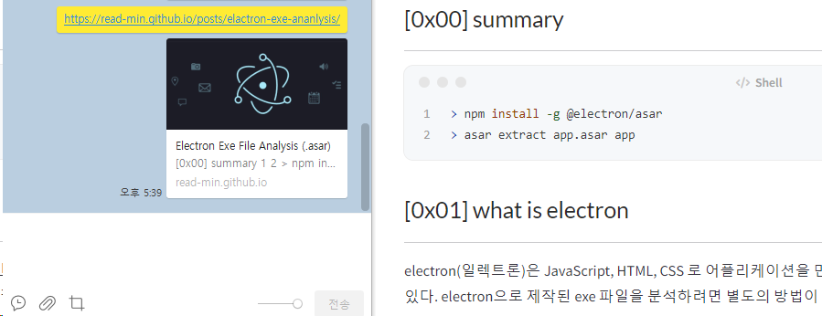
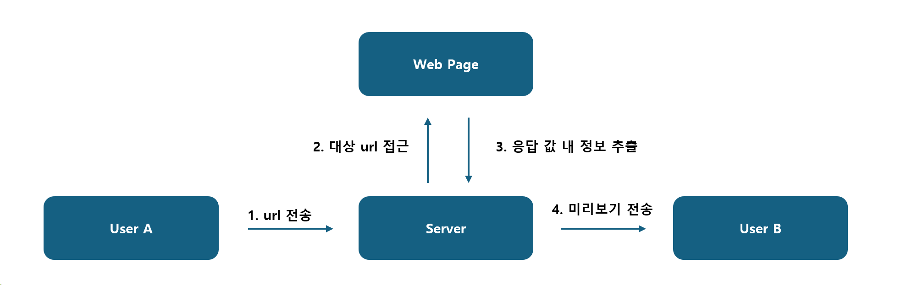
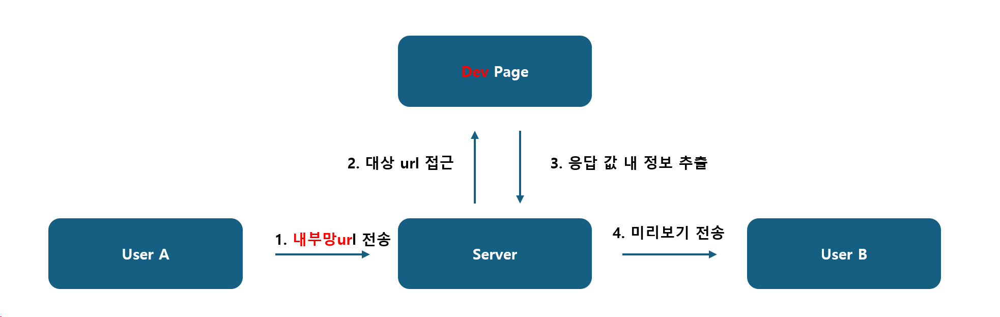
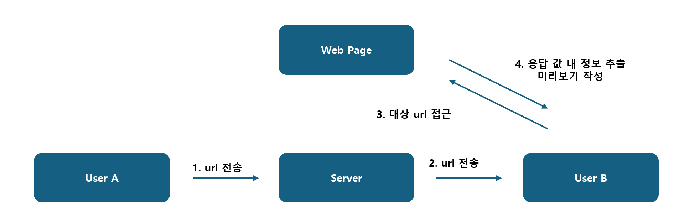
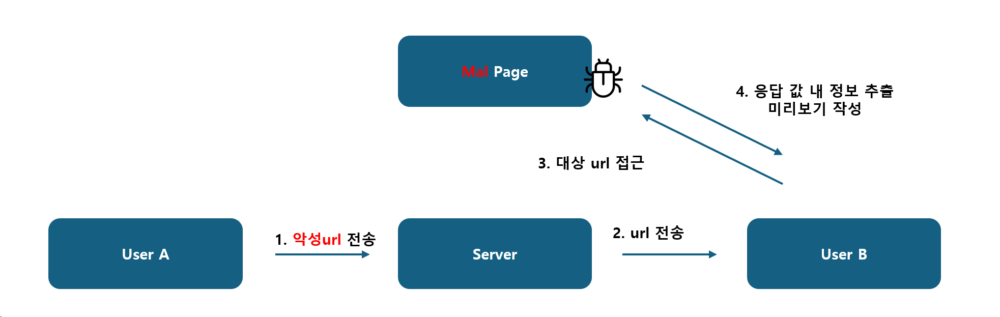
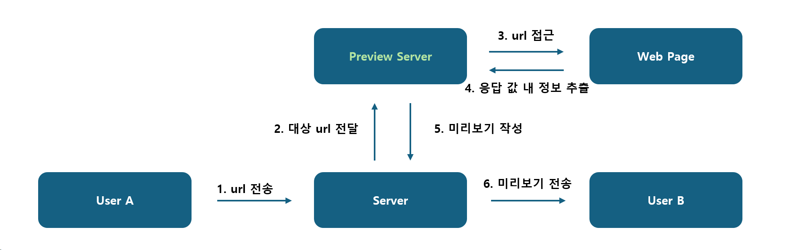
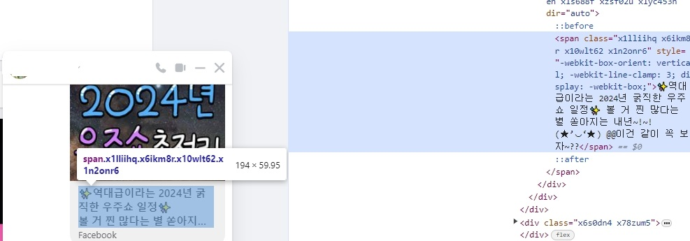
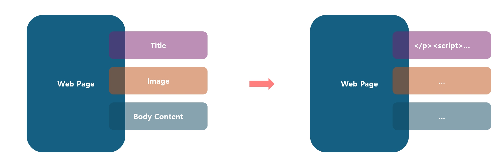

## [0x00] overview
---
메신저 앱을 보던 중 url을 입력하면 해당 웹 페이지의 제목, 이미지, 내용 등 미리보기 되는 부분이 궁금해졌다. 저런 미리보기 컨텐츠는 서버/클라이언트 둘 중 어느 측에서 가지고 올 것인가? 이에 대한 궁금증을 시작으로 보안적으로 고려해야할 부분까지 정리해보고자 한다.


## [0x01] preview
---
url link에 preview는 우리 남조선에서는 가장 많이 접한 것이 바로 카톡에 url을 첨부했을 경우이다. 아래 사진과 같이 url을 입력해주면 제목, 이미지, 그리고 약간의 내용까지 출력되는 것을 볼 수 있다.



그렇다면 내 서버에 직접 파일을 올려놓고 테스트 했을 때, 어떻게 로그가 남는지 확인해보자. 웹 서버에 index.html를 호출한 결과에 대한 access log의 내용은 아래와 같다. 내가 직접 `curl`로 index.html에 접근 시 당연하게 나의 ip 정보가 출력된다. 반대로 카톡을 통해 호출한 경우 내 ip가 아닌 전혀 다른 곳(아마 카톡 서버 중 하나)의 ip인 `211.xxx.xxx.106`이 남아있을 것을 볼 수 있다.
``` bash
# 내 pc에서 직접 호출한 결과
211.xxx.xxx.129 - - [18/Mar/2024:08:43:00 +0000] "GET /index.html HTTP/1.1" 200 10926 "-" "curl/8.0.1"

# 메신저앱을 통해 호출된 결과
211.xxx.xxx.106 - - [18/Mar/2024:08:43:17 +0000] "GET /index.html HTTP/1.1" 200 3423 "-" "facebookexternalhit/1.1; kakaotalk-scrap/1.0; +https://devtalk.kakao.com/t/scrap/33984"
```

## [0x02] vulnerability
---
그렇다면 이런 편리한 기능을 갖고 왜 포스팅을 하는가? 당연히 보안상 고려해야할 부분이 있기 떄문이다. 단순한 호기심에서 시작하여 몇 가지 생각과 검색을 해본 결과를 정리하고자 한다(대부분의 링크 프리뷰 모듈(?또는 제품?)에서는 검증을 당연히 잘 하고 있겠지만..).

우선 채팅 당사자의 pc나 모바일앱에서 직접 url에 접근 하는 것이 아닌 제품 서버(위의 경우 카톡 서버 211.xxx.xxx.106)에서 접근을 하다보니 ssrf 취약점에 노출 될 가능성도 있지 않을까 싶다. 

> 여기서부턴 실제 사례 조사보단 생각이나 상상을 정리한 부분이 많이 포함되어 있습니다. 실제 저렇게 구현된 경우가 없을 수도 있습니다. 반박 시 여러분의 말이 맞으니 댓글로 알려주시면 감사하겠습니다.
{: .prompt-tip }


### [case #1]
우선 첫 번째 경우 아래와 같이 동작한다고 가정해보자. 


이런 경우 대상 서버의 내부에서만 접근 가능한 url을 전송하여 ssrf를 노려볼 수 있을 것 같다.


### [case #2]
두 번째 경우 url 전송 시 클라이언트 측에서 미리보기를 작성하는 경우이다. 서버에서 대상 url에 직접 접근하는 것이 위험하다면, 클라이언트에게 해당 행동을 전가하면 되는 것이 아닌가?!


짧게 생각하면 맞지만, 사실 이 부분도 문제가 있다. ssrf 라는 문제에서는 벗어나지만, 바로 우리의 고객인 User B의 정보가 대상 서버에 정보를 남긴다는 것이다. 


user B가 직접 서버에 접근 시 해당 사용자의 ip가 우선 서버에 남게 되기도하며, 악성 웹 스크립트를 넣어놓고 사용자가 접근하면 동작하게 할 수도 있다.

여러모로 2차 공격의 위협에 놓이기 더 좋은 조건의 경우이다. 관련되어 두 가지 괜찮은 자료가 있어 첨부해놓는다.
- hackerone bug report: https://hackerone.com/reports/1782467
- securityintelligence: https://securityintelligence.com/articles/link-previews-security-and-privacy/


### [case #3]
그렇다면 어떻게 해야 ssrf나 사용자가 위험에 노출되지 않게끔 할 수 있을까? 개인적인 의견이지만, 아래와 같다.


내부 서버와는 별도로 preview를 작성하기 위한 전용 서버를 두는 것이다. 그렇다면 ssrf의 위험도 적고, 사용자의 정보가 노출될 위험도 없다. 


## [0x03] xss
---
마지막으로 공유하고 싶은 경우는 xss가 동작하게끔 하는 경우이다. 아래 사진은 meta(facebook)의 대화 내용 중 하나를 캡쳐해 온 것이다.


위와 같이 메신저에선 제목, 이미지, 내용 등을 조합하여 웹 페이지에서 보여지게끔 만들어진다. 하지만 만약 가지고 온 정보를 조합하여 미리보기를 보여줄 때 공격성 문구를 제대로 처리하지 않는다면 위험이 될 수 있다.

아래와 같이 메세지 미리보기가 어떻게 보여지는지 사전에 파악 후, html 형태에 맞게끔 값을 조작하여 웹 페이지를 생성해놓는다면 xss와 같이 사용자에게 악성 스크립트가 동작할 수도 있지 않을까 싶다.



## [0x04] conclusion
---
어떻게 구성을 해야 안전할까에 대해 고민해보았다. 물론 구성만 잘해놓는게 아니라, 대상 url에서 악의적인 행위에 당하지 않도록 보호하는 부분도 당연히 구현이 필요할 것 같다.

정말 어쩌다 우연히 미리보기에 대해 궁금증이 생겨서 잠깐 생각과 조사한 내용으로 글을 작성하여 실습으로 증명하지도 못한 부분이 많습니다. 하지만 뭔가 가능할 것 같아 기록해놓는 것이니, 의견이 있다면 편하게 댓글 남겨주세요.

## [0x05] reference
---
- https://hackerone.com/reports/1782467
- https://securityintelligence.com/articles/link-previews-security-and-privacy/
- https://security.snyk.io/package/npm/link-preview-generator
