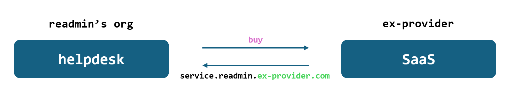
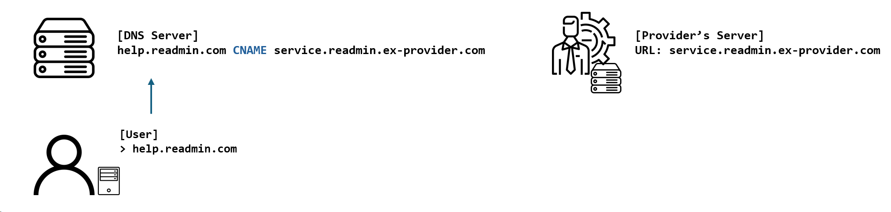
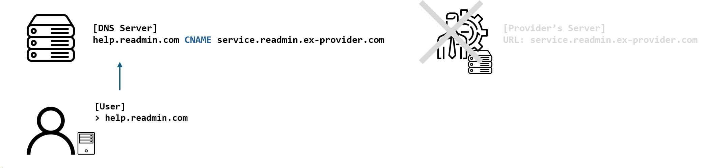
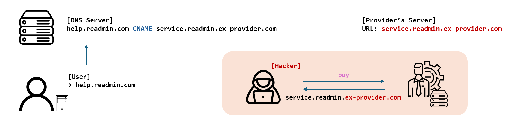

## [0x00] overview
---
최근 들어 subdomain takeover 취약점 이야기가 많이 보이고 있어 블로그에 정리해보고자 한다. 버그바운티에서도 꽤 금액을 챙겨가는 만큼, 지식을 잘 정리해놓고자 한다.


## [0x01] subdomain
---
그렇다면 정말 기초적인 내용이지만 subdomain부터 간단히 정리해보자. subdomain은 말 그대로 보조 도메인으로 `https://read-min.testmin.com`라는 url을 아래와 같이 나눠보자.
- `https`: 프로토콜
- `read-min`: 서브 도메인
- `testmin.com`: 최상위 도메인


## [0x02] dns (cname, a record)
---
이제 CNAME과 A Record에 대해 알아야 한다. 둘의 차이는 key, value 맵핑이 ip로 되어있는가 또 다른 도메인으로 되어있는가의 차이다.

우선 a record는 아래와 같이 각 도메인에 맞게 ip가 mapping 되어 있다. test.com에 요청을 할 경우 dns는 1.1.1.1을 반환한다.

A Record

| key           | value     | type      |
|---------------|-----------|-----------|
| test.com      | 1.1.1.1   | a record  |
| test.net      | 2.2.2.2   | a record  |
| readmin.com   | 3.3.3.3   | a record  |

반대로 cname의 경우 아래 표의 두번째 행과 같이 다른 도메인을 가리키고 있다. 즉 dns에 test.readmin.com을 요청하면 dev.readmin.com이 반환된다. 이후 다시 한번 dns에 dev.readmin.com에 대한 요청이 전달되고, 최종적으로 5.5.5.5가 반환된다.

| key               | value       | type      |
|-------------------|-------------|-----------|
| dev.readmin.com   | 5.5.5.5     | a record  |
| test.readmin.com  | dev.readmin.com | cname  |


## [0x03] subdomain takeover
---
이제 이 공격을 이해하기 위한 개념 소개는 모두 끝났다. 이제 subdomain takeover가 무엇인지 알아보자. subdomain takeover는 대상 조직에 등록된 cname의 value 값이 더 이상 서비스하지 않는 경우에 발생한다. 

공격자는 과거에는 등록되어 사용했었지만, 현재에는 사용되지 않는 서비스를 찾아 cname의 설정이 여전히 등록되어있는지 확인하여 취약 여부를 판단한다.


## [0x04] scenario
---
아래의 예를 통해 공격 시나리오에 대해 알아보자. 우선 readmin이라는 도메인을 사용하는 조직이, helpdesk와 같은 신규 서비스를 도입하기 위해 자체 개발이 아닌 외부 서비스(ex-provider)의 도입을 결정했다. 이후 `ex-provider.com` 측에서 제공한 `service.readmin.ex-provider.com`을 받아 사용하면 된다.


하지만 readmin 기업에서는 대상 웹에 접근 할 때 `ex-provider.com`이라는 문자를 포함시키지 않고 싶어 한다. 큰 기업일수록 뭔가 없어보이기도 하고..😒. 이러한 이유로 일관성 있게 `xxx.readmin.com`으로 보여지고 싶을 것이다. 이때 사용하는게 바로 cname이다.


readmin 기업은 dns 서버에 `help.readmin.com -> service.readmin.ex-provider.com`와 같은 형태로 설정해놓았기에, 사용자가 `help.readmin.com`을 찾을 경우 `service.readmin.ex-provider.com`을 응답하여 해당 ex-provider.com의 서버로 접속하게 한다.


이렇게 서비스를 하다가 readmin 기업은 지속적인 지출 절감 등의 이유로 기존의 계약을 해제해야 한다. 이제 계약은 해제되어 `service.readmin.ex-provider.com`에 접속을 할 수 없다. 
> 여기서 가장 중요한 점은 dns애 등록해놓은 cname 설정은 실수로 제거하지 않은 상태이다.
{: .prompt-tip }




이러한 상태에서 hacker는 cname에 설정된 값을 탐지([0x05] tool에서 설명)하였다. 이후 해당 설정으로 대상 도메인이 취약한지 확인하고자 한다. 우선 ex-provider에 기존 서비스 명과 동일한 이름으로 등록한다. 아래 그림과 같이 기존의 dns 서버 설정의 cname이 그대로일 경우, user는 help.readmin.com에 접속하려 했지만 실제로는 hacker가 준비한 서버로 연결된다.


이런 공격 시나리오로 subdomain takeover가 이루어진다.


## [0x05] tool
---
이제 어떻게 취약여부를 확인하는지 관련 툴을 통해 알아보자. subdomain takeover 관련해 검색해보면 정말 많은 도구가 있다. 사람마다 사용 방법도 다르기에 모든 것을 다룰 수는 없고, 나의 경우 subfinder와 amass로 그나마 결과를 뽑을 수 있었기에 이 두가지에 대해서만 다뤄보겠다.

### subfinder
우선 subfinder는 쉽고 빠르게 서브도메인을 찾아주는 역할을 해준다. 다른 간단한 서브도메인 도구들 대비 해당 도구를 고른 이유는 [guleum 블로그](https://guleum.com/171)에서 추천을 하여 선택했다.

> *sublist3r과 subfinder 모두 퍼저로써 훌륭하지만 개인적으론 subfinder를 선호합니다. 이유는 waybackurl(Method Fuzzing)이나 httpx(StatusCode) 간에 파이프라인으로 서로 상화 작용하여 사용할 수 있으므로 편합니다. 

설치는 [subfinder github](https://github.com/projectdiscovery/subfinder)에 나온 것과 같이 go를 이용해 설치하면 된다. go 외에 다른 설치 방법도 서칭하여 같이 첨부한다.
``` bash
# using go
go install -v github.com/projectdiscovery/subfinder/v2/cmd/subfinder@latest

# not go
$ wget https://github.com/projectdiscovery/subfinder/releases/download/v2.4.8/subfinder_2.4.8_linux_amd64.tar.gz
$ tar -zxvf subfinder_2.4.8_linux_amd64.tar.gz
$ cd subfinder
$ ls
$ mv subfinder /usr/bin/subfinder
```

설치가 완료되었다면 아래와 같이 실행하면 서브 도메인 결과를 수집해주는 것을 볼 수 있다.
``` bash
┌──(root㉿kali)-[/home/user]
└─# subfinder -d testex.com

               __    _____           __
   _______  __/ /_  / __(_)___  ____/ /__  _____
  / ___/ / / / __ \/ /_/ / __ \/ __  / _ \/ ___/
 (__  ) /_/ / /_/ / __/ / / / / /_/ /  __/ /
/____/\__,_/_.___/_/ /_/_/ /_/\__,_/\___/_/

                projectdiscovery.io

[INF] Current subfinder version v2.6.0 (outdated)
[INF] Loading provider config from /root/.config/subfinder/provider-config.yaml
[INF] Enumerating subdomains for testex.com
mail.testex.com
fct.testex.com
mail6.testex.com
www.testex.com
mog.testex.com
ssgowa.testex.com
[INF] Found 28 subdomains for testex.com in 2 seconds 92 milliseconds
```
개인적으로 위 결과만으로는 무엇을 해야할지 알지 못했다. 그리하여 찾게 된 툴인 amass를 좀 더 선호한다.

### amass
amass의 경우 [hahwul 블로그](https://www.hahwul.com/2021/10/10/amass-scripts/)를 통해 접하게 되었는데 subfinder보다는 더 오래걸리긴 하지만, 꽤 괜찮은 결과를 뽑아주기에 용이했다. 설치 방법의 경우 각 환경에 맞게 잘 정리 된 [공식 github](https://github.com/owasp-amass/amass/blob/master/doc/install.md)를 참고하면 된다.


추가적으로 amass 사용 시 같이 사용할 스크립트([subfinder..ads](https://github.com/PatrikFehrenbach/amass-tools/blob/master/subfinder.ads)) 또한 경로와 코드를 첨부한다. 
``` lua
name = "subfinder"
type = "ext"

function vertical(ctx, domain)
    print("in sub finder")
    local cmd = outputdir(ctx) .. "subfinder -d " .. domain

    local data = assert(io.popen(cmd))
    for line in data:lines() do
        newname(ctx, line)
    end
    data:close()
end
```

이제 amass를 이용해 나타난 결과를 보자(실제 정보를 변형하여 첨부). 아래에서 주요하게 봐야할 포인트는 바로 `cname_record`로 이어진 항목들이다.
``` bash
┌──(root㉿kali)-[/home/user]
└─# amass enum -d testex.com -scripts ./subfinder.ads
16509 (ASN) --> managed_by --> AMAZON-02 - Amazon.com, Inc. (RIROrganization)
4766 (ASN) --> announces --> 61█████0/13 (Netblock)
testex.com (FQDN) --> ns_record --> n█████9.awsdns-41.com (FQDN)
testex.com (FQDN) --> mx_record --> testex-com.mail.protection.outlook.com (FQDN)
www.testex.com (FQDN) --> a_record --> 61.7█████0.40 (IPAddress)
mail5.testex.com (FQDN) --> a_record --> 2█████7.43 (IPAddress)
a12discover.testex.com (FQDN) --> cname_record --> a12discover.outlook.com (FQDN)
a53odiscover.outlook.com (FQDN) --> cname_record --> a53or.tm-4.office.com (FQDN)
43.57.34.211.in-addr.arpa (FQDN) --> ptr_record --> mail5.testex.com (FQDN)
a1965.dscw39.akamai.net (FQDN) --> aaaa_record --> 2600:14█████0:14█████:8015 (IPAddress)
205.251.192.0/21 (Netblock) --> contains --> 20█████.1█████0 (IPAddress)
```

cname 설정에 따라 'a12discover.testex.com'에 들어온 요청은 'a12discover.outlook.com'로 가게끔 된다. 그러므로 공격자나 보안담당자 입장에서 해야할 일은 바로 'a12discover.outlook.com'로 등록한 서비스가 현재 유효한지를 확인해야 한다.

만약 현재는 유효하지 않은 서비스일 경우, 공격자가 outlook.com에 a12discover라는 이름으로 도메인을 등록할 경우 위험에 노출 된다.


## [0x06] risk & mitigation
---
그렇다면 subdomain takeover로 인해 발생할 수 있는 위협과 조치 방안에 대해 알아보자. 우선 하위 도메인을 공격자가 제어할 경우 아래와 같은 위험에 노출될 수 있다.
- 피싱사이트
- CORS, CSP 우회
- Cookie 탈취


조치 방법의 경우 더 이상 사용하지 않는 cname 항목을 제거해야 한다. 물론 지속적인 관리를 통해 취약 여부에 대한 관리가 필요하다.


## [0x07] question
---
사실 글을 작성하면서 자료를 찾다보니, 초반에 문득 궁금증이 생겼었다. 무지에서 나온 궁금증이였지만 이제는 답을 알게 되었으니 혹시나 하여 기록해놓는다.

**초기 궁금중**
> 그렇다면 내 블로그처럼 `https://read-min.github.io`는 취약한 것이 아닌가? github.io의 수많은 서브 도메인이 존재하고 있는데...

**현재 대답**
> 만약 github 블로그를 통해 받은 `~~~.github.io`와 같은 도메인을 기업(조직)이 dns 서버에 cname으로 등록해놓았다면, 해당 기업은 subdomain takeover의 취약 가능성에 노출 된다. dns에 등록된 상태에서 추후 해당 블로그를 없앤채로 놔둔다면, 공격자가 해당 도메인으로 다시 발급받아서 사용하면 된다.

## [0x08] conclusion
---
내용을 정리하다보니 생각보다 많이 길어졌다😎. 실제 큰 기업일수록 dns 설정 정보에 많은 데이터가 포함되어 있어 관리가 미흡할 수 있다. 물론 버그바운터 입장에서도 꽤 수입이 짭짤한 항목이다보니 관심이 있다면 reference에 첨부한 버그바운티 사례를 보면 좋을 하다. 

현직자로서 실제 dns에 등록된 cname 값과 amass로 수집한 결과를 보면 다소 차이가 있긴하다. 실제로는 등록된 정보가 더 많다보니 더 다양한 도구도 알아봐야하지 않나 싶다.🤔

## [0x09] reference
---
공격 시나리오 참고
- https://informer.io/resources/subdomain-takeover

악용 가능성
- https://book.hacktricks.xyz/v/kr/pentesting-web/domain-subdomain-takeover

버그바운티 사례
- https://medium.com/@HX007/subdomain-fuzzing-worth-35k-bounty-daebcb56d9bc
- https://hackerone.com/reports/661751
- https://hackerone.com/reports/325336
- https://hackerone.com/reports/484420

ETC.
- https://github.com/riramar/Web-Attack-Cheat-Sheet?tab=readme-ov-file#subdomain-takeover
- https://w01fgang.tistory.com/145

Subdomain WordList
- https://github.com/netsecurity-as/subfuz/blob/master/subdomain_megalist.txt
 
아래 코드는 어떤 문서에서 진단 시 사용하는 코드라고 복사해놓았는데, 출처를 잊어버림
``` bash
subfinder -d https://sginfra.net >> domains ; assetfinder -subs-only https://sginfra.net >> domains ; amass enum -norecursive -noalts -d https://sginfra.net >> domains ; subjack -w domains -t 100 -timeout 30 -ssl -c ~/go/src/github.com/haccer/subjack/fingerprints.json -v 3 >> takeover ; 
```


