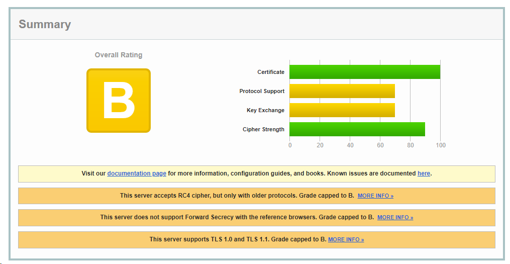
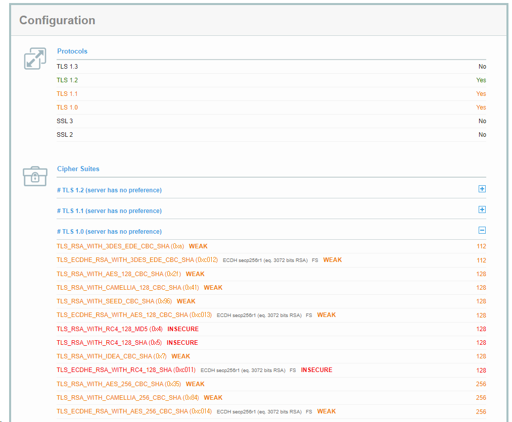

### [0x00] SSL/TLS
#### SSL
> SSL(Secure Sockets Layer)은 네트워크 통신에서 보안을 제공하는 프로토콜로, 데이터를 암호화하여 안전한 전송을 가능하게 한다.

#### TLS
> TLS(Transport Layer Security)는 SSL의 후속 버전으로, 더 안전하고 강력한 암호화 방법을 제공하여 데이터의 안전성을 강화한다. TLS는 현재 주로 웹 통신에서 사용되며, HTTPS(SSL/TLS를 이용한 HTTP)의 기본적인 보안 기술로 활용된다.

다만 위의 SSL/TLS를 사용함에 있어 취약점들이 발견되어, 버전 관리에 유의해야 한다.


### [0x01] Check Version
#### Openssl
아래와 같이 버전을 지정하여 확인 가능
``` bash
openssl s_client -connect google.com:443 -tls1
openssl s_client -connect google.com:443 -tls1_1
openssl s_client -connect google.com:443 -tls1_2
openssl s_client -connect google.com:443 -tls1_3
```
대상 버전 미지원 시 아래와 같은 형태로 에러가 나타난다. 
``` bash
└─# openssl s_client -connect www.test.com:443 -tls1_3
CONNECTED(00000003)
40B76E358F7F0000:error:0A000410:SSL routines:ssl3_read_bytes:sslv3 alert handshake failure:../ssl/record/rec_layer_s3.c:1586:SSL alert number 40
---
no peer certificate available
---
No client certificate CA names sent
---
SSL handshake has read 7 bytes and written 251 bytes
Verification: OK
---
New, (NONE), Cipher is (NONE)
This TLS version forbids renegotiation.
Compression: NONE
Expansion: NONE
No ALPN negotiated
Early data was not sent
Verify return code: 0 (ok)
---
```


#### Website
아래와 같이 [ssl 검사 사이트](https://www.ssllabs.com/ssltest/analyze.html?d=smilegate.com)를 통해 확인이 가능하며, 각 버전별로 어떠한 점이 취약한지도 보여준다.




### [0x02] Vulnerable Version
주로 사용되는 SSL/TLS 버전은 다음과 같다.

- SSL 2.0: 매우 취약하여 더 이상 권장되지 않습니다. 사용을 피해야 함
- SSL 3.0: POODLE (Padding Oracle On Downgraded Legacy Encryption) 취약점으로 인해 안전하지 않아 더 이상 권장되지 않음
- TLS 1.0: BEAST (Browser Exploit Against SSL/TLS) 공격에 취약하므로 사용을 피하는 것이 좋음
- TLS 1.1: 보안 결함이 발견되어 현재는 사용이 권장되지 않습니다.
- TLS 1.2: 현재까지 널리 사용되며 안전한 통신을 위한 권장 사양 중 하나
- TLS 1.3: 최신 버전으로, 보안성과 성능 면에서 향상되었습니다. 최신 웹 브라우저와 서버는 TLS 1.3을 지원하는 경우가 많음


### [0x03] Exploitation
중간자 공격 (Man-in-the-Middle, MITM)
- 취약한 SSL/TLS 버전은 암호화 강도가 낮거나 취약할 수 있어, 공격자가 중간에서 통신을 감시하거나 조작할 수 있는 기회를 제공
- 공격자가 암호화된 연결을 해독하고 수정하여 사용자 정보를 탈취하거나 악성 코드를 주입

암호 해독 (Decryption)
- 취약한 SSL/TLS 버전은 암호화된 데이터의 해독을 쉽게 만들 수 있어, 이를 통해 공격자는 중요한 정보를 빠르게 탈취하거나 악용 가능

POODLE (Padding Oracle On Downgraded Legacy Encryption)
- SSL 3.0의 취약점을 이용한 공격으로, 공격자가 암호화된 통신의 끝부분에서 패딩을 조작하여 정보를 추출 가능

BEAST (Browser Exploit Against SSL/TLS)
- TLS 1.0의 취약점을 이용한 공격으로, 공격자가 암호화된 쿠키 정보 등을 탈취 가능

FREAK (Factoring RSA Export Keys)
- 이전에 Export용으로 만들어진 RSA 키를 사용하는 취약한 시스템을 이용한 공격

DROWN (Decrypting RSA with Obsolete and Weakened eNcryption)
- TLS 및 SSL 버전 간 공격으로, 하위 호환성을 이용하여 암호화된 정보를 탈취하는 공격


### [0x04] Reference
- https://www.ssllabs.com/ssltest/analyze.html
- https://aday7.tistory.com/entry/HTTPS-SSLTLS-%EB%B3%B4%EC%95%88-%ED%94%84%EB%A1%9C%ED%86%A0%EC%BD%9C-%EC%9D%B4%ED%95%B4%ED%95%98%EA%B8%B0-TLS-12-TLS-13
